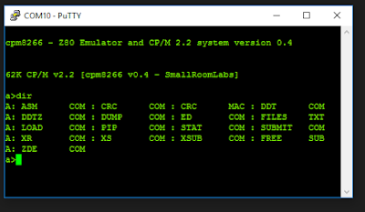

Last month I saw an intriguing article on creating a Z80 CP/M Emulator on my favorite device - the ESP8266 on hackaday.io.<br />
<br />
<a href="https://hackaday.io/project/20552-cpm-8266">
https://hackaday.io/project/20552-cpm-8266</a><br />
<br />
My first real computer was a dual processor 6502 / Z80. That was a bit of a misnomer, as one could not actually use both them at the same time. This was a "Basis 108" Apple II compatible from West Germany: A behemoth of a computer&nbsp;in an awesome cast aluminum case.&nbsp;Essentially the "second" processor was the Z80 add-on board but built-in to the motherboard. The thoughts of revisiting my old friend CP/M was too hard to resist.
<br />
<br />
I used my existing Build-ESP8266 project on a Raspberry Pi, originally created to ease compiling of MicroPython:
<br />
<br />
<a href="https://github.com/gojimmypi/build_esp8266">
https://github.com/gojimmypi/build_esp8266</a><br />
<br />
As this script downloads and recompiles everything needed for the ESP8266 toolchain, it was a simple matter to adapt for this Z80 CP/M project.
<br />
<br />
I only needed to adjust one value in the `./cpm8266/code/Makefile`
<br />

```text
-FLASHBAUD&nbsp     = 921600
+FLASHBAUD&nbsp     = 115200
```

The speed of 921600 was just too crazy, giving an error at upload time:


```
Makefile:180: recipe for target 'flashinit' failed
make: *** [flashinit] Error 2
```

So adjusting down to 115200 solved that problem.

I also had the ESP8266 toolchain installed in slightly different locations. Fortunately everything was parameterized in environment variables. So when using my `Build_ESP8266 script` the values are:


```bash
export ESP8266SDK=/opt/esp-open-sdk/
export ESPPORT=/dev/ttyUSB0
export ESPTOOL=/opt/esp-open-sdk/esptool/esptool.py
```

<br />I added these items to my `doPathLink.sh` (be sure to run with source command):<br />
<br />
```bash
source ./doPathLink.sh
```

<br />
From their instructions, I only needed add a few additional items not covered in my Build_esp8266.sh script:
<br />
<br />

## Install prerequisites for cpm8266



<pre class="language highlighter-rouge">
<code class="highlight">apt-get install z80asm cpmtools zip vim-common</code></pre>
<br />
After that, a quick compile and upload&nbsp;via "make full"&nbsp;and voila! A working CP/M emulator, shockingly easy!
<br />
<br />

<div class="separator" style="clear: both; text-align: left;">
<a href="../images/s1600/CPM.PNG" imageanchor="1" style="margin-left: 1em; margin-right: 1em;">
</a>
</div>

<div class="separator" style="clear: both; text-align: left;">
&nbsp;
</div>

<div class="separator" style="clear: both; text-align: left;">
Many thanks to the SmallRoomLabs folks - this is an awesome project! Seeing a CP/M prompt in a putty window is unbelievable!
</div>

<div class="separator" style="clear: both; text-align: left;">
&nbsp;
</div>

<div class="separator" style="clear: both; text-align: left;">
Now I wonder if I can get WiFi working from CP/M....
</div>


 Copyright (c) gojimmypi all rights reserved. Blogger Image Move Cleaned: 5/3/2021 1:35:51 PM
<br />

<!--   Copyright (c) gojimmypi all rights reserved.  -->