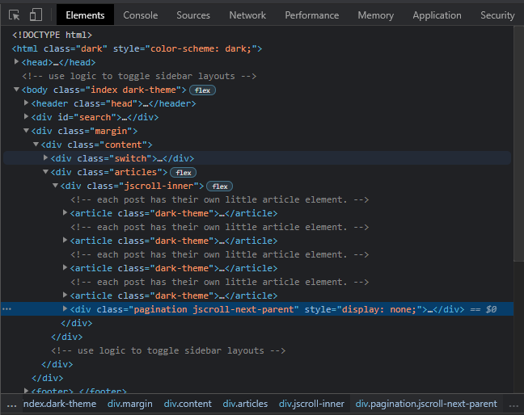

Another cool feature I wanted to fix was the infinite scrolling of blog previews. 
This turned out to be by far the most time consuming issue. 

The underlying problem was on the [original initializer](https://github.com/DigitalMindCH/gridster-jekyll-theme/blob/e238c2143969aa0d34dae6ab7b1f03dc2bf5c5d1/js/infinite/init.js#L4).
The post item list was so short on the demo, it only _appeared_ that scrolling was working. What was happening is that after the next batch of `article` items loaded, 
nothing happened for the page one after that.

The key to infinite scroll loading, is to have a link available to indicate where the next batch of data is located. In my case, a list of `article` elements:



When the next scroll event was triggered, the `.pagination` item went missing:


There's relatively little [configuration documentation](https://github.com/pklauzinski/jscroll/blob/master/docs/configuration.md) available. 
In other places, it appeared the code was using space-delimited strings. The configuration certainly does not. After some trial and error regarding what to use,
it turned out that adding the `.pagination` class name to the comma-delimited `contentSelector` was the key to ensuring the `nextSelector` was actually available. 
See also [jscroll #75](https://github.com/pklauzinski/jscroll/issues/75#issuecomment-139453951)


```
$(document).ready(function () {
	$('.articles').jscroll({
		contentSelector: 'article, .pagination',
		nextSelector: '.next',
		callback: removeWrap,
	});
});

function removeWrap() {
	var thisTheme = document.documentElement.style.getPropertyValue("color-scheme");
	const thisElements = $('.jscroll-added article');
	var forceDarkMode = (thisTheme == 'dark');
	for (i = 0; i < thisElements.length; i++) {
		thisElements[i].classList.toggle("dark-theme", forceDarkMode);
	}

	$('.jscroll-added article').unwrap();
}
```

Note that I also added an initializer for my new [dark mode](../dark-mode/) feature in the `removeWrap` callback.


```

```

See [scottlogic](https://www.scottlogic.com/), specifically [Jekyll Pagination and Infinite Scroll](https://blog.scottlogic.com/2014/10/14/jekyll-pagination-and-infinite-scrolling.html)