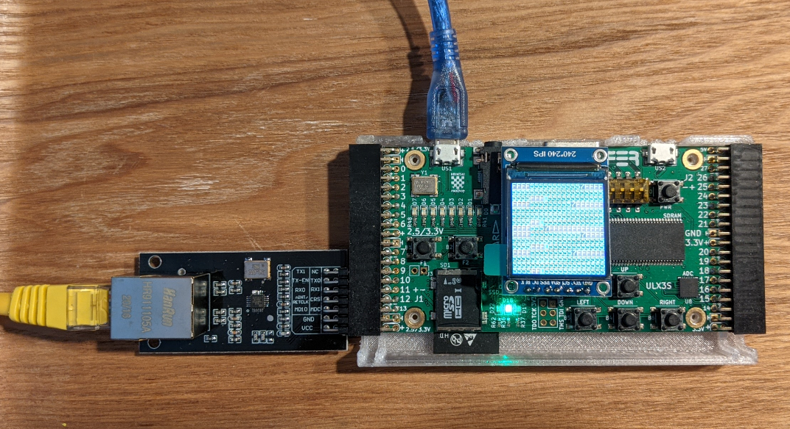
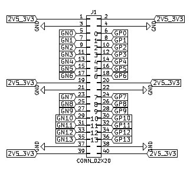

These are my notes on sniffing Ethernet packets with the Radiona ULX3S FPGA.

I first learned of [emard's ethernet example](https://github.com/emard/ulx3s-misc/tree/master/examples/eth/rmii/proj) when I recieved an email
for a new [issue](https://github.com/emard/ulx3s/issues/14). I promptly ordered a [LAN8720 PMod](https://www.amazon.com/gp/product/B07S8MRH92/) as well
as a [ST7789 SPI TFT LCD](https://www.amazon.com/gp/product/B07P9X3L7M/).

The [verilog source code](https://github.com/emard/ulx3s-misc/blob/master/examples/eth/rmii/proj/top/top_eth_hex_demo.v) is surprisingly short.
Packet capture and display driver in less that 350 lines of code, including comments.

Keep in mind this is an very primitive and limited example. For one, the [arp reply contents](https://github.com/emard/ulx3s-misc/blob/0b72cbd94c0cd9e0c2b095ea97fa021ae3c5f898/examples/eth/rmii/proj/top/top_eth_hex_demo.v#L33)
are hard coded. Still, it is an impressive proof-of-concept.

Wiring is quite simple: the connectors on etiher side of the ULX3S have pins specifically arranged to allow PMOD modules to be directly connected.



The header on the left side is `J1` with this pinout:




Note that this example also requires [vhd2vl](http://doolittle.icarus.com/~larry/vhd2vl/) and as [noted in docs](https://github.com/ldoolitt/vhd2vl#10-how-to-build-and-install-vhd2vl):

> _To install, copy the resulting `src/vhd2vl` file to someplace in your `$PATH`, like `$HOME/bin` or `/usr/local/bin.`_

I didn't have this installed, so:


```
cd /mnt/c/workspace/
git clone https://github.com/ldoolitt/vhd2vl.git
cd vhd2vl
make
sudo cp ./src/vhd2vl /usr/local/bin/vhd2vl
```

I already had the yosys/nextpnr/trellis installed:


```bash
cd /mnt/c/workspace/
git clone https://github.com/emard/ulx3s-misc.git
cd ulx3s-misc/examples/eth/rmii/proj/
make -f makefile.trellis
```

Note that I was doing this on WSL1, which does not support native USB devices. Thus in the [ulx3s-misc/scripts/trellis_main.mk](https://github.com/emard/ulx3s-misc/blob/0b72cbd94c0cd9e0c2b095ea97fa021ae3c5f898/scripts/trellis_main.mk#L91)
I needed to make a change to instead call the Windows/DOS exetable version of `fujprog`.


```
# programming tools
UJPROG ?= /mnt/c/workspace/fujprog/build/fujprog.exe
```

In all, it was really quite easy to get it [working](https://twitter.com/gojimmypi/status/1401289709230325762?s=20)!

```
gojimmypi@DESKTOP(WSL): /mnt/c/workspace/ulx3s-misc/examples/eth/rmii/proj (master * u=) emard/ulx3s-misc

0 $  make -f makefile.trellis program
/mnt/c/workspace/fujprog/build/fujprog.exe ulx3s_12f_eth_hex.bit
ULX2S / ULX3S JTAG programmer v4.6 (git e0cedeb built Aug  1 2020 14:00:08)
Copyright (C) Marko Zec, EMARD, gojimmypi, kost and contributors
Using USB cable: ULX3S FPGA 12K v3.0.3
Programming: 100%
Completed in 5.48 seconds.
gojimmypi@DESKTOP(WSL): /mnt/c/workspace/ulx3s-misc/examples/eth/rmii/proj (master * u=) emard/ulx3s-misc

0 $
```


