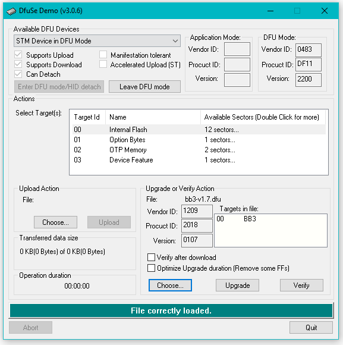
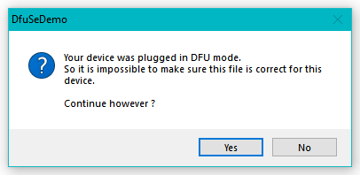
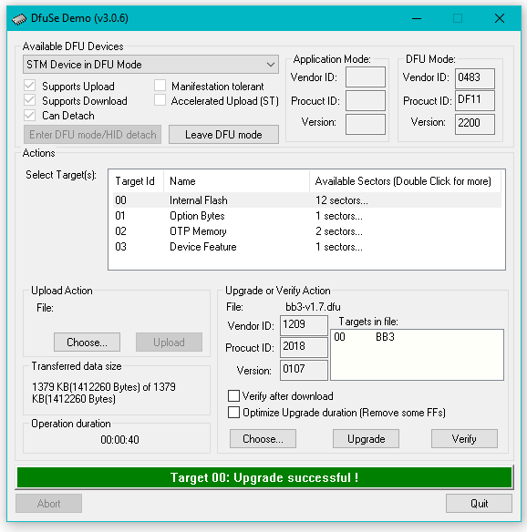
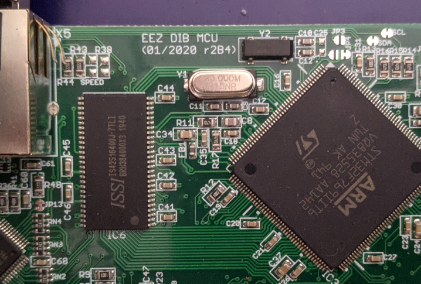

The Envos BenchBox 3 has some upgrades, and possible hardware modification due.

If like me, you bought your [BB3 via the Crowd Supply campaign](https://www.crowdsupply.com/envox/eez-bb3), 
you may wish to review [my ground safety modification notes](../envox-eez-bench-box-3-ground/).

There's been a recent flurry of [BB3 news](https://www.crowdsupply.com/envox/eez-bb3/updates/latest-firmware-1-7-released-and-a-note-for-two-channel-bb3-users), 
including an update to the firmware to [version 1.7](https://github.com/eez-open/modular-psu-firmware/releases/tag/1.7), 
as well as a potential [problem with R4 overheating](https://github.com/eez-open/modular-psu/issues/108).

[Instructions for upgrading the firmware](https://www.envox.eu/eez-bench-box-3/bb3-user-manual/13-firmware-upgrade/) can be found in the online manual.
I'm using the [STM DfuSe_Demo](https://www.st.com/en/development-tools/stsw-stm32080.html) and a USB Type A to mini-B cable (no hub).

The important part is step #4:

> _Turn power off using the power switch on the front panel and keep the BOOT0 switch pressed when power is turned on. The BOOT0 switch is located in the lower left corner of the front panel. If the BOOT0 switch has been pressed long enough, EEZ BB3 enters DFU mode and the existing firmware will be deactivated and the Welcome page will not be displayed. The cooling fan will stop spinning after few seconds._

There will likely be a warning:

I saw a success message!

Next, just power off, be sure to remove USB cable, wait a few seconds, and power back on.

Since I was upgrading from V1.4, I saw the "MCU Version is not available. Please choose:" message. 

> _If you got BB3 as a kit through a Crowd Supply crowdfunding campaign and the color of the MCU module PCB is green, choose r2B4 (the newer version of r3B3 has a PCB in blue)._

I chose the R2B4 via the touch screen. Oddly, the first time I selected it, the "Next" button did not highlight, I could not continue. I rebooted and it worked fine the second time.

There was a misunderstanding if I had the [problematic `r3B3` version](https://github.com/eez-open/modular-psu/issues/108#issuecomment-873639185)
or not. I confirmed I do have the `r3B3` AUX-PS PCBA (thanks [electrokean](https://github.com/eez-open/modular-psu/issues/108#issuecomment-873639501))
but the `r2B4` version of the EEZ DIB MCU board:

The [GitHub issue explicitly calls out 2 Mean Wells](https://github.com/eez-open/modular-psu/issues/108#issue-919579001) as being problematic.
I have 3 and did not see the overheating issue with R4.
