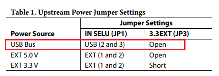
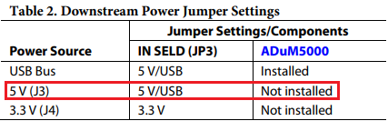
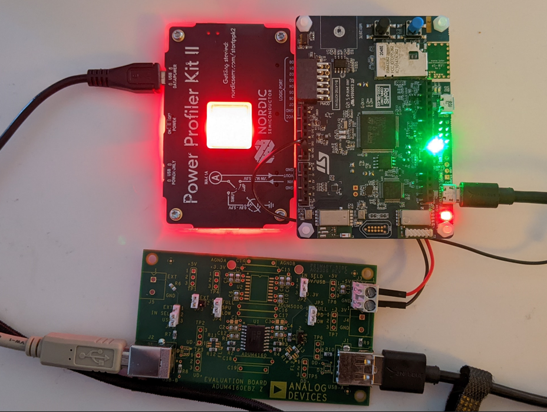
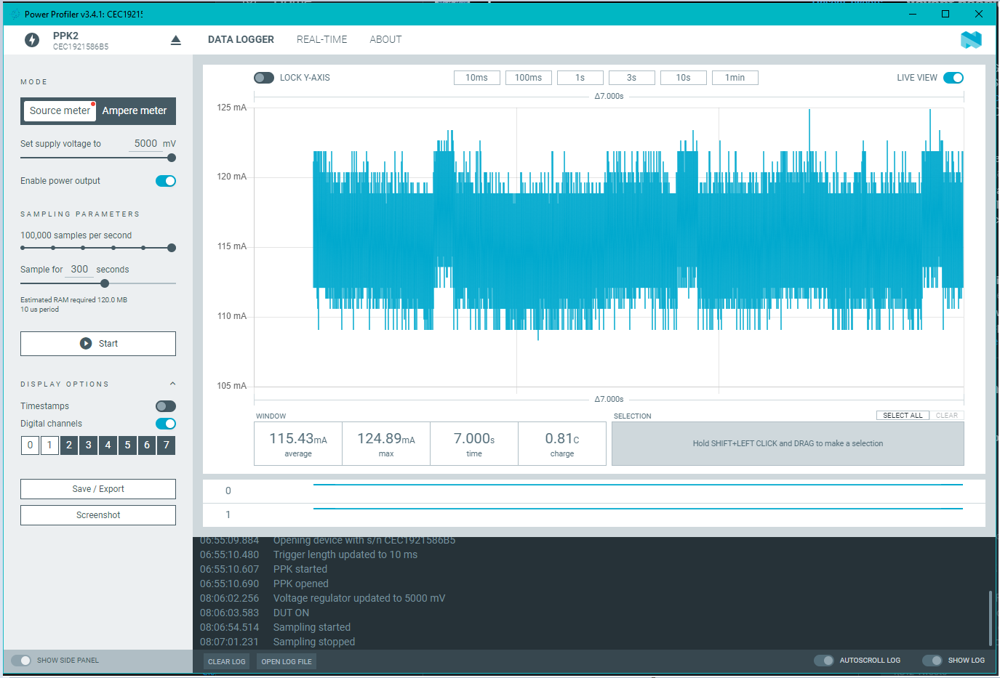

As part of my [homework](https://github.com/gojimmypi/IoT_BBQ/blob/main/Assignments/Exercise_10.md)
and [class project](https://github.com/gojimmypi/IoT_BBQ/blob/main/Assignments/Final_Project.md)
for the [Making Embedded Systems class](https://classpert.com/classpertx/courses/making-embedded-systems/cohort),
here are some of my notes on measuring the power consumption of my
[B-L475E-IOT01A Discovery Board](https://www.st.com/resource/en/user_manual/um2153-discovery-kit-for-iot-node-multichannel-communication-with-stm32l4-stmicroelectronics.pdf).

The [Nordic Power Profile Kit](https://www.nordicsemi.com/Products/Development-hardware/Power-Profiler-Kit-2)
works in one of two modes: either [Measuring current in Source Meter mode](https://infocenter.nordicsemi.com/index.jsp?topic=%2Fug_ppk2%2FUG%2Fppk%2Fmeasure_current_source_meter.html&cp=10_8_5_1)
or [Measuring current in Ampere Meter mode](https://infocenter.nordicsemi.com/index.jsp?topic=%2Fug_ppk2%2FUG%2Fppk%2Fmeasure_current_source_meter.html&anchor=concept_kkn_bwn_lnb__fig_yny_jn4_lnb).
I'm using it in source mode to power the isolated side of the [Analog Devices EVAL-ADUM4160 USB Development Board](https://www.analog.com/en/design-center/evaluation-hardware-and-software/evaluation-boards-kits/eval-adum4160.html).

The Upstream Power Jumper Settings for the USB Isolation board to be powered from USB:

The Downstream Power Jumper Settings do NOT have the ADuM5000 power isolation chip installed, and instead gets external power via `J3` Power Profiler `Vout` and `GND` as
shown on page 3 of the [UG-043 EVAL-ADuM4160EBZ User Guide](https://www.analog.com/media/en/technical-documentation/user-guides/eval-adum4160ebz-ug-043.pdf):

If you are interested in power analysis, there's also this [Otii Arc](https://www.qoitech.com/) to consider.

The first power profile for my app running on the board is shown here:

[nRF Connect for Desktop](https://www.nordicsemi.com/Products/Development-tools/nrf-connect-for-desktop)

[download](https://www.nordicsemi.com/Products/Development-tools/nRF-Connect-for-desktop/Download#infotabs)

[Power Profiler Kit v1.1.0 User Guide](https://infocenter.nordicsemi.com/pdf/PPK1_User_Guide_20210226.pdf)

More notes in progress...
