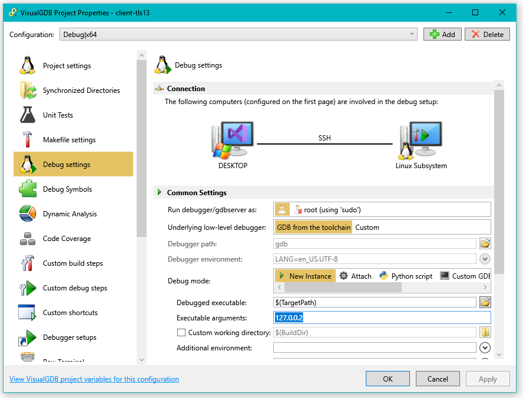
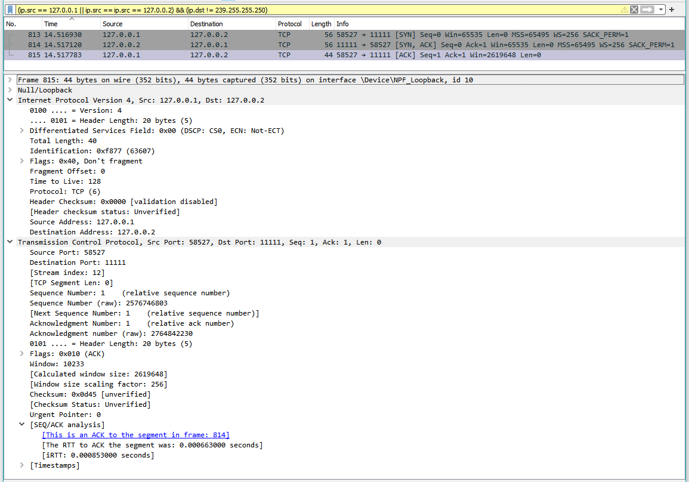
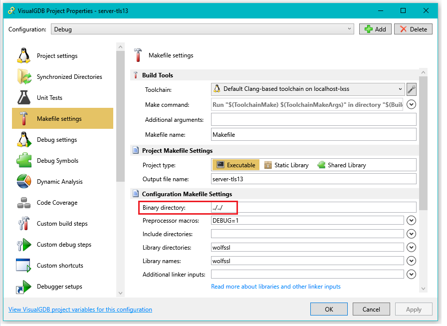
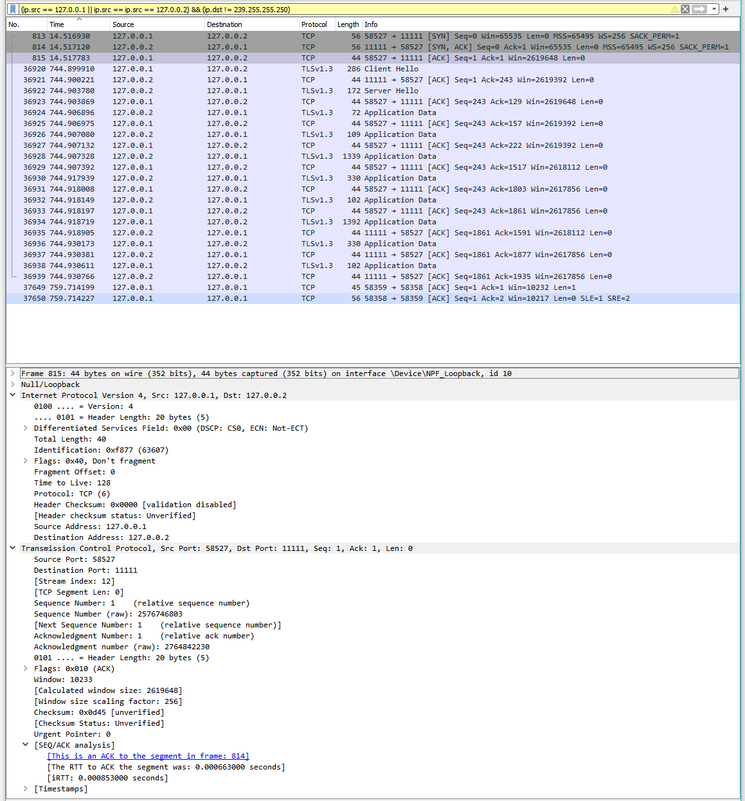
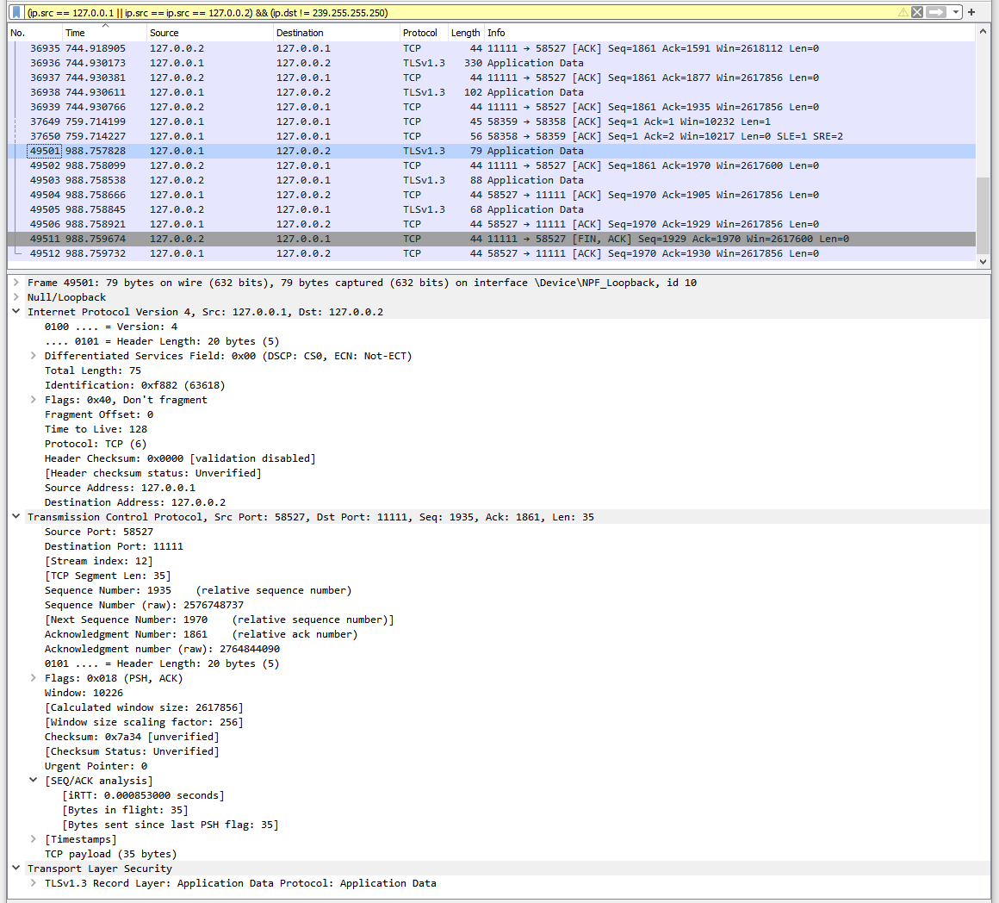
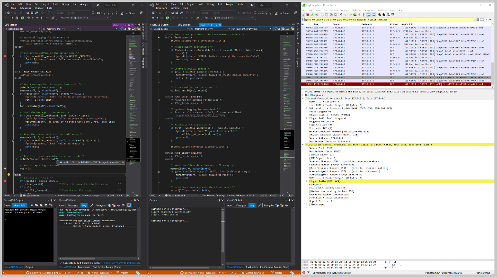

---
layout: post
title: "wolfSSL Single Step TLS1.3 Inspection with WireShark"
date: '2022-03-05'
author: gojimmypi
tags:
- WireShark
- wolfSSL
- WSL
- GDB
---

# Understanding TLS 1.3 connections with wolfSSL.

[wolfSSL](https://www.wolfssl.com/) is an open source, widely-used encryption library used to secure [billions of connections](https://www.wolfssl.com/docs/case-studies/#:~:text=Through%20use%20in%20games%2C%20databases,wolfSSL%20products%20are%20being%20used.).

This is a packet inspection exercise for one of the [wolfSSL examples](https://github.com/wolfSSL/wolfssl-examples), 
specifically the [client-tls13](https://github.com/wolfSSL/wolfssl-examples/blob/master/tls/client-tls13.c) 
and the [server-tls13](https://github.com/wolfSSL/wolfssl-examples/blob/master/tls/server-tls13.c).

The encryption libraries work on a variety of platforms. Here we will be using [Visual Studio 2019](https://visualstudio.microsoft.com/vs/older-downloads/) 
(on Windows) with the [VisualGDB extension](https://visualgdb.com/) debugging Linux code in [WSL](https://docs.microsoft.com/en-us/windows/wsl/).

First, the server app is started. It is [listening on all available local networks](https://github.com/wolfSSL/wolfssl-examples/blob/c85c7a115297f4ab60baab3ea56ea077d01dc1d9/tls/server-tls13.c#L167). 
One of those networks is of course home `127.0.0.0` and the server will assume itself to be at `127.0.0.1`.

Next, the client is started, single stepping for this exercise. The default parameter for the VisualGDB examples is an address also on the home network: `127.0.0.2`



When running WireShark, this filter could be useful to only look at interesting packets for this exercise:

```
(ip.src == 127.0.0.1 || ip.src == 127.0.0.2) && (ip.dst != 239.255.255.250)
```

The first client operation is this [initial opening of a socket](https://github.com/wolfSSL/wolfssl-examples/blob/c85c7a115297f4ab60baab3ea56ea077d01dc1d9/tls/client-tls13.c#L155):
```c
    /* Connect to the server */
    if ((ret = connect(sockfd, (struct sockaddr*) &servAddr, sizeof(servAddr))) == -1) {
```

Here we see the initial TCP [SYN], [SYN-ACK], and [ACK] packets from the above `connect()`:




For reference: the source code is in `wolfssl-examples\tls` and each of the VisualGDB projects are in separate subdirectories of `VisualGDB-tls`:

```
C:\workspace\wolfssl-examples>tree

├───certs
│   ├───1024
│   └───crl
├───tls
│   └───VisualGDB-tls
│       ├───client-tls13
│       │   ├───Debug
│       ├───server-tls13
│       │   └───Debug
```

Note that when using `make` to build the examples in place for Linux, there are [hard-coded file references](https://github.com/wolfSSL/wolfssl-examples/blob/c85c7a115297f4ab60baab3ea56ea077d01dc1d9/tls/client-tls13.c#L41) to refer to the adjacent [certs directory](https://github.com/wolfSSL/wolfssl-examples/tree/master/certs)
for some files. For example:

```
#define CERT_FILE "../certs/client-cert.pem"
#define KEY_FILE  "../certs/client-key.pem"
#define CA_FILE   "../certs/ca-cert.pem"
```

In order for VisualGDB to also build to that directory, we use `../../` for the `Binary Directory` setting instead of the default `Debug` or `Release` subdirectories.

NOTE: The `../../` directory will likely change, as the `clean` process does not work so well. Fortunately the celver folks at sysprogs
have a circuit breaker in place to help prevent shooting oneself in the foot. For more details, see the [PR Comment](https://github.com/wolfSSL/wolfssl-examples/pull/298).

```
make  CONFIG=Debug clean
rm -rf ../../
rm: refusing to remove '.' or '..' directory: skipping '../../'
make: *** [Makefile:238: clean] Error 1
```



There are [some setup steps for our secure channel](https://github.com/wolfSSL/wolfssl-examples/blob/c85c7a115297f4ab60baab3ea56ea077d01dc1d9/tls/client-tls13.c#L168), but no packets sent.

```
    /* Initialize wolfSSL */
    if ((ret = wolfSSL_Init()) != WOLFSSL_SUCCESS) {
        fprintf(stderr, "ERROR: Failed to initialize the library\n");
        goto exit;
    }

    /* Create and initialize WOLFSSL_CTX */
    if ((ctx = wolfSSL_CTX_new(wolfTLSv1_3_client_method())) == NULL) {
        fprintf(stderr, "ERROR: failed to create WOLFSSL_CTX\n");
        ret = -1; goto exit;
    }

    /* Load client certificate into WOLFSSL_CTX */
    if ((ret = wolfSSL_CTX_use_certificate_file(ctx, CERT_FILE, WOLFSSL_FILETYPE_PEM))
        != WOLFSSL_SUCCESS) {
        fprintf(stderr, "ERROR: failed to load %s, please check the file.\n",
                CERT_FILE);
        goto exit;
    }

    /* Load client key into WOLFSSL_CTX */
    if ((ret = wolfSSL_CTX_use_PrivateKey_file(ctx, KEY_FILE, WOLFSSL_FILETYPE_PEM))
        != WOLFSSL_SUCCESS) {
        fprintf(stderr, "ERROR: failed to load %s, please check the file.\n",
                KEY_FILE);
        goto exit;
    }

    /* Load CA certificate into WOLFSSL_CTX */
    if ((ret = wolfSSL_CTX_load_verify_locations(ctx, CA_FILE, NULL))
         != WOLFSSL_SUCCESS) {
        fprintf(stderr, "ERROR: failed to load %s, please check the file.\n",
                CA_FILE);
        goto exit;
    }

    /* Create a WOLFSSL object */
    if ((ssl = wolfSSL_new(ctx)) == NULL) {
        fprintf(stderr, "ERROR: failed to create WOLFSSL object\n");
        ret = -1; goto exit;
    }

    /* Attach wolfSSL to the socket */
    if ((ret = wolfSSL_set_fd(ssl, sockfd)) != WOLFSSL_SUCCESS) {
        fprintf(stderr, "ERROR: Failed to set the file descriptor\n");
        goto exit;
    }
```

Once everything is in order, we call `wolfSSL_connect()` to [connect to the server](https://github.com/wolfSSL/wolfssl-examples/blob/c85c7a115297f4ab60baab3ea56ea077d01dc1d9/tls/client-tls13.c#L226):

```c
    /* Connect to wolfSSL on the server side */
    if ((ret = wolfSSL_connect(ssl)) != WOLFSSL_SUCCESS))
```   

And we see the following TLS 1.3 packets exchanged to initially establish a secure connection:



After we have established an encrypted connection configured, we can [send data](https://github.com/wolfSSL/wolfssl-examples/blob/c85c7a115297f4ab60baab3ea56ea077d01dc1d9/tls/client-tls13.c#L245) via `wolfSSL_write()`:

```c
    /* Send the message to the server */
    if ((ret = wolfSSL_write(ssl, buff, len)) != len)
 ```

 

 Here are two instances of Visual Studio, side-by-side, single-step debugging each of the client (left) and server (middle) examples, with WireShark packets on the right:

 