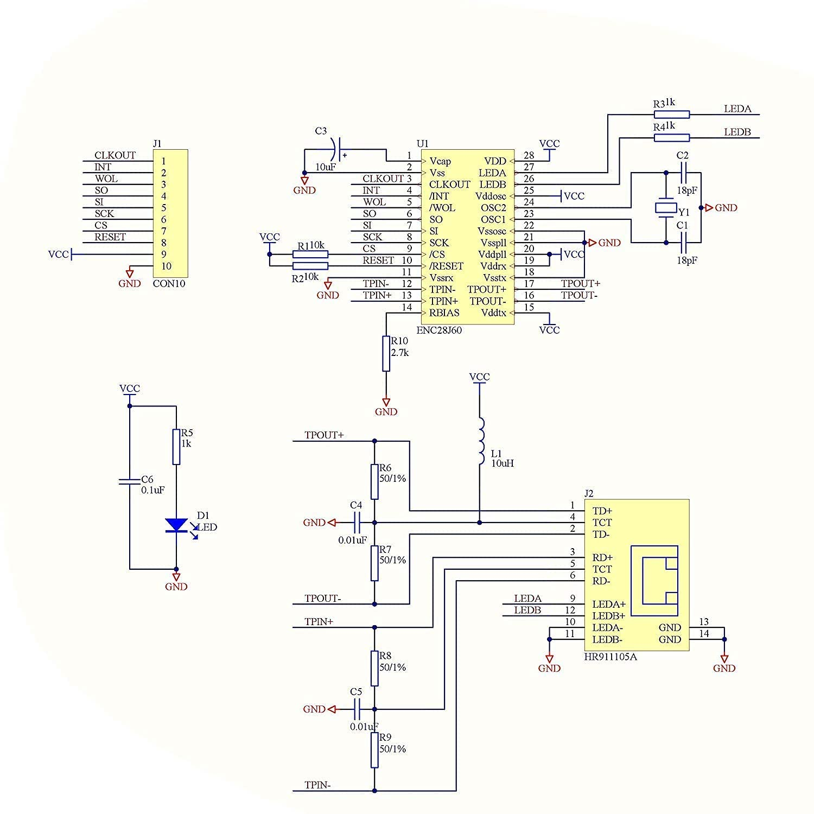
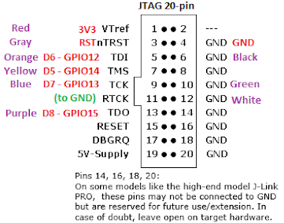

[wolfSSL install](https://github.com/wolfSSL/wolfssl/blob/master/INSTALL)

Some tips on hooking up wired-ethernet ENC28J60 to the ESP32.

I found this helpful review for the [Hiletgo Enc28j60 reseau LAN Ethernet Module on Amazon](https://www.amazon.fr/dp/B00WX1NRO0/):

>_MOSI on the board is ST (one would expect SI), the interrupt pin is LNT (again, INT is to be expected), there's a Q3 pin whose functionality is lost on me because the pinout on HiLetgo's schematic doesn't specify it, there's a second ground pin, and while the power pin specifies 5V, this board should not operate with a 5V input unless there's some unknown level shifter within the board._
_The main problem I had on startup was the unstable oscillator. I realized later that the power and ground pins on the PCB were shorted. As soon as I used the other ground on the board, the issue was solved and the chip operated as is specified on the datasheet. It's a really weird solution to a really simple problem that wouldn't happen had there been sufficient quality control._

See also the [Microchip ENC28J60 Data Sheet](http://ww1.microchip.com/downloads/en/devicedoc/39662c.pdf)

This [Hiletgo ENC28J60 schematic from Amazon](https://www.amazon.com/HiLetgo-ENC28J60-Ethernet-Network-Arduino/dp/B00WX1NRO0):


There are at least two different ENC28J60 boards, each with completely different pins and labeling. One is obvous, the other no so much.
Fortunately [gildas] posted [some useful information on the arduino site](https://forum.arduino.cc/t/wrong-ethernet-module-12-pins-on-enc28j60/261712/6)
, see also [njh/EtherCard](https://github.com/njh/EtherCard) regarding the second pinout:


| Arduino| ESP32    | alt name | label | label | alt name  |  ESP32 | arduino |
| :----: | :------: | :------: | :---: | :---: | :-------: | :----: | :-----: |
| 5V     | 5V       |   5V     |   5V  | GND   |   GND     | GND    |    GND  |
|        | GPIO4    |   INT    |  LNT  | CLK   |   ?       |   ?    |    ?    |
| Pin 12 | GPIO25   | SPI_MISO |   SO  | WOL   | WakeOnLan |        |         |
| Pin 13 | GPIO19   |  SCK     |  SCK  |  ST   |SI/SPI_MOSI| GPIO23 | Pin 11  |
|        |          | Reset    |  RST  |  CS   |  SPI_CS   | GPIO22 | Pin 10  |
|        | 3V3      |   3.3v   |   Q3  | GND   |   GND     |    GND |         |

Use _either_ 5V/GND *OR* Q3/GND (3.3v) - but not both!

Note active low pins:  <span style="text-decoration:overline">RESET</span>,
<span style="text-decoration:overline">CS</span>,  <span style="text-decoration:overline">INT</span>

## ESP32 JTAG Pinout Wiring
```
TDI  -> GPIO12
TCK  -> GPIO13
TMS  -> GPIO14
TDO  -> GPIO15
TRST -> EN / RST (Reset)
GND  -> GND
```



## ENC28J60 Pinout Wiring

From Espressif [Pin Assignment](https://github.com/espressif/esp-idf/tree/master/examples/ethernet/enc28j60#pin-assignment) example:

```
SPI_CLK   -> GPIO19
SPI_MOSI  -> GPIO23
SPI_MISO  -> GPIO25
SPI_CS    -> GPIO22
Interrupt -> GPIO4
```

<style>
    table {
        border: 2px;
        align-self:self-start;
    }
</style>

JTAG

|ESP32   |  Name  |  Pin  |  Pin  | Name  | ESP32 |
| :----: | :----: | :---: | :---: | :---: | :---: |
|  3v3   | VTref  |   1   |   2   |  NC   |  GND  |
| EN/RST | nTRST  |   3   |   4   |  GND  |  GND  |
| GPIO12 |  TDI   |   5   |   6   |  GND  |  GND  |
| GPIO14 |  TMS   |   7   |   8   |  GND  |  GND  |
| GPIO13 |  TCK   |   9   |  10   |  GND  |  GND  |
|   GND  |  RTCK  |  11   |  12   |  GND  |  GND  |
| GPIO15 |  TDO   |  13   |  14   | GND*  |   NC  |
|   NC   | RESET  |  15   |  16   | GND*  |   NC  |
|   NC   | DBGRQ  |  17   |  18   | GND*  |   NC  |
|   NC   | 5v out |  19   |  20   | GND*  |   NC  |

ENC28J60 Ethernet (flavor #1)

| GPIO   | ENC28J60    | Color  |
| ------ | ----------- |------- |
| GPIO19 | SPI_CLK     | gray   |
| GPIO23 | SPI_MOSI    | orange |
| GPIO25 | SPI_MISO    | yellow |
| GPIO22 | SPI_CS      | white  |
| GPIO4  | Interrupt   | brown  |

JTAG
```
TDI  -> GPIO12
TCK  -> GPIO13
TMS  -> GPIO14
TDO  -> GPIO15
TRST -> EN / RST (Reset)
GND  -> GND
```


Alternate JTAG

| name | color |
| ---- | ----- |
|  vt |    red |
| tdo |   purple |
| tck |  bkue |
| tms |  yellow |
| tdi |  orange |
| trst |  gray |
|  vt  |  red |

