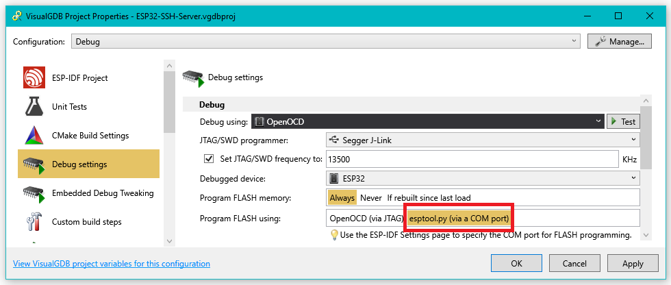
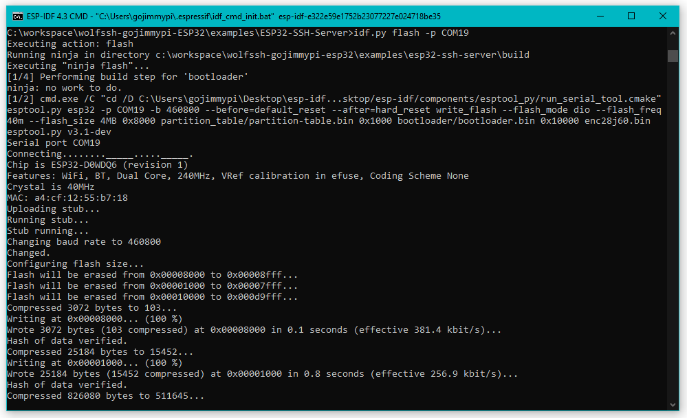
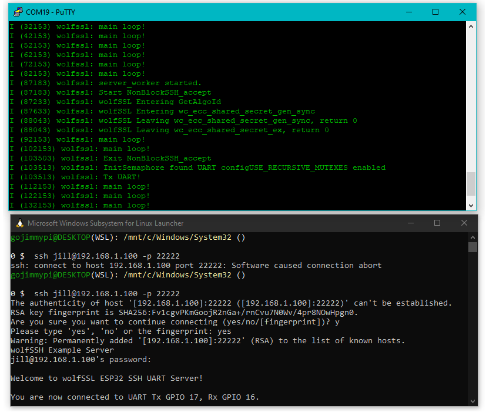
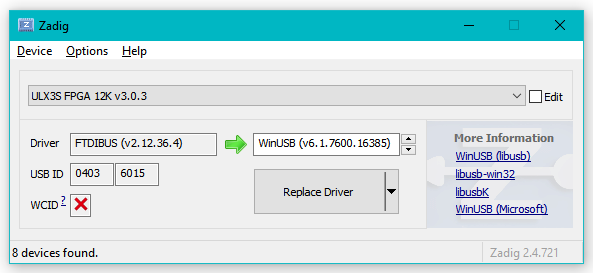
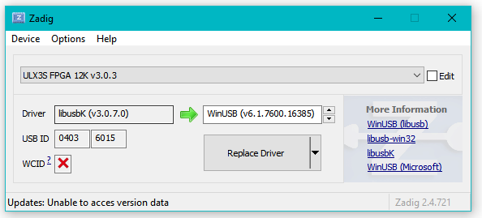
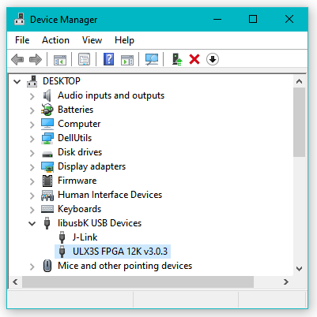

So you have a ULX3S and want to connect via SSH.

The [ULX3S](https://www.crowdsupply.com/radiona/ulx3s) is cool not only for being an impressively designed FPGA board with plenty of onboard peripherals, but also
because one of the "peripherals" is an [ESP32](https://www.espressif.com/en/products/socs/esp32)!

I [first heard](https://gojimmypi.github.io/ulx3s-day-1/) about Radiona back in 2019. In fact, I have [several blogs about the ULX3S](https://gojimmypi.github.io/tag/ulx3s/).

This isn't your typical ESP32 though. It sits _behind_ the FPGA. To use it, the FPGA needs to be configured. I have a [quick start](https://github.com/gojimmypi/ulx3s-examples/blob/master/VisualMicro/README.md)
that does just that. I have a [precompiled binary FPGA image](https://github.com/gojimmypi/ulx3s-examples/blob/master/bin/passthru.bit) for the 12F, 
or there are [other specific versions available](https://github.com/ulx3s/ulx3s-bin/tree/master/fpga/passthru) depending on the ECP5 size. 
The only other thing needed is an app such as [fujprog](https://github.com/kost/fujprog). There are [other releases](https://github.com/kost/fujprog/releases) 
avilable for download if you don't want to bake your own cake.

Reminder we can call an Windows executable from WSL:


```bash
wget https://github.com/kost/fujprog/releases/download/v4.8/fujprog-v48-win64.exe
wget https://github.com/emard/ulx3s-bin/raw/master/fpga/passthru/passthru-v20-85f/ulx3s_85f_passthru.bit
./fujprog-v48-win64.exe ulx3s_85f_passthru.bit
```

Upon successful program this is a typical output:

```
0 $  ./fujprog-v48-win64.exe ulx3s_85f_passthru.bit
ULX2S / ULX3S JTAG programmer v4.8 (git 96ebb45 built Oct  7 2020 22:42:00)
Copyright (C) Marko Zec, EMARD, gojimmypi, kost and contributors
Using USB cable: ULX3S FPGA 12K v3.0.3
Programming: 100%
Completed in 10.97 seconds.
```
Once the FPGA has been configured with the passthru code, the ESP32 can be accessed as if it were connected directly to the USB port.

I'm using the [VisualGDB](https://visualgdb.com/) extension for Visual Studio, so I needed to change the `Program FLASH Using` setting to `esptool.py (via COM port)`.



Next, I have the [wolfSSL ESP32 SSH Server](https://github.com/gojimmypi/wolfssh/tree/ESP32_Development/examples/ESP32-SSH-Server) project in the works.

Just compile and upload. Connect to the ULX3S COM port to see diagnostic messages (don't forget to close putty when programming!). 

The [ESP-IDF](https://docs.espressif.com/projects/esp-idf/en/latest/esp32/get-started/index.html) also of course works (VisualGDB is a nice front end, but still used ESP-IDF).
In my case, the ULX3S is on COM19

```
idf.py flash -p COM19
```

Programming from the ESP-IDF should looks something like this:



Upon success, the diagnostic messages will be output to the COM port, and the SSH server can be accessed from anywhere on your nextwork:



Login from WSL. The default password for `jill` is `upthehill`:


```bash
ssh jill@192.168.1.100 -p 22222
```

## SSH to UART

I next need to see which ESP32 GPIO pins are immediately accessible on the ULX3S. The the SSH server on the ULX3S will be able to 
[connect to a UART via wolfSSH](https://twitter.com/gojimmypi/status/1514049174840360963?s=20&t=QBljwHfdYYIivb82zy9G7Q).

<br />

## Troubleshooting

When uploading FPGA binary files, the FTDI drivers should make the device appear as a COM port in Windows.
If there's an error `Cannot find JTAG cable`: Make sure to use the USB cable connected to the FTDI (the connector opposite the SD card) 
and [USING THE FTDI](https://github.com/gojimmypi/f32c_tools/tree/master/ujprog#change-ulx3s-driver-to-ftdi) Drivers, available for [download from ftdichip](https://www.ftdichip.com/Drivers/D2XX.htm). 

```
ULX2S / ULX3S JTAG programmer v4.8 (git 96ebb45 built Oct  7 2020 22:42:00)
Copyright (C) Marko Zec, EMARD, gojimmypi, kost and contributors
FT_Open() failed
Cannot find JTAG cable.
```

This is what Zadig looks like with a happy ULX3S ready for FPGA bitstream upload:




### OpenOCD

Reminder to instead use OpenOCD with the ULX3S, the `libusbK` drivers are needed:

Zadig is your friend. See also [details for ICE40](https://gojimmypi.github.io/ice40-fpga-programming-with-wsl-and/) and
[Programming FPGA Devices from WSL](https://gojimmypi.github.io/programming-fpga-devices-from-wsl/). 


Just replace the default drivers with `libusbK`:



Windows users make sure the ULX3S is listed under the `libusbK USB Devices` in Device Manager:



