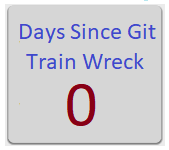
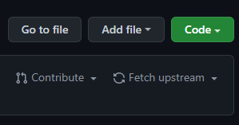
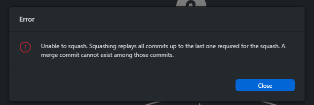
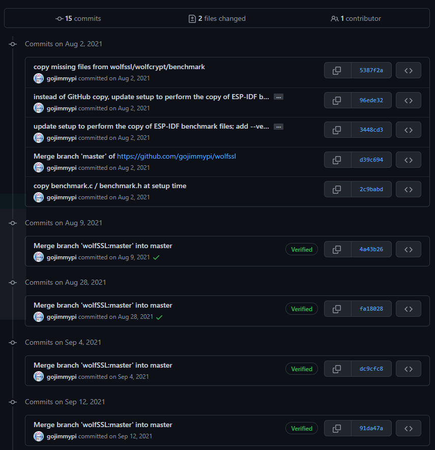
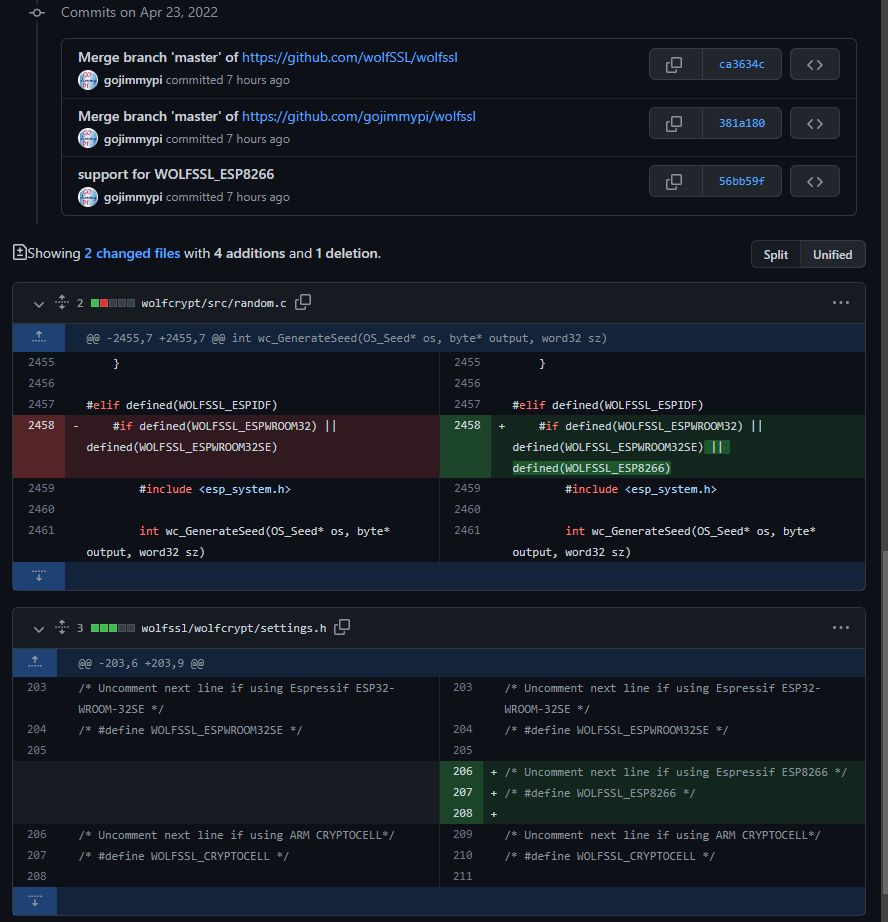

When things go really sideways and the GitHub master branch of a fork is so terribly messed up and the changes are not even desired,
there's hope!

TL;DR  
- Keep the forked `master` (preferably named `main`) branch clean from incremental merge or update commits, so that these instructions are not needed.
- Create a separate branch for each commit to upstream.
- Don't use the web `fetch upstream` button.
- BACKUP your local GitHub repo before doing enything presented here. 



How I got into this mess: some time ago, I had forked a repo. No big deal. Occasionally I would keep my fork updated by clicking the `Fetch upstream`
button on the GitHub web site:



Don't do this!!

The problem with doing the `fetch upstream` is that it adds that to your commit history. No big deal right? As that's actually part of, well, the history.
The issue is when you want to _contribute_ to that upstream repo, and the maintainers politely and expectedly ask to "please squash your commits". Easy enough?
Nope. If there are merge commits and you try to squash, GitHub gives an [error](https://twitter.com/gojimmypi/status/1512176504809029644?s=20&t=1tSWq6ZXbb7DjQm-qjem4A):



Now what?

The first time this happened, I was able to reset the head and fetch from the upstream repo without _too_ much problem. Easily said, it actually took
quite some time.

So when I encountered what seemed to be the same problem, I tried the same solution. No joy. It was a much longer period of time with messages and commits, and
a total of 15 commits that were simply impossible to squash. So I tried to fix it. Here's what I started with:



The ironic thing is I actually only wanted to make 2 tiny changes to two files:



My attempts to "fix" that didn't go so well. I ended up with _over a thousand_ [commits that I didn't want](https://github.com/gojimmypi/wolfssl/commits/master_test).
Somehow my name ended up associated with ALL of the commits from the point I tried to undo. from way back last summer. sigh.

The most radical `git --untangle-mess` I've ever done was to _replace_ the entire main (master) branch with the upstream contents.
Once again, SO to the rescue: [How to replace master branch in Git, entirely, from another branch](https://stackoverflow.com/questions/2862590/how-to-replace-master-branch-in-git-entirely-from-another-branch) - the 
second answer, using `git branch -m`, but checking out the upstream master:

*DANGER*: This completely wipes out the master branch and does a forced push. Use with caution!

MAKE A BACKUP BEFORE PROCEEDING

Configure your `upstream` to point to the upstream repo where you forked from:


```bash
git remote add upstream https://github.com/user/upstream_repo.git
git fetch upstream
```

*DANGER*: Replace the master branch from upstream:


```bash
# you should be starting with a fresh git clone on the master branch

# checkout the upstream master
git checkout upstream/master

# create and switch to a branch called newmaster
git switch -c newmaster

# set the upstream origin to new master
git push --set-upstream origin newmaster

# move the master branch to oldmaster
git branch -m master oldmaster1

# move the new master (the checkout from upstread) to master
git branch -m newmaster master

# force push these changes
git push -f origin master
```

in the future, to refresh your fork with the upstream master


```
git fetch upstream
git pull upstream master

```

_Hopefully_ this will work for others. It did for me. I'll never again work on anything but my own branches. Lesson learned.

In the end, I did finally create my [clean PR](https://github.com/wolfSSL/wolfssl/pull/5077).

```
git commit --amend --author="gojimmypi <jim@wolfssl.com>"
```


## Resources, Inspiration, Credits, and Other Links

- [git rebase docs](https://git-scm.com/docs/git-rebase)
- `git rebase` and `git reset` ideas: [Squash my last X commits together using Git](https://stackoverflow.com/questions/5189560/squash-my-last-x-commits-together-using-git)
- more on  `git rebase` and `git reset`: [Delete commits from a branch in Git](https://stackoverflow.com/questions/1338728/delete-commits-from-a-branch-in-git)
- still more `git rebase` and `git reset`: [How to permanently remove few commits from remote branch](https://stackoverflow.com/questions/3293531/how-to-permanently-remove-few-commits-from-remote-branch)
- [Overwrite everything in master with another branch in git](https://stackoverflow.com/questions/29870328/overwrite-everything-in-master-with-another-branch-in-git)
- [Clean up a fork and restart it from the upstream](https://stackoverflow.com/questions/9646167/clean-up-a-fork-and-restart-it-from-the-upstream)
- [Change author of commit](https://www.git-tower.com/learn/git/faq/change-author-name-email)
- gojimmypi [Keeping a fork up to date](https://gist.github.com/gojimmypi/b281469dcbe9e6d8efd00be7ce18d222)
