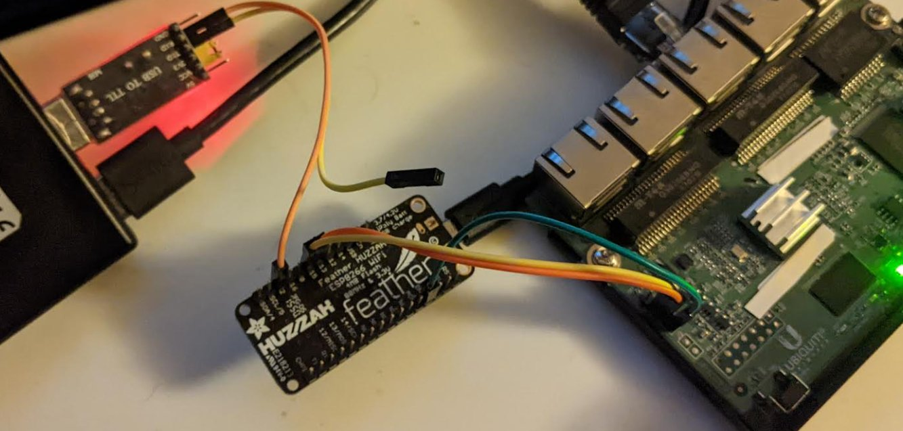
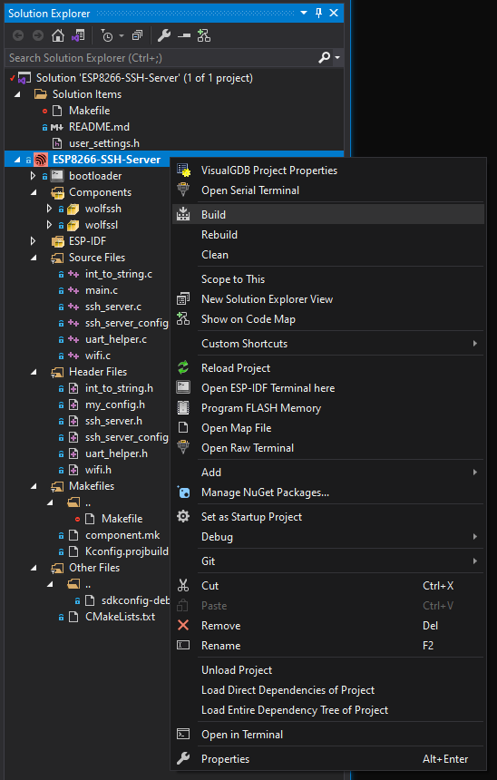

Create an embedded UART SSH Server on the Adafruit Huzzah ESP8266. Securely connect to Tx/Rx pins from 
your network. See also the [ESP32 SSH Server](../SSH-to-ULX3S-ESP32/) project.



The challenge here was although there are 3 hardware UARTs on the ESP8266, only 2 can be active and usuable at any given time. 
Of the 2 active UARTs, only one can have both Tx and Rx. Only UART0 and UART2 have both Tx and Rx.
UART1 can only transmit. There's no `RXD1`.

| Actual UART | Name  |      Tx        |      Rx         |
|--------------------------------------------------------|
| UART #0     | UART0 | TXD0 = GPIO  1 | RXD0 = GPIO   3 |
| UART #1     | UART1 | TXD1 = GPIO  2 |      N/A        |
| UART #2     | UART0 | TXD2 = GPIO 15 | RXD2 = GPIO 13  |

The USB port is normally connected to UART0.

So we need _two_ UART swaps: one to configure the console output prior to compile, another at runtime.

`UART #0` can be swapped with `UART #2` by using `uart_enable_swap();` _after_ initialization:



```c
    // Configure parameters of an UART driver,
    // communication pins and install the driver
    uart_config_t uart_config = {
        .baud_rate = BAUD_RATE,
        .data_bits = UART_DATA_8_BITS,
        .parity = UART_PARITY_DISABLE,
        .stop_bits = UART_STOP_BITS_1,
        .flow_ctrl = UART_HW_FLOWCTRL_DISABLE
    };
    uart_param_config(UART_NUM_0, &uart_config);

    /* Install UART driver, and get the queue. */
    uart_driver_install(UART_NUM_0, BUF_SIZE * 2, BUF_SIZE * 2, 100, &uart0_queue, 0);

    /* swap GPIO pins 1,3 with 15,13 */
    uart_enable_swap();
```
Note that after the swap, `UART #2` will still be known as `UART0` in code! The difference is now
`UART0` will be using _different pins_.

When swapping `UART #0` and `UART #2`, in our case, we _don't_ want the USB traffic to be seen on the 
external UART for our SSH Server. But we _do_ want to be able to see diagnostic messages that 
are normally viewed on the USB port. The ESPLOG default output is configured with the ESP-IDF `make menuconfig`

The issue is the second UART only has Tx pin available as [confirmed on ESP8266 forum](https://www.esp8266.com/viewtopic.php?p=2173).

It is important that `GPIO15` is not pulled high at boot time.
If the target Tx pin is pulled high, or the Tx/Rx pins are reversed, the ESP8266 will not boot properly. 

## Building

The [project](https://github.com/gojimmypi/wolfssh/blob/ESP8266_Development/examples/ESP8266-SSH-Server/ESP8266-SSH-Server.vgdbproj) was developed in Visual Studio with the VisualGDB extension.
Just open the solution file in the [examples/ESP8266-SSH-Server](https://github.com/gojimmypi/wolfssh/tree/ESP8266_Development/examples/ESP8266-SSH-Server) directory. 
Right-click the project and "Build...":



Alternatively, the code can be built via the [RTOS ESP-IDF for ESP8266](https://docs.espressif.com/projects/esp8266-rtos-sdk/en/latest/get-started/index.html)

## ESP8266 Toolchain

Install the latest [ESP8266 Toolchain](https://docs.espressif.com/projects/esp8266-rtos-sdk/en/latest/get-started/windows-setup.html).

To use a dual Windows/Linux (WSL) consider a shared directory such as `C:\ESP8288\esp\`
which would be `/mnt/c/ESP8266/esp/` in WSL.

Note there may be an old version of wolfSSL in `ESP8266_RTOS_SDK\components\esp-wolfssl` that should be deleted.



```bash
mkdir -p /mnt/c/ESP8266/esp/
cd /mnt/c/ESP8266/esp/
git clone --recursive https://github.com/espressif/ESP8266_RTOS_SDK.git
export IDF_PATH="/mnt/c/ESP8266/esp/ESP8266_RTOS_SDK/"

# Optional section if python pip needs to be installed
# see https://pip.pypa.io/en/stable/installation/
wget  https://bootstrap.pypa.io/get-pip.py

# or for Python 2.7
# wget https://bootstrap.pypa.io/pip/2.7/get-pip.py 

# install pip if needed
python -m pip install --user -r $IDF_PATH/requirements.txt

# download the Espressif xtensa compiler
curl --output xtensa-lx106-elf-gcc8_4_0-esp-2020r3-linux-amd64.tar.gz https://dl.espressif.com/dl/xtensa-lx106-elf-gcc8_4_0-esp-2020r3-linux-amd64.tar.gz

# unzip Espressif xtensa compiler
tar -xzf xtensa-lx106-elf-gcc8_4_0-esp-2020r3-linux-amd64.tar.gz

# tell the environment where to find the xtensa compiler
export PATH="$PATH:/mnt/c/ESP8266/esp/xtensa-lx106-elf/bin"

# delete the old version of wolfSSL
rm -r ./ESP8266_RTOS_SDK/components/esp-wolfssl
```

## Quick Start

For convenience ONLY, there's a [static copy of wolfSSL components](https://github.com/gojimmypi/wolfssh/tree/ESP8266_Development/examples/Espressif-component-static).

DO NOT USE those static components for anythin other than this demo. To ensure proper security,

WSL Quick Start, use the [ESPPORT](https://github.com/espressif/esp-idf/issues/1026#issuecomment-331307660) with make:


```
cd /mnt/c/workspace/
git clone https://github.com/gojimmypi/wolfssh.git
cd ./wolfssh
git checkout ESP8266_Development
cd ./examples/ESP8266-SSH-Server

# Reminder that WSL USB devices are called /dev/ttySNN and not /dev/TTYUSBn
# For example, on Windows, COM15 is ttyS15 in WSL
make flash ESPPORT=/dev/ttyS15
```

BUT Note that there's a STALE version of the wolfSSL component for convenience only!
For proper security, the mosst recent code should always be used:


```bash

# fetch the ESP8266-SSH-Server example
cd /mnt/c/workspace
git clone https://github.com/gojimmypi/wolfssh/tree/ESP8266_Development/examples/ESP8266-SSH-Server

cd /mnt/c/workspace/wolfSSH/examples/ESP8266-SSH-Server

# optional; existing settings should be appropriate
# make menuconfig

make

```

It is important to ensure the ESP8266 console is NOT routed to `UART0` (the default). The [sdkconfig](https://github.com/gojimmypi/wolfssh/blob/ESP8266_Development/examples/ESP8266-SSH-Server/sdkconfig)
for the command-line ESP-IDF, and the [VisualGDB config](https://github.com/gojimmypi/wolfssh/blob/ESP8266_Development/examples/ESP8266-SSH-Server/ESP8266-SSH-Server.vgdbproj) are already setup to do this.

To manually check, use `make menuconfig`:

```
Component config --->
    ESP8266-specific --->
       UART for console output ---> Custom
       UART peripheral to use for console output(0-1) ---> (UART1)
```
or in some cases:

```
Common ESP-related --->
     UART for console output (Custom)  ---> Custom
     UART peripheral to use for console output (0-1) --->(UART1) 
```

See also:

[use UART1 for log output](https://github.com/espressif/ESP8266_RTOS_SDK/issues/633).

[esp_err_t uart_enable_swap(void)](https://docs.espressif.com/projects/esp8266-rtos-sdk/en/latest/api-reference/peripherals/uart.html#_CPPv416uart_enable_swapv)

[plieningerweb's soft UART](https://github.com/plieningerweb/esp8266-software-uart)


## Troubleshooting

### could not open port 'COM[n]': WindowsError(5, 'Access is denied.')

An error like this, although intimidating and long, typically means something else is using the 
COM port. Check for running instances of Putty, etc. 

```
esptool.py v2.4.0
Flashing binaries to serial port COM15 (app at offset 0x10000)...
esptool.py v2.4.0
Traceback (most recent call last):
  File "C:/SysGCC/esp8266/rtos-sdk/v3.4/components/esptool_py/esptool/esptool.py", line 3035, in <module>
    _main()
  File "C:/SysGCC/esp8266/rtos-sdk/v3.4/components/esptool_py/esptool/esptool.py", line 3028, in _main
    main()
  File "C:/SysGCC/esp8266/rtos-sdk/v3.4/components/esptool_py/esptool/esptool.py", line 2736, in main
    esp = chip_class(args.port, initial_baud, args.trace)
  File "C:/SysGCC/esp8266/rtos-sdk/v3.4/components/esptool_py/esptool/esptool.py", line 212, in __init__
    self._port = serial.serial_for_url(port)
  File "C:/SysGCC/esp8266/mingw32/lib/python2.7/site-packages/serial/__init__.py", line 88, in serial_for_url
    instance.open()
  File "C:/SysGCC/esp8266/mingw32/lib/python2.7/site-packages/serial/serialwin32.py", line 62, in open
    raise SerialException("could not open port {!r}: {!r}".format(self.portstr, ctypes.WinError()))
serial.serialutil.SerialException: could not open port 'COM15': WindowsError(5, 'Access is denied.')
make: *** [/rtos-sdk/v3.4/components/esptool_py/Makefile.projbuild:76: flash] Error 1
--------------------------
Command exited with code 2
```

### fatal error: wolfssl/options.h: No such file or directory

If a olfSSL not found error like this is encountered:
```
In file included from /mnt/c/workspace/wolfssh-gojimmypi-ESP32/examples/ESP8266-SSH-Server/main/uart_helper.c:27:
/mnt/c/workspace/wolfssh-gojimmypi-ESP32/examples/ESP8266-SSH-Server/main/ssh_server.h:41:10: fatal error: wolfssl/options.h: No such file or directory
 #include <wolfssl/options.h>
          ^~~~~~~~~~~~~~~~~~~
compilation terminated.
make[1]: *** [/mnt/c/ESP8266/esp/ESP8266_RTOS_SDK/make/component_wrapper.mk:292: uart_helper.o] Error 1
make: *** [/mnt/c/ESP8266/esp/ESP8266_RTOS_SDK//make/project.mk:571: component-main-build] Error 2
```

Be sure to install both the [wolfSSL](https://github.com/wolfSSL/wolfssl/tree/master/IDE/Espressif/ESP-IDF) 
and [wolfSSH](https://github.com/gojimmypi/wolfssh/tree/ESP8266_Development/ide/Espressif/ESP-IDF) components.
For example, into: `C:\ESP8266\esp\ESP8266_RTOS_SDK\components`. Be sure to install wolfSSL 
component first.


```batch
c:
cd C:\workspace\wolfssl-gojimmypi\IDE\Espressif\ESP-IDF
.\setup_win.bat C:\ESP8266\esp\ESP8266_RTOS_SDK\


c:
cd C:\workspace\wolfssh-gojimmypi-ESP32\ide\Espressif\ESP-IDF

.\setup_win.bat C:\ESP8266\esp\ESP8266_RTOS_SDK\
```

Or, if you are using the VisualGDB extension for Visual Studio and want to compile 
from WSL command-line:


```
.\setup_win.bat  C:\SysGCC\esp8266\rtos-sdk\v3.4
```

### Where is the wolfSSL config file?

As noted in [wolfssl/pull/5077](https://github.com/wolfSSL/wolfssl/pull/5077#discussion_r859922235):

The method of uncommenting a line in `settings.h` is outdated. 
Most people use `user_settings.h` / `WOLFSSL_USER_SETTINGS` or `./configure CFLAGS="-DFLAG"` now.

The `user_settings.h` is typically found in `components\wolfssl\include`

###  fatal error: soc/dport_reg.h: No such file or directory

An error such as this in `esp32-crypt.h`:

```
/mnt/c/ESP8266/esp/ESP8266_RTOS_SDK/components/wolfssh/wolfssl/wolfcrypt/port/Espressif/esp32-crypt.h:38:10: fatal error: soc/dport_reg.h: No such file or directory
 #include "soc/dport_reg.h"
          ^~~~~~~~~~~~~~~~~
compilation terminated.
make[1]: *** [/mnt/c/ESP8266/esp/ESP8266_RTOS_SDK/make/component_wrapper.mk:292: main.o] Error 1
make: *** [/mnt/c/ESP8266/esp/ESP8266_RTOS_SDK//make/project.mk:571: component-main-build] Error 2
```
This error indicates the wrong target device is selected (ESP8266 needed vs ESP32 found )

Check your config.


## Other Stuff

There's this [junhuanchen/esp-idf-software-serial](https://github.com/junhuanchen/esp-idf-software-serial/blob/master/main.c) with these compile errors:

```
Severity Description                                                                                 Project          File                                                              Line
Error    implicit declaration of function 'gpio_pad_select_gpio'; did you mean 'gpio_set_direction'? EmbeddedProject9 C:\Users\gojimmypi\source\repos\EmbeddedProject9\main\sw_serial.h 39  
Error    implicit declaration of function 'esp_cpu_get_ccount'; did you mean 'soc_get_ccount'?       EmbeddedProject9 C:\Users\gojimmypi\source\repos\EmbeddedProject9\main\sw_serial.h 69  
Error    unknown type name 'portMUX_TYPE'; did you mean 'portBASE_TYPE'?                             EmbeddedProject9 C:\Users\gojimmypi\source\repos\EmbeddedProject9\main\sw_serial.h 81  
Error    'portMUX_INITIALIZER_UNLOCKED' undeclared (first use in this function)                      EmbeddedProject9 C:\Users\gojimmypi\source\repos\EmbeddedProject9\main\sw_serial.h 81  
Error    macro "portENTER_CRITICAL" passed 1 arguments, but takes just 0                             EmbeddedProject9 C:\Users\gojimmypi\source\repos\EmbeddedProject9\main\sw_serial.h 82  
Error    'portENTER_CRITICAL' undeclared (first use in this function)                                EmbeddedProject9 C:\Users\gojimmypi\source\repos\EmbeddedProject9\main\sw_serial.h 82  
Error    macro "portEXIT_CRITICAL" passed 1 arguments, but takes just 0                              EmbeddedProject9 C:\Users\gojimmypi\source\repos\EmbeddedProject9\main\sw_serial.h 113 
Error    'portEXIT_CRITICAL' undeclared (first use in this function)                                 EmbeddedProject9 C:\Users\gojimmypi\source\repos\EmbeddedProject9\main\sw_serial.h 113 
Error    unknown type name 'portMUX_TYPE'; did you mean 'portBASE_TYPE'?                             EmbeddedProject9 C:\Users\gojimmypi\source\repos\EmbeddedProject9\main\sw_serial.h 142 
Error    'portMUX_INITIALIZER_UNLOCKED' undeclared (first use in this function)                      EmbeddedProject9 C:\Users\gojimmypi\source\repos\EmbeddedProject9\main\sw_serial.h 142 
Error    macro "portENTER_CRITICAL" passed 1 arguments, but takes just 0                             EmbeddedProject9 C:\Users\gojimmypi\source\repos\EmbeddedProject9\main\sw_serial.h 143 
Error    'portENTER_CRITICAL' undeclared (first use in this function)                                EmbeddedProject9 C:\Users\gojimmypi\source\repos\EmbeddedProject9\main\sw_serial.h 143 
Error    macro "portEXIT_CRITICAL" passed 1 arguments, but takes just 0                              EmbeddedProject9 C:\Users\gojimmypi\source\repos\EmbeddedProject9\main\sw_serial.h 162 
Error    'portEXIT_CRITICAL' undeclared (first use in this function)                                 EmbeddedProject9 C:\Users\gojimmypi\source\repos\EmbeddedProject9\main\sw_serial.h 162 
Error    unknown type name 'wSerial'; did you mean 'SwSerial'?                                       EmbeddedProject9 C:\Users\gojimmypi\source\repos\EmbeddedProject9\main\main.c      156 
```

## Resources, Inspiration, Credits, and Other Links

- Adafruit [Feather HUZZAH with ESP8266](https://www.adafruit.com/product/2821)
- Adafruit [Huzzah ESP8266 Pinout v1.2](https://learn.adafruit.com/assets/46249)
- Espressif [ESP8266 Technical Reference](https://www.espressif.com/sites/default/files/documentation/esp8266-technical_reference_en.pdf)
- Espressif GitHub [ESP8266_RTOS_SDK](https://github.com/espressif/ESP8266_RTOS_SDK/tree/master)
- ESP8266 forum [Second UART](https://www.esp8266.com/viewtopic.php?p=2173)
- Espressif [FAQ UART0 and UART1](https://github.com/espressif/esp-faq/blob/master/docs/en/software-framework/peripherals.rst#when-using-esp8266-i-want-to-use-uart0-exclusively-for-downloading-and-then-use-uart1-to-communicate-with-other-chips-can-gpio4-and-gpio5-be-configured-as-uart1-serial-ports)
- GitHub [ESP8266_RTOS_SDK issue 667, example](https://github.com/espressif/ESP8266_RTOS_SDK/issues/667#issuecomment-517883651)
- Docs [ESP8266 RTOS SDK Programming Guide - UART](https://docs.espressif.com/projects/esp8266-rtos-sdk/en/latest/api-reference/peripherals/uart.html)
- GitHub [ESP8266_RTOS_SDK/components/esp8266/driver/uart.c](https://github.com/espressif/ESP8266_RTOS_SDK/blob/master/components/esp8266/driver/uart.c)
- Arduino [esp8266 serial notes](https://github.com/esp8266/Arduino/blob/master/doc/reference.rst#serial)
- VisualGDB [Debugging ESP8266 firmware with the UART GDB Stub](https://visualgdb.com/tutorials/esp8266/gdbstub/)
- GitHub [ESP8266_RTOS_SDK/components/esp8266/driver/gpio.c](https://github.com/espressif/ESP8266_RTOS_SDK/blob/release/v3.4/components/esp8266/driver/gpio.c)
- Non-Arduino [plieningerweb/esp8266-software-uart](https://github.com/plieningerweb/esp8266-software-uart/blob/master/softuart/softuart.c)
- Arduino GitHub issue [Enabling UART2 for the NodeMCU?](https://github.com/esp8266/Arduino/issues/482)

