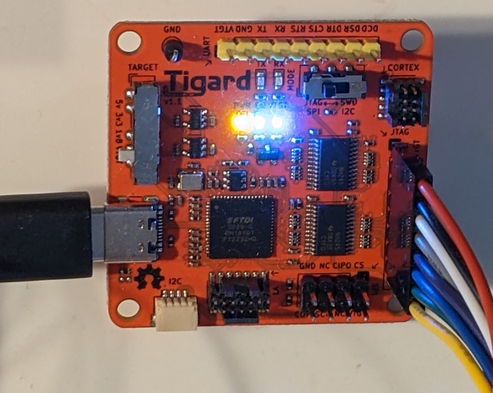
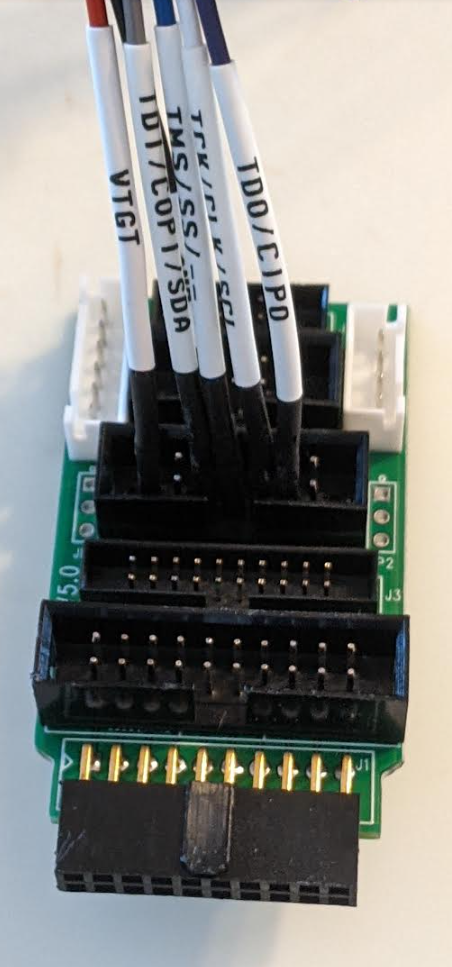
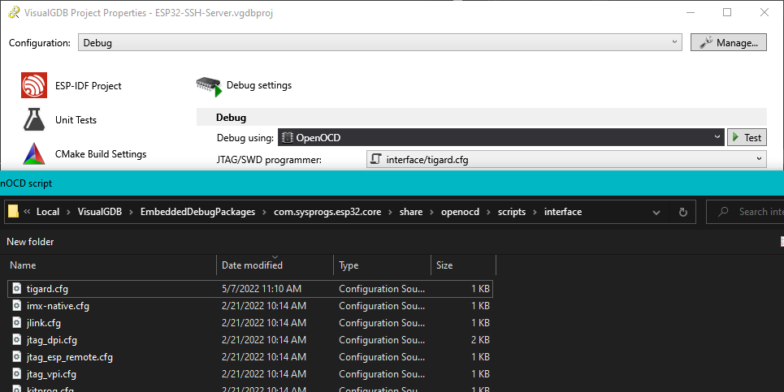
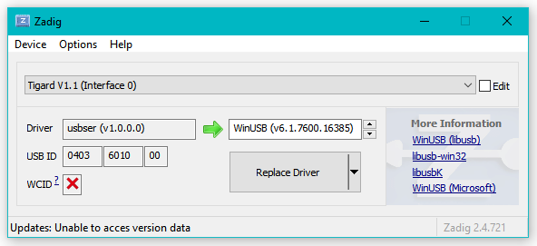
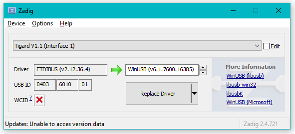
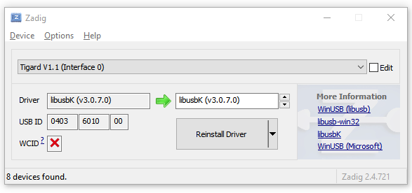
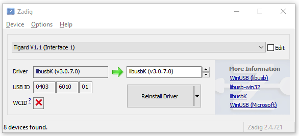

Here are some notes on single-step JTAG debugging the Espressif ESP32 using the 
[Tigard from Crowd Supply](https://www.crowdsupply.com/securinghw/tigard) in Visual Studio
with the [Sysprogs VisualGDB](https://visualgdb.com/) extension.



The Tigard will be used to aid in the development of the 
[ESP32 SSH to UART](https://github.com/gojimmypi/wolfssh/tree/ESP32_Development/examples/ESP32-SSH-Server) project
running on [several ESP32 boards](https://twitter.com/gojimmypi/status/1517819633952120834?s=20) 
as well as the [ESP8266](https://twitter.com/gojimmypi/status/1522390443345940481?s=20).

ESP32 JTAG Pinout Wiring:

```text
TDI -> GPIO12
TCK -> GPIO13
TMS -> GPIO14
TDO -> GPIO15
TRST -> EN / RST (Reset)
GND -> GND
```

An adapter can be useful for quick-connect:



To get started, the config is needed from the [tigard-tools](https://github.com/tigard-tools/tigard#jtag-debug-on-jtag-or-cortex-header).
Paste this text into the `interface\tigard.cfg` file:


```text
interface ftdi
ftdi_vid_pid 0x0403 0x6010
ftdi_channel 1
adapter_khz 2000
ftdi_layout_init 0x0038 0x003b
ftdi_layout_signal nTRST -data 0x0010
ftdi_layout_signal nSRST -data 0x0020
transport select jtag
```

The default install file for VisualGDB is typically here:

```
C:\Users\%USERNAME%\AppData\Local\VisualGDB\EmbeddedDebugPackages\com.sysprogs.esp32.core\share\openocd\scripts\interface
```

Here's the config file selection as viewed from Visual Studio:

 

Out of the box, the intial JTAG test did not go so well. The first output from VisualGDB gave this error:

```
C:\Users\gojimmypi\AppData\Local\VisualGDB\EmbeddedDebugPackages\com.sysprogs.esp32.core\bin\openocd.exe -c "gdb_port 51982" -c "telnet_port 51980" -f interface/tigard.cfg -c "adapter_khz 13500" -f target/esp32.cfg -c "echo VisualGDB_OpenOCD_Ready"
Open On-Chip Debugger 0.10.0 (2022-01-12)
Licensed under GNU GPL v2
libusb1 09e75e98b4d9ea7909e8837b7a3f00dda4589dc3
For bug reports, read
    http://openocd.org/doc/doxygen/bugs.html
DEPRECATED! use 'adapter driver' not 'interface'
DEPRECATED! use 'adapter speed' not 'adapter_khz'
jtag
DEPRECATED! use 'adapter speed' not 'adapter_khz'
adapter speed: 13500 kHz

Warn : Transport "jtag" was already selected
VisualGDB_OpenOCD_Ready
Info : Listening on port 6666 for tcl connections
Info : Listening on port 51980 for telnet connections
Error: libusb_open() failed with LIBUSB_ERROR_NOT_SUPPORTED
Error: libusb_open() failed with LIBUSB_ERROR_NOT_FOUND
Error: no device found
Error: unable to open ftdi device with vid 0403, pid 6010, description '*', serial '*' at bus location '*'

Error: No JTAG interface configured yet.  Issue 'init' command in startup scripts before communicating with targets.
Error: Failed to clear OCDDCR_ENABLEOCD!
Error: No JTAG interface configured yet.  Issue 'init' command in startup scripts before communicating with targets.
Error: Failed to clear OCDDCR_ENABLEOCD!

```

As much as I want to like Windows, after all these years the USB drivers are still a pain. 
[Zadig](https://zadig.akeo.ie/) to the rescue, once again (see also [Single Step JTAG Debugging ESP32](https://gojimmypi.github.io/single-step-jtag-debugging-esp32/)).

Here's where it started, Windows defaults:





Here's after the drivers are replaced with `libusbK`:





Note Sysprogs also has a similar [UsbDriverTool](http://visualgdb.com/UsbDriverTool/).

But even after replacing the drivers, I saw this error:

```
C:\Users\gojimmypi\AppData\Local\VisualGDB\EmbeddedDebugPackages\com.sysprogs.esp32.core\bin\openocd.exe -c "gdb_port 52115" -c "telnet_port 52113" -f interface/tigard.cfg -c "adapter_khz 13500" -f target/esp32.cfg -c "echo VisualGDB_OpenOCD_Ready"
Open On-Chip Debugger 0.10.0 (2022-01-12)
Licensed under GNU GPL v2
libusb1 09e75e98b4d9ea7909e8837b7a3f00dda4589dc3
For bug reports, read
    http://openocd.org/doc/doxygen/bugs.html
DEPRECATED! use 'adapter driver' not 'interface'
DEPRECATED! use 'adapter speed' not 'adapter_khz'
jtag
DEPRECATED! use 'adapter speed' not 'adapter_khz'
adapter speed: 13500 kHz

Warn : Transport "jtag" was already selected
VisualGDB_OpenOCD_Ready
Info : Listening on port 6666 for tcl connections
Info : Listening on port 52113 for telnet connections
Error: libusb_open() failed with LIBUSB_ERROR_NOT_SUPPORTED
Error: failed to reset FTDI device: LIBUSB_ERROR_PIPE
Error: unable to open ftdi device with vid 0403, pid 6010, description '*', serial '*' at bus location '*'

Error: No JTAG interface configured yet.  Issue 'init' command in startup scripts before communicating with targets.
Error: Failed to clear OCDDCR_ENABLEOCD!
Error: No JTAG interface configured yet.  Issue 'init' command in startup scripts before communicating with targets.
Error: Failed to clear OCDDCR_ENABLEOCD!
```

A simple matter of unplugging the Tigard for a few moments, and plugging it back in was the soluton. 

A successful Tigard JTAG test then looks like this:

```
C:\Users\gojimmypi\AppData\Local\VisualGDB\EmbeddedDebugPackages\com.sysprogs.esp32.core\bin\openocd.exe -c "gdb_port 52516" -c "telnet_port 52514" -f interface/tigard.cfg -c "adapter_khz 29500" -f target/esp32.cfg -c "echo VisualGDB_OpenOCD_Ready"
Open On-Chip Debugger 0.10.0 (2022-01-12)
Licensed under GNU GPL v2
libusb1 09e75e98b4d9ea7909e8837b7a3f00dda4589dc3
For bug reports, read
    http://openocd.org/doc/doxygen/bugs.html
jtag
DEPRECATED! use 'adapter speed' not 'adapter_khz'
adapter speed: 29500 kHz

Warn : Transport "jtag" was already selected
VisualGDB_OpenOCD_Ready
Info : Listening on port 6666 for tcl connections
Info : Listening on port 52514 for telnet connections
Error: libusb_open() failed with LIBUSB_ERROR_NOT_SUPPORTED
Info : ftdi: if you experience problems at higher adapter clocks, try the command "ftdi_tdo_sample_edge falling"
Info : clock speed 29500 kHz
Info : JTAG tap: esp32.cpu0 tap/device found: 0x120034e5 (mfg: 0x272 (Tensilica), part: 0x2003, ver: 0x1)
Info : JTAG tap: esp32.cpu1 tap/device found: 0x120034e5 (mfg: 0x272 (Tensilica), part: 0x2003, ver: 0x1)
Info : esp32.cpu0: Target halted, PC=0x4000921A, debug_reason=00000001
Info : esp32.cpu1: Target halted, PC=0x400076E2, debug_reason=00000000
Info : starting gdb server for esp32.cpu0 on 52516
Info : Listening on port 52516 for gdb connections
Info : accepting 'gdb' connection on tcp/52516
Warn : No symbols for FreeRTOS!
Info : esp32.cpu0: Target halted, PC=0x40092AEE, debug_reason=00000001
Info : Set GDB target to 'esp32.cpu0'
Info : Flash mapping 0: 0x10020 -> 0x3f400020, 105 KB
Info : Flash mapping 1: 0x30020 -> 0x400d0020, 349 KB
Info : esp32.cpu0: Target halted, PC=0x40092AEE, debug_reason=00000001
Info : Auto-detected flash bank 'esp32.cpu0.flash' size 4096 KB
Info : Using flash bank 'esp32.cpu0.flash' size 4096 KB
Info : esp32.cpu0: Target halted, PC=0x40092AEE, debug_reason=00000001
Info : Flash mapping 0: 0x10020 -> 0x3f400020, 105 KB
Info : Flash mapping 1: 0x30020 -> 0x400d0020, 349 KB
Info : Using flash bank 'esp32.cpu0.irom' size 352 KB
Info : esp32.cpu0: Target halted, PC=0x40092AEE, debug_reason=00000001
Info : Flash mapping 0: 0x10020 -> 0x3f400020, 105 KB
Info : Flash mapping 1: 0x30020 -> 0x400d0020, 349 KB
Info : Using flash bank 'esp32.cpu0.drom' size 108 KB
Info : New GDB Connection: 1, Target esp32.cpu0, state: halted
Info : dropped 'gdb' connection
shutdown command invoked
```

The `Error: libusb_open() failed with LIBUSB_ERROR_NOT_SUPPORTED` message seems to innocuous.

Although `adapter speed` is in the config file, it seems VisualGDB is the one sending the `adapter_khz`
text.

The deprecated warnings were easy enough to address. Here's the final Tigard confile file:


```text
adapter driver ftdi
ftdi_vid_pid 0x0403 0x6010
ftdi_channel 1
adapter speed 2000
ftdi_layout_init 0x0038 0x003b
ftdi_layout_signal nTRST -data 0x0010
ftdi_layout_signal nSRST -data 0x0020
transport select jtag
```

And voila! Single-step debugging the Espressif ESP32 in Visual Studio:


