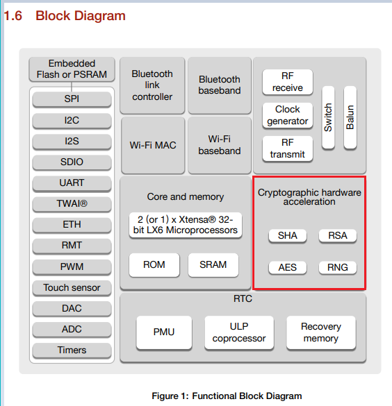
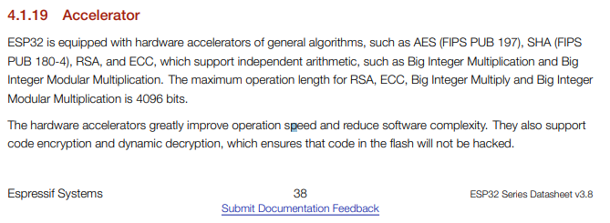
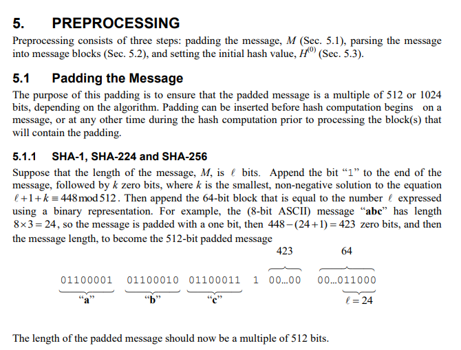
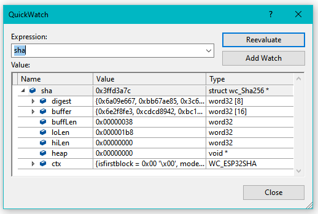
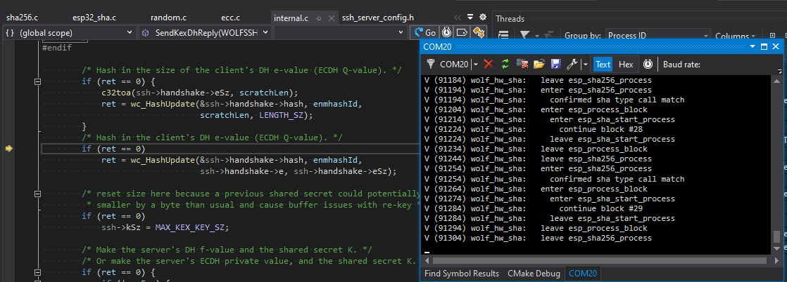
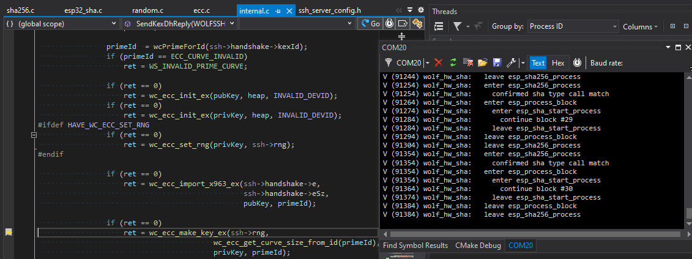
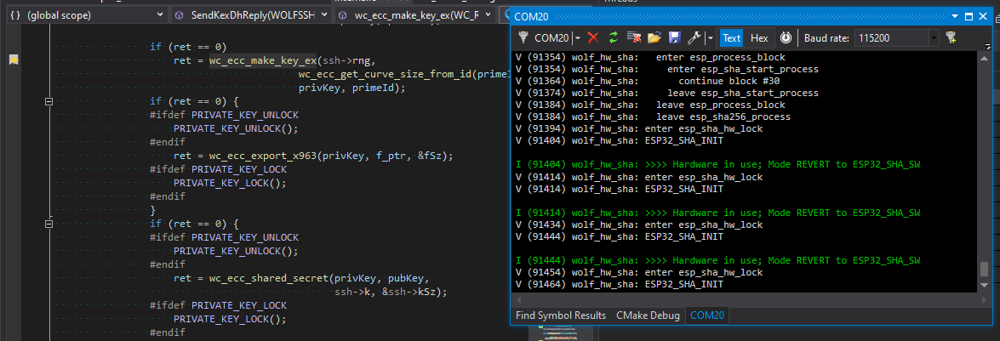

PREVIEW, WIP

Here are some notes on the Espressif ESP32 Hardware Encryption Features for wolfSSL.

Any discussion of ESP32 (or any other) hardware encryption should address the generally
non-updatable nature of the implementation. For example, early versions of the ESP32
were discovered by [limitedresults](https://limitedresults.com/) to have 
[exploitable hardware vulnerabilities](https://limitedresults.com/2019/08/pwn-the-esp32-crypto-core/).

Hardware vulnerabilities exist across the board, for pretty much all platforms: 
[hertzbleed](https://www.tomshardware.com/news/intel-amd-hertzbleed-cpu-vulnerability-boost-clock-speed-steal-crypto-keys),
[heartbleed](https://www.tomshardware.com/news/stagefright-vulnerability-drm-android-heartbleed,29682.html),
[Spectre](https://www.tomshardware.com/news/intel-amd-spectre-v2-vulnerability-mitigation-bug-fix-patch-cpu-security), etc.

Clearly physical security is just as important as any software design. 

Key to any security implementation is a prompt disclosure and response from the vendor. 
Espressif announced [Security Advisory concerning fault injection and eFuse protections (CVE-2019-17391)](https://www.espressif.com/en/news/Security_Advisory_Concerning_Fault_Injection_and_eFuse_Protections%20)
shortly after "_LimitedResults provided a proof of concept report demonstrating fault injection attack and analysis to recover keys stored in eFuse_".

Note modern ESP32 devices have had a hardware revision to address the fault injection.

> "_The ESP32-D0WD-V3 chip has checks in ROM which prevent fault injection attack_" -- [Espressif Security Advisory](https://www.espressif.com/en/news/Security_Advisory_Concerning_Fault_Injection_and_eFuse_Protections)


## Getting Started

Ensure the user settings header is enabled: define `WOLFSSL_USER_SETTINGS` via `-DWOLFSSL_USER_SETTINGS` in the CMake file at compile time.

wolfssl libraries are typically found in the [components](https://github.com/espressif/esp-idf/tree/master/components) directory 
of either the local project `${CMAKE_HOME_DIRECTORY}` or the ESP-IDF `$ENV{IDF_PATH}` directory.

## Terminology

- `ctx`:  context object.
- `DH`: diffie hellman
- `HW`: hardware encryption method
- `SW`: software encryption method


## Hardware Acceleration Overview

There are two useful features of hardware security implemented in the ESP32: Storarage and Computational Acceleration.

There's an ability to [store keys](https://docs.espressif.com/projects/esp-idf/en/latest/esp32/security/secure-boot-v1.html#keys) 
in the [eFuse non-volatile memory](https://www.espressif.com/sites/default/files/documentation/esp32_technical_reference_manual_en.pdf#efuse).

From the [ESP32 Datasheet](https://www.espressif.com/sites/default/files/documentation/esp32_datasheet_en.pdf), page 12:



Here's the summary from page 38:



The interesting files for the wolfSSL hardware encryption for the ESP32 are found in 
the [esp32-crypt.h](https://github.com/wolfSSL/wolfssl/tree/master/wolfssl/wolfcrypt/port/Espressif) 
and [source files](https://github.com/wolfSSL/wolfssl/tree/master/wolfcrypt/src/port/Espressif):

- [sp32_aes.c](https://github.com/wolfSSL/wolfssl/blob/master/wolfcrypt/src/port/Espressif/esp32_aes.c)
- [esp32_mp.c](https://github.com/wolfSSL/wolfssl/blob/master/wolfcrypt/src/port/Espressif/esp32_mp.c)
- [esp32_sha.c](https://github.com/wolfSSL/wolfssl/blob/master/wolfcrypt/src/port/Espressif/esp32_sha.c)
- [esp32_util.c](https://github.com/wolfSSL/wolfssl/blob/master/wolfcrypt/src/port/Espressif/esp32_util.c)

Of particular interest and importance: the Espressif hardware acceleration implementation is NOT RTOS friendly. ONLY ONE hash can be generated at a time.
There is NO mechanism to save an in-progress computation to let something else use the hardware on an interim basis.

One of the concerns might be the encryption used by WiFi. At this time, at least in [ESP-IDF the WiFi crypto functions](https://github.com/espressif/esp-idf/tree/master/components/wpa_supplicant/src/crypto)
are performed in software, such as the [hmac_sha256_vector()](https://github.com/espressif/esp-idf/blob/20f5e180eecccfaff815d707e1fcbba2f4d6a391/components/wpa_supplicant/src/crypto/sha256.c#L26).

Another place of interest regarding the hardware crypto is found in the [esp_rom component](https://github.com/espressif/esp-idf/tree/master/components/esp_rom):

- ESP32 [aes.h](https://github.com/espressif/esp-idf/blob/master/components/esp_rom/include/esp32/rom/aes.h), [rsa_pss.h](https://github.com/espressif/esp-idf/blob/master/components/esp_rom/include/esp32/rom/rsa_pss.h), and [sha.h](https://github.com/espressif/esp-idf/blob/master/components/esp_rom/include/esp32/rom/sha.h), among [others](https://github.com/espressif/esp-idf/tree/master/components/esp_rom/include/esp32/rom).
- ESP32-C2 [aes.h ?], [rsa_pss.h](https://github.com/espressif/esp-idf/blob/master/components/esp_rom/include/esp32c2/rom/rsa_pss.h), and [sha.h](https://github.com/espressif/esp-idf/blob/master/components/esp_rom/include/esp32c2/rom/sha.h), among [others](https://github.com/espressif/esp-idf/tree/master/components/esp_rom/include/esp32c2/rom).
- ESP32-C3 [aes.h](https://github.com/espressif/esp-idf/blob/master/components/esp_rom/include/esp32c3/rom/aes.h), [rsa_pss.h](https://github.com/espressif/esp-idf/blob/master/components/esp_rom/include/esp32c3/rom/rsa_pss.h), and [sha.h](https://github.com/espressif/esp-idf/blob/master/components/esp_rom/include/esp32c3/rom/sha.h), among [others](https://github.com/espressif/esp-idf/tree/master/components/esp_rom/include/esp32c3/rom).
- ESP32-H2 [aes.h](https://github.com/espressif/esp-idf/blob/master/components/esp_rom/include/esp32h2/rom/aes.h), [rsa_pss.h](https://github.com/espressif/esp-idf/blob/master/components/esp_rom/include/esp32h2/rom/rsa_pss.h), and [sha.h](https://github.com/espressif/esp-idf/blob/master/components/esp_rom/include/esp32h2/rom/sha.h), among [others](https://github.com/espressif/esp-idf/tree/master/components/esp_rom/include/esp32h2/rom).
- ESP32-S2 [aes.h](https://github.com/espressif/esp-idf/blob/master/components/esp_rom/include/esp32s2/rom/aes.h), [rsa_pss.h](https://github.com/espressif/esp-idf/blob/master/components/esp_rom/include/esp32s2/rom/rsa_pss.h), and [sha.h](https://github.com/espressif/esp-idf/blob/master/components/esp_rom/include/esp32s2/rom/sha.h), among [others](https://github.com/espressif/esp-idf/tree/master/components/esp_rom/include/esp32s2/rom).
- ESP32-S3 [aes.h](https://github.com/espressif/esp-idf/blob/master/components/esp_rom/include/esp32s2/rom/aes.h), [rsa_pss.h](https://github.com/espressif/esp-idf/blob/master/components/esp_rom/include/esp32s2/rom/rsa_pss.h), and [sha.h](https://github.com/espressif/esp-idf/blob/master/components/esp_rom/include/esp32s2/rom/sha.h), among [others](https://github.com/espressif/esp-idf/tree/master/components/esp_rom/include/esp32s3/rom).

Unfortunately, the implementation seems to be proprietary, as there are only `ld` linker files with [functions assignments to addresses](https://github.com/espressif/esp-idf/blob/20f5e180eecccfaff815d707e1fcbba2f4d6a391/components/esp_rom/esp32/ld/esp32.rom.ld#L1568).
It is assumed the functions in question are _not_ using the hardware acceleration. TODO how to confirm this?

Note that on multicore ESP32 devices, there's a concurrency [warning](https://github.com/espressif/esp-idf/blob/20f5e180eecccfaff815d707e1fcbba2f4d6a391/components/esp_rom/include/esp32/rom/sha.h#L48):

> Do not use these function in multi core mode due to inside they have no safe implementation (without DPORT workaround).

# Reference Documents

The following documents are directly applicable to the cryto-acceleration functions:

- AES (FIPS PUB 197) [Advanced Encryption Standard (AES)](https://csrc.nist.gov/publications/detail/fips/197/final)
- Hash SHA-2 (FIPS PUB 180-4) [Secure Hash Standard (SHS)](https://csrc.nist.gov/publications/detail/fips/180/4/final)

<br />

### wolfSSL Fine Tuning

If size is more important the speed for software computation, the `USE_SLOW_SHA` can be defined. 
See [sha.c](https://github.com/wolfSSL/wolfssl/blob/8f7db87f01739d51e4b0b3af904ea3a94dff2584/wolfcrypt/src/sha.c#L482) 

> "_nearly 1 K bigger in code size but 25% faster_". 


### wolfSSL ESP32 Hardware Encryption

Turn on with `-DWOLFSSL_ESP32WROOM32_CRYPT`. This is enabled by defalt for the ESP32-WROOM. Enables:

- `int esp_sha_process(struct wc_Sha* sha, const byte* data)`
- `int esp_sha_digest_process(struct wc_Sha* sha, byte blockproc)`
- `int esp_sha256_process(struct wc_Sha256* sha, const byte* data)`
- `int esp_sha256_digest_process(struct wc_Sha256* sha, byte blockproc)`

<br />


### SHA Accelerator

See Chapter 23, page 573 of the [ESP32 Technical Reference Manual](https://www.espressif.com/sites/default/files/documentation/esp32_technical_reference_manual_en.pdf#23%20SHA%20Accelerator%20(SHA))
and [Section 5 of FIPS PUB 180-4 Secure Hash Standard](https://nvlpubs.nist.gov/nistpubs/FIPS/NIST.FIPS.180-4.pdf), "SHS".

By default, SHA accerlation is enabled with `WOLFSSL_ESP32WROOM32_CRYPT`.
To disable just SHA acceleration, use `NO_WOLFSSL_ESP32WROOM32_CRYPT_HASH`.

See wolfSSL [esp32_sha.c](https://github.com/wolfSSL/wolfssl/blob/master/wolfcrypt/src/port/Espressif/esp32_sha.c)


Given `const byte* V`, a SHA-256 is calculated in wolfSSL:


```c
    byte data[DRBG_SEED_LEN];
    len = (outSz / OUTPUT_BLOCK_LEN) + ((outSz % OUTPUT_BLOCK_LEN) ? 1 : 0);
    XMEMCPY(data, V, sizeof(data));

    for (i = 0; i < len; i++) {
    ret = wc_InitSha256(sha);
        if (ret == 0) {
            ret = wc_Sha256Update(sha, data, sizeof(data));
        }
        if (ret == 0) {
            ret = wc_Sha256Final(sha, digest);
        }
        wc_Sha256Free(sha);
     }
```

Note that from a typical code implementation perspective, we don't even know if the accerlation features are being used.
The exact same API interface is used with the actual implementation being controlled with the compiler `#define`s.

To aid in development, it can be helpful to have a [web hash converter](https://hash.online-convert.com/) or desktop SHA-256 calculator.
See [system.security.cryptography.sha256](https://docs.microsoft.com/en-us/dotnet/api/system.security.cryptography.sha256?view=net-6.0):


```c#
using System;
using System.Security.Cryptography;

namespace mySHA256_calculator
{
    class Program
    {
        public static void PrintByteArray(byte[] array)
        {
            for (int i = 0; i < array.Length; i++)
            {
                Console.Write($"{array[i]:X2}");
                if ((i % 4) == 3) Console.Write(" ");
            }
            Console.WriteLine();
        }

        // 32 words:  45725791 C47B3261 8CC57B88 343E2BCE EC3B0A01 B83BC97D 144A2CBC 11A20C3D
        // 16 words:  60E05BD1 B195AF2F 94112FA7 197A5C88 28905884 0CE7C6DF 9693756B C6250F55
        //  8 words:  84E0C0EA FAA95A34 C293F278 AC52E45C E537BAB5 E752A00E 6959A13A E103B65A
        //
        // 64 zeros (16 words of 4 bytes of "0" = 0x30)
        // 0000000000000000000000000000000000000000000000000000000000000000
        //            60E05BD1 B195AF2F 94112FA7 197A5C88 28905884 0CE7C6DF 9693756B C6250F55
        //
        // "0" = 0x30 (VS)
        // 5FECEB66 FFC86F38 D952786C 6D696C79 C2DBC239 DD4E91B4 6729D73A 27FB57E9
        //
        // 0x30000000
        // 4F8320D9 1E97D546 DC799848 E8D218E1 8050AF7A 7964E041 4DE9E547 9006D7E3

        static void Main(string[] args)
        {
            using (SHA256 mySHA256 = SHA256.Create())
            {
                int word_size = 8;

                byte[] buffer = new byte[word_size * 4];

                int byte_fill = word_size * 4;
                for (int i = 0; i < byte_fill; i++)
                {
                    buffer[i] = 0x30;
                }
                byte[] hashValue = mySHA256.ComputeHash(buffer);
                PrintByteArray(buffer);    // 30303030 30303030 30303030 30303030 30303030 30303030 30303030 30303030
                PrintByteArray(hashValue); // 84E0C0EA FAA95A34 C293F278 AC52E45C E537BAB5 E752A00E 6959A13A E103B65A
                Console.WriteLine("");

                byte[] buffer2 = new byte[4];
                buffer2[0] = 0x30;
                buffer2[1] = 0x00;
                buffer2[2] = 0x00;
                buffer2[3] = 0x00;
                byte[] hashValue2 = mySHA256.ComputeHash(buffer2);

                PrintByteArray(buffer2);    // 30000000
                PrintByteArray(hashValue2); // 4F8320D9 1E97D546 DC799848 E8D218E1 8050AF7A 7964E041 4DE9E547 9006D7E3
            }
        }
    }
}
```

There are some interesting notes about the SHA encryption registers on the ESP32:

- The hash _output_ is found the the same registers used for _input_, both starting at `SHA_TEST_0_REG` at `0x3FF03000`.
- There's only 1 register set for all hash functions: SHA1, SHA256, SHA384, SHA512.
- The initial hash values, (see [SHA-2 pseudcode](https://en.wikipedia.org/wiki/SHA-2), e.g. h0 := 0x6a09e667 in [wolfcrypt sha256.c](https://github.com/wolfSSL/wolfssl/blob/390908bccc5fbe678e3dd0ea43526aca430b27cb/wolfcrypt/src/sha256.c#L710)) _do not_ need to be loaded.
- Once a hash process is started, the interim result is hidden and cannot be stashed to start on a different computation.
- At least one `asm volatile("memw");`  "_should be executed in between every load or store to a volatile variable_" (See Xtensa ISA Reference Manual)
- Repeated calls to `periph_module_enable(PERIPH_SHA_MODULE)` are tracked for recursion. Call to `periph_module_disable` is only effective after [all enables are unwrapped](https://github.com/espressif/esp-idf/blob/5e6cffbb14fa78e6e8475550c1606b29ec1aa7f0/components/driver/periph_ctrl.c#L31).
- A call to `periph_module_reset` will reset the device regardless of how many times `periph_module_enable` was called, and the [call-counter is not reset](https://github.com/espressif/esp-idf/blob/5e6cffbb14fa78e6e8475550c1606b29ec1aa7f0/components/driver/periph_ctrl.c#L37).
- Data must be processed in 512 bit chunks for SHA256 (64 bytes stored in sixteen 4-byte words, starting at `SHA_TEST_0_REG` at `0x3FF03000`)
- The trailing bit "1" _and_ 64-bit has word count _does_ need to be manually applied to the last block as noted on page 18 of [FIPS PUB 180-4](https://nvlpubs.nist.gov/nistpubs/FIPS/NIST.FIPS.180-4.pdf) :



Reminder: The ESP32 SHA encryption accelerator _does not do final padding_. The `0x80` and 64-bit message length need to be manually added! 

Each block of data is hashed into digest for wolfSSL:



Given the single-computation nature of the hardware acclerated hash content registers, note that even in a single-thread RTOS, multiple 
hashes may need to be computed concurrently. This will cause the second one to fall back to software calculations.

For example, in the ESP32 SSH to UART example, the non-blocking call to [wolfSSH_accept](https://github.com/gojimmypi/wolfssh/blob/713c7358501b9107d2e85a2a3f0e296a89a180ad/examples/ESP32-SSH-Server/main/ssh_server.c#L174)
that is [started upon connection](https://github.com/gojimmypi/wolfssh/blob/713c7358501b9107d2e85a2a3f0e296a89a180ad/examples/ESP32-SSH-Server/main/ssh_server.c#L235)

The `SendKexDhReply()` (Send Key Exchange Diffe-Hellman Key) hashes together multiple different items all in one big SHA256 hash result:



However, after about 30 increments to the hash calculation, _another_ call is made to `wc_ecc_make_key_ex()` which _also_ will need a few small hashes:



As there can be only one hardware hash in progress at a given time, the code _should_ detect this and fall back to software hashes, as seen here with verbose debugging turned on:



Extra care should be taken when computing hardware-accelerated hashes in a multi-thread RTOS environment.

<br />


### RSA Accelerator

The RSA Accelerator is for math functions. 
See [Espressif/esp32_mp.c](https://github.com/wolfSSL/wolfssl/blob/master/wolfcrypt/src/port/Espressif/esp32_mp.c)
and Chapter 24, page 582 of the 
[ESP32 Technical Reference Manual](https://www.espressif.com/sites/default/files/documentation/esp32_technical_reference_manual_en.pdf#24%20RSA%20Accelerator%20(RSA)).

NOTE:
> The maximum operation length for RSA, ECC, Big Integer Multiply and Big Integer Modular Multiplication is 4096 bits


Turn on with `-DWOLFSSL_ESP32WROOM32_CRYPT_RSA_PRI`. Enables:


##### Large Number Modular Exponentiation

The operation is based on Montgomery multiplication. Aside from the
arguments X, Y , and M, two additional ones are needed -r and M'
These arguments are calculated in advance by software.

See Chapter 24.3.2, page 584 of the [ESP32 Technical Reference Manual](https://www.espressif.com/sites/default/files/documentation/esp32_technical_reference_manual_en.pdf#24.3.2%20Large%20Number%20Modular%20Exponentiation):

- `Z = (X ^ Y) mod M`  (sometimes in DH context referred to as `Y = (G ^ X) mod P`)


```c
    int esp_mp_exptmod(struct fp_int* X, /* G */
                       struct fp_int* Y, /* X */
                              word32 Xbits,
                       struct fp_int* M, /* P */
                       struct fp_int* Z) /* Y */
```

##### Large Number Modular Multiplication

See Chapter 24.3.3, page 584 of the [ESP32 Technical Reference Manual](https://www.espressif.com/sites/default/files/documentation/esp32_technical_reference_manual_en.pdf#24.3.3%20Large%20Number%20Modular%20Multiplication):


- `Z = X * Y (mod M)`


```c
    int esp_mp_mulmod(fp_int* X, 
                      fp_int* Y, 
                      fp_int* M, 
                      fp_int* Z)
``` 


Support for large-number multiplication:

- `Z = X * Y`


```c
int esp_mp_mul(fp_int* X, 
               fp_int* Y, 
               fp_int* Z)
```


Support for various lengths of operands:
<br />

### AES Accelerator

See chapter 22 of [ESP32 Technical Reference Manual](https://www.espressif.com/sites/default/files/documentation/esp32_technical_reference_manual_en.pdf#22%20AES%20Accelerator%20(AES)).

> The AES Accelerator supports six algorithms of FIPS PUB 197, specifically AES-128, AES-192 and AES-256 encryption and decryption.


- `int wc_esp32AesCbcEncrypt(struct Aes* aes, byte* out, const byte* in, word32 sz);`
- `int wc_esp32AesCbcDecrypt(struct Aes* aes, byte* out, const byte* in, word32 sz);`
- `int wc_esp32AesEncrypt(struct Aes *aes, const byte* in, byte* out);`
- `int wc_esp32AesDecrypt(struct Aes *aes, const byte* in, byte* out);`

[esp32_aes.c](https://github.com/wolfSSL/wolfssl/blob/master/wolfcrypt/src/port/Espressif/esp32_aes.c)

### ECC 

*Not* to be confused with the Error Code Capture feature:

> Error Code Capture (ECC) feature allows the TWAI controller to record the error type and bit position of a
TWAI bus error in the form of an error code -- [Technical Reference Manual 21.5.8 ](https://www.espressif.com/sites/default/files/documentation/esp32_technical_reference_manual_en.pdf)


> The maximum operation length for RSA, ECC, Big Integer Multiply and Big Integer Modular Multiplication is 4096 bits -- [4.1.19 Acclerator of ESP32 Datasheet](https://www.espressif.com/sites/default/files/documentation/esp32_datasheet_en.pdf)

- todo
<br />

### RNG Random Number Generator 

- todo

Random number generator table:

| Start Address | End Address | Size |
| ------------- | ----------- | ---- |
| 0x3FF7_5000   | 0x3FF7_5FFF |  4KB |

<br />

### wolfSSL utility library

[util](https://github.com/wolfSSL/wolfssl/blob/master/wolfcrypt/src/port/Espressif/esp32_util.c)
<br />


### Coding Convention

In wolfCrypt those API's return 0 for success.

`WOLFSSL_SUCCESS` and `WOLFSSL_FAILURE` values should only be used in the ssl layer, not in wolfCrypt.

WOLFSSL_SUCCESS and WOLFSSL_FAILURE values should only be used in the ssl layer, not in wolfCrypt
<br />


### Development

Install wolfSSL for WSL:


```bash
cd  /mnt/c/workspace/wolfssl
./configure  --enable-tls13 --prefix=/usr/ && make && sudo make install
# or
./configure --enable-dtls --enable-tls13 --prefix=/usr/ && make && sudo make install
```

Setup ESP-IDF


```bash
cd ~/esp/esp-idf
 . $HOME/esp/esp-idf/export.sh
idf.py -p /dev/ttyS9 -b 230400 flash monitor
```

DTLS compile:

```
gcc -o server-dtls server-dtls.c -Wall -I/usr/local/include -Os -L/usr/local/lib -lm -lwolfssl  -Wl,-rpath=/usr/local/lib
```

WSL TLS1.3 Server:

```
cd /mnt/c/workspace/wolfssl-examples/tls
 ./server-tls13 -v 4
```
<br />

Resources, Inspiration, Credits, and Other Links:<br />

- wolfSSL [wolfcrypt sha256.c](https://github.com/wolfSSL/wolfssl/blob/master/wolfcrypt/src/sha256.c)
= wolfSSL [wolfcrypt esp32_sha.c](https://github.com/wolfSSL/wolfssl/blob/master/wolfcrypt/src/port/Espressif/esp32_sha.c)
- wolfSSL [Espressif](https://www.wolfssl.com/Espressif/)
- wolfSSL [docs/Espressif](https://www.wolfssl.com/docs/espressif/)
- wolfSSL [wolfSSL ESP32 Hardware Acceleration Support](https://www.wolfssl.com/wolfssl-esp32-hardware-acceleration-support/)
- wolfSSL [Porting Guide](https://www.wolfssl.com/docs/porting-guide/)
- wolfSSL [wolfcrypt stm32](https://github.com/wolfSSL/wolfssl/blob/master/wolfcrypt/src/port/st/stm32.c)
- wolfSSL [Building wolfSSL](https://www.wolfssl.com/documentation/wolfssl-manual/chapter02.html)
- Espressif [ESP32 Datasheet](https://www.espressif.com/sites/default/files/documentation/esp32_datasheet_en.pdf)
- Espressif [ESP32 Technical Reference Manual](https://www.espressif.com/sites/default/files/documentation/esp32_technical_reference_manual_en.pdf)
- Espressif Blog [Understanding ESP32's Security Features](https://blog.espressif.com/understanding-esp32s-security-features-14483e465724)
- Espressif Blog [ESP32: TLS (Transport Layer Security) And IoT Devices](https://blog.espressif.com/esp32-tls-transport-layer-security-and-iot-devices-3ac93511f6d8)
- Espressif Blog [ESP32-S2: Digital Signature Peripheral](https://blog.espressif.com/esp32-s2-digital-signature-peripheral-7e70bf6dde88)
- Espressif GitHub Example [ESP-MQTT SSL Mutual Authentication with Digital Signature](https://github.com/espressif/esp-idf/blob/master/examples/protocols/mqtt/ssl_ds/README.md)
- Espressif [Logging Library](https://docs.espressif.com/projects/esp-idf/en/v4.2/esp32/api-reference/system/log.html)
- Espressif [ESP-TLS](https://docs.espressif.com/projects/esp-idf/en/latest/esp32/api-reference/protocols/esp_tls.html)
- LimitedResults [Pwn the ESP32 Forever: Flash Encryption and Sec. Boot Keys Extraction](https://limitedresults.com/2019/11/pwn-the-esp32-forever-flash-encryption-and-sec-boot-keys-extraction/)
- wolfSSL [ESP32 Hardware Acceleration Support](https://www.wolfssl.com/wolfssl-esp32-hardware-acceleration-support/)
- wolfSSL [Install](https://github.com/wolfSSL/wolfssl/blob/master/INSTALL)
- Wireshark [capture filters](https://wiki.wireshark.org/CaptureFilters)
- Adafruit [ESP32uesday: The ESP32-S3 is More Than a Fancy S2](https://blog.adafruit.com/2022/05/31/esp32uesday-the-esp32-s3-is-more-than-a-fancy-s2/)
- OpenOCD [Open On-Chip Debugger User Guide](https://openocd.sourceforge.io/doc/pdf/openocd.pdf)
- Stackoverflow [How to debug "cannot open shared object file: No such file or directory"?](https://stackoverflow.com/questions/67753007/how-to-debug-cannot-open-shared-object-file-no-such-file-or-directory/67753144#67753144)
- Xtensa [Instruction Set Architecture (ISA) Reference Manual](http://0x04.net/~mwk/doc/xtensa.pdf)
- Michael Driscoll's [The Animated Elliptic Curve](https://curves.ulfheim.net/)
- Michael Driscoll's [The Illustrated TLS 1.3 Connection](https://tls13.xargs.org/)
- Microsoft [Cipher Suites in TLS/SSL (Schannel SSP)](https://docs.microsoft.com/en-us/windows/win32/secauthn/cipher-suites-in-schannel)
- Wikipedia [SHA-2](https://en.wikipedia.org/wiki/SHA-2)
- NIST [FIPS PUB 180-4](https://nvlpubs.nist.gov/nistpubs/FIPS/NIST.FIPS.180-4.pdf)
- NIST [SP 800-90A Deterministic Random Bit Generator Validation System (DRBGVS)](https://csrc.nist.gov/csrc/media/projects/cryptographic-algorithm-validation-program/documents/drbg/drbgvs.pdf)
