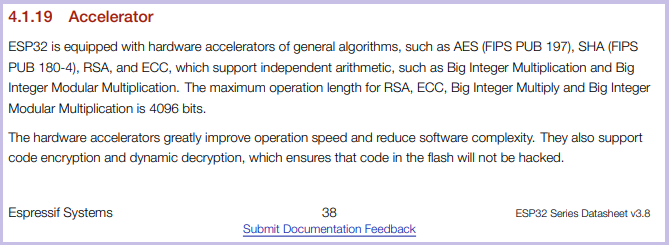

PREVIEW, WIP

Any discussion of ESP32 (or any other) hardware encryption should address the generally
non-updatable nature of the implementation. For example, early versions of the ESP32
were discovered by [limitedresults](https://limitedresults.com/) to have 
[explotable hardware vulnerabilities](https://limitedresults.com/2019/08/pwn-the-esp32-crypto-core/).
Clearly physical security is just as important as any software design. 

Key to any security implementation is a prompt disclosure and response from the vendor. 
Espressif announced [Security Advisory concerning fault injection and eFuse protections (CVE-2019-17391)](https://www.espressif.com/en/news/Security_Advisory_Concerning_Fault_Injection_and_eFuse_Protections%20)
in the months after "_LimitedResults provided a proof of concept report demonstrating fault injection attack and analysis to recover keys stored in eFuse_".

> "_The ESP32-D0WD-V3 chip has checks in ROM which prevent fault injection attack_"

There are two useful features of hardware security implemented in the ESP32: Storarage and Computational Acceleration.

There's an ability to [store keys](https://docs.espressif.com/projects/esp-idf/en/latest/esp32/security/secure-boot-v1.html#keys) 
in the [eFuse non-volatile memory](https://www.espressif.com/sites/default/files/documentation/esp32_technical_reference_manual_en.pdf#efuse).

From the [ESP32 Datasheet](https://www.espressif.com/sites/default/files/documentation/esp32_datasheet_en.pdf), page 12:




The interesting files for the wolfSSL hardware encryption for the ESP32 are found in 
the [esp32-crypt.h](https://github.com/wolfSSL/wolfssl/tree/master/wolfssl/wolfcrypt/port/Espressif) 
and [source files](https://github.com/wolfSSL/wolfssl/tree/master/wolfcrypt/src/port/Espressif):

AES (FIPS PUB 197) [esp32_aes.c](https://github.com/wolfSSL/wolfssl/blob/master/wolfcrypt/src/port/Espressif/esp32_aes.c)

### wolfSSL ESP32 Hardware Encrpytion

Turn on with `-DWOLFSSL_ESP32WROOM32_CRYPT`. Enables:

- `int esp_sha_process(struct wc_Sha* sha, const byte* data)`
- `int esp_sha_digest_process(struct wc_Sha* sha, byte blockproc)`
- `int esp_sha256_process(struct wc_Sha256* sha, const byte* data)`
- `int esp_sha256_digest_process(struct wc_Sha256* sha, byte blockproc)`

<br />


### SHA Accelerator

To disable just SHA acceleration, use `DNO_WOLFSSL_ESP32WROOM32_CRYPT_HASH`

Hash SHA-2 (FIPS PUB 180-4): [esp32_sha.c](https://github.com/wolfSSL/wolfssl/blob/master/wolfcrypt/src/port/Espressif/esp32_sha.c)
<br />


### RSA Accelerator

See Chapter 24, page 582 of the [ESP32 Technical Reference Manual](https://www.espressif.com/sites/default/files/documentation/esp32_technical_reference_manual_en.pdf)

multiplication: [esp32_mp.c](https://github.com/wolfSSL/wolfssl/blob/master/wolfcrypt/src/port/Espressif/esp32_mp.c)


Turn on with `-DWOLFSSL_ESP32WROOM32_CRYPT_RSA_PRI`. Enables:

> The maximum operation length for RSA, ECC, Big Integer Multiply and Big Integer Modular Multiplication is 4096 bits

Support for large-number modular exponentiation:

- TODO


Support for large-number modular multiplication:

- `int esp_mp_mulmod(fp_int* X, fp_int* Y, fp_int* M, fp_int* Z)`: `Z = X * Y (mod M)` 


Support for large-number multiplication:

- `int esp_mp_mul(fp_int* X, fp_int* Y, fp_int* Z)` 


Support for various lengths of operands:
<br />


### ECC 

*Not* to be confused with the Error Code Capture feature:

> Error Code Capture (ECC) feature allows the TWAI controller to record the error type and bit position of a
TWAI bus error in the form of an error code


> The maximum operation length for RSA, ECC, Big Integer Multiply and Big Integer Modular Multiplication is 4096 bits

- todo

### RNG Random Number Generator 

- todo

| Start Address | End Address | Size |
| ------------- | ----------- | ---- |
| 0x3FF7_5000   | 0x3FF7_5FFF |  4KB |

utility:

[util](https://github.com/wolfSSL/wolfssl/blob/master/wolfcrypt/src/port/Espressif/esp32_util.c)


`WOLFSSL_SUCCESS` and `WOLFSSL_FAILURE` values should only be used in the ssl layer, not in wolfCrypt.

```
git submodule add -b master https://github.com/gojimmypi/wolfssh wolfssh

```

### Coding Convention

In wolfCrypt those API's return 0 for success.

WOLFSSL_SUCCESS and WOLFSSL_FAILURE values should only be used in the ssl layer, not in wolfCrypt

### Development

Install wolfSSL for WSL:

```bash
cd  /mnt/c/workspace/wolfssl
./configure  --enable-tls13 --prefix=/usr/ && make && sudo make install
# or
./configure --enable-dtls --enable-tls13 --prefix=/usr/ && make && sudo make install
```

DTLS compile:

```
gcc -o server-dtls server-dtls.c -Wall -I/usr/local/include -Os -L/usr/local/lib -lm -lwolfssl  -Wl,-rpath=/usr/local/lib
```

WSL TLS1.3 Server:

```
cd /mnt/c/workspace/wolfssl-examples/tls
 ./server-tls13 -v 4
```


- Espressif [ESP32 Datasheet](https://www.espressif.com/sites/default/files/documentation/esp32_datasheet_en.pdf)
- Espressif [ESP32 Technical Reference Manual](https://www.espressif.com/sites/default/files/documentation/esp32_technical_reference_manual_en.pdf)
- Espressif Blog [Understanding ESP32's Security Features](https://blog.espressif.com/understanding-esp32s-security-features-14483e465724)
- Espressif Blog [ESP32: TLS (Transport Layer Security) And IoT Devices](https://blog.espressif.com/esp32-tls-transport-layer-security-and-iot-devices-3ac93511f6d8)
- Espressif Blog [ESP32-S2: Digital Signature Peripheral](https://blog.espressif.com/esp32-s2-digital-signature-peripheral-7e70bf6dde88)
- Espressif GitHub Example [ESP-MQTT SSL Mutual Authentication with Digital Signature](https://github.com/espressif/esp-idf/blob/master/examples/protocols/mqtt/ssl_ds/README.md)
- LimitedResults [Pwn the ESP32 Forever: Flash Encryption and Sec. Boot Keys Extraction](https://limitedresults.com/2019/11/pwn-the-esp32-forever-flash-encryption-and-sec-boot-keys-extraction/)
- wolfSSL [ESP32 Hardware Acceleration Support](https://www.wolfssl.com/wolfssl-esp32-hardware-acceleration-support/)

