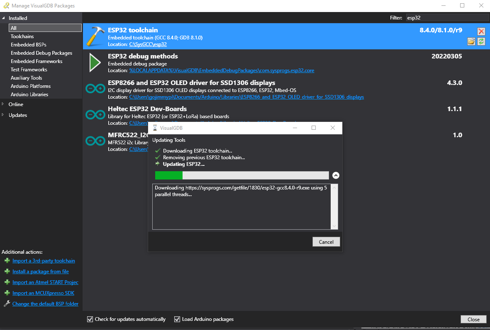

There's a new open source ESP32 + FPGA Board! I recently received a [ICE-V Wireless ESP32-C3 + ICE40 FPGA board](https://groupgets.com/campaigns/1036-ice-v-wireless).

Full disclosure: [@QwertyEmbedded](https://twitter.com/qwertyembedded) reached out via Twitter with a no-strings-attached offer:

> Someone mentioned that you might be interested in getting a early proto of the ICE-V wireless board

I practically fell out of my chair! Of course I'm interested!! I knew about the board. I was doing my best not to start yet
_another_ project, but I find open source FPGA boards, in particular those with an Espressif *ESP32*, even more appealing!

Now, admittedly I feel a little bit of split loyalty, as I'm also a volunteer member of the Radiona team that has the awesome
[ULX3S](https://www.crowdsupply.com/radiona/ulx3s) board, also sometimes in stock at [Mouser](https://www.mouser.com/c/?q=ulx3s). 
With the chip shortage, well - we all know that story. Stay tuned for the [ULX4M](https://intergalaktik.eu/news/ulx4s-ld-v0-0-1)
FPGA board coming soon that plugs into the Raspberry Pi CM4 / Compute Module.

The bottom line is that everyone wins with open source boards. Besides, the ICE-V Wireless is certainly not a direct competitor
by any means. It just happens to have and FPGA and ESP32, similar to the ULX3S. But that's where the similarity ends.

The ULX3S uses the ECP line of Lattice FPGA and has an incredible selection of [on-board peripherals](https://radiona.org/ulx3s/): 
uSD, GPDI/DVI video, FTDI FT231XS, and more. 

The ICE-V Wireless uses the Lattice ICE40 FPGA. This is the same chip used by Piotr on his [1bitsquared iCEBreaker](https://1bitsquared.com/products/icebreaker) 
which also has an FTDI USB chip. The ICE-V board is priced only a little more, but has no USB controller.

No USB Controller?!?! How can that be? How to program the FPGA? Aha... clever solution here. The Espressif flavor here is the
ESP32-C3. It has it's own, [built-in USB controller *and* JTAG adapter ](https://twitter.com/gojimmypi/status/1543470855442747392?s=20&t=yni6VTW1GU0cXj3xSxaobA). 

[@beriberikix](https://twitter.com/beriberikix) kindly [pointed out](https://twitter.com/beriberikix/status/1543611207550001153):

> It's not an actual USB device. They just put enough transistors to implement JTAG and a basic serial port. They're careful to call it a "USB Serial Controller" not a USB peripheral.

I'm not entirely sure what might be missing: if it acts like a serial terminal and can attach as a JTAG debugger, what else might be desired?

The ULX3S has the ESP32 _behind_ the FPGA. This means that the FPGA needs to be [configured as a pass-thru](https://github.com/gojimmypi/ulx3s-examples/blob/master/VisualMicro/README.md).
to access the ESP32. There's also a [more recent blog that uses VisualGDB with the passthru](https://gojimmypi.github.io/SSH-to-ULX3S-ESP32/).

In contrast, the ICE-V board has the FPGA sitting _behind the ESP32_.  So ya: the ESP32 needs to be configured to pass thru
data and control signals to program the FPGA. Clearly this is a completely different architecture.

To round out the existing open source FPGA boards, be sure to also check out the [Greg Davill Orange Crab](https://1bitsquared.com/products/orangecrab).

There's also this [Humble ICE FPGA with Raspberry Pi RP2040](https://twitter.com/mkvenkit/status/1544948344191066112)

Regarding the ESP32 toolchain for the ICE-V see [ESP32-C3 Getting Started](https://docs.espressif.com/projects/esp-idf/en/latest/esp32c3/get-started/index.html)
a nice install of the ESP32 toolchain is avilable from the UI in Visual GDB that allows all the features of Visual Studio for single-step debugging, etc:

[ice-v-wireless](https://groupgets.com/campaigns/1036-ice-v-wireless)

- ICE-V Wireless [Schematic](https://github.com/ICE-V-Wireless/ICE-V-Wireless/blob/main/docs/esp32c3_fpga_schematic.pdf)
- Espressif [Solutions at Embedded World 2022](https://www.youtube.com/watch?v=j9IOdgxVcE0&t=47s)
- Espressif [ESP32-C3 Getting Started](https://docs.espressif.com/projects/esp-idf/en/v4.4.1/esp32c3/get-started/index.html)
- Espressif [ESP32-C3 UART](https://docs.espressif.com/projects/esp-idf/en/latest/esp32c3/api-reference/peripherals/uart.html)
- Espressif [Configure ESP32-C3 built-in JTAG Interface](https://docs.espressif.com/projects/esp-idf/en/v4.4.1/esp32c3/api-guides/jtag-debugging/configure-builtin-jtag.html)
- Espressif [JTAG Debugging for ESP32-C3](https://docs.espressif.com/projects/esp-idf/en/latest/esp32c3/api-guides/jtag-debugging/index.html)
- Espressif [IDE - What's new in v2.4](https://blog.espressif.com/espressif-ide-and-whats-new-in-v2-4-0-part-1-7ea84340a819)
- Espressif [IDF Component Manager](https://docs.espressif.com/projects/esp-idf/en/latest/esp32/api-guides/tools/idf-component-manager.html)
- Espressif [ESP32-C3 dport_access.h](https://github.com/espressif/esp-idf/blob/release/v4.4/components/soc/esp32c3/include/soc/dport_access.h)
- Sysprogs VisualGDB [Troubleshooting ESP-IDF Toolchain Compatibility](https://visualgdb.com/documentation/espidf/#troubleshooting)
- Sysprogs VisualGDB [Advanced ESP-IDF Project Structure](https://visualgdb.com/documentation/espidf/)
- Sysprogs VisualGDB [ESP32 Toolchains and Compatible ESP-IDF Releases](https://visualgdb.com/support/esp32/)
- Sysprogs VisualGDB [Full List of Settings](https://visualgdb.com/settings/)
- Sysprogs VisualGDB [Project Settings indeed apply to IntelliSense only](https://sysprogs.com/w/forums/topic/preprocessor-definitions/#post-2278)
- [new git script for wolfSSL install](https://github.com/gojimmypi/esp-idf/tree/PR_wolfssl_component/components/wolfssl)