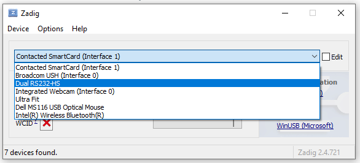
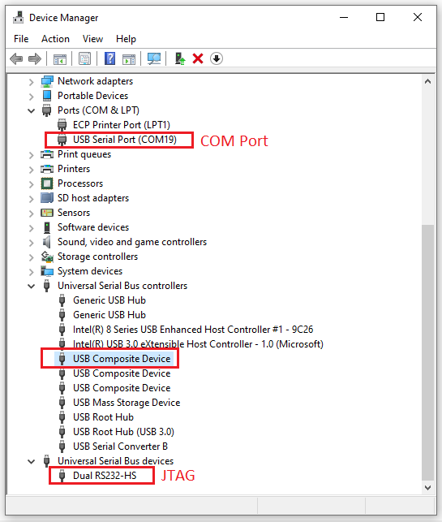

The FTDI 2232, such as the one found on the [Espressif ESP32-Ethernet-Kit V1.2](https://docs.espressif.com/projects/esp-idf/en/latest/esp32/hw-reference/esp32/get-started-ethernet-kit.html#) 
is _normally_ a 2-interface device. But sometimes Microsoft Windows... well, you know.

If for some reason Windows just insists that there's only one device, there's hope! 

The problem condition as reported in Zadig:

Although the board will technically work with only once device, a decision will need to be made as to whether
that the respective interface is used for JTAG _or_ Serial. 

During development one typically wants JTAG _and_ an interface for COM-port 
serial output.

To resolve this situation, first ensure the board is plugged in and manually update
the driver from Device Manager "Driver Tab". 

Pick from a list of drivers on computer and select the "USB Composite Device":

The FTDI 2232 should now appear as two separate interfaces: 

- `Dual RS232-HS (Interface 0)`
- `Dual RS232-HS (Interface 1)`

If the driver was installed successfully, try unplugging the USB device and plugging it
in again. Repeat above steps if needed.

In the typical Windows style, the appropriate drivers are likely _not_ installed.

The `Interface 0` should be configured as `WinUSB` for the COM port:

The `Interface 1` should be configured as `FTDI Bus` for the JTAG interface:

Device Manager should show both devices:

If everything is working properly, the VisualGDB JTAG test should show success:

This behavior was observed on only 1 of 2 Windows 10 computers using the exact
same device. The problematic computer was one that does not meet the requirements
for Windows 11, but otherwise had all currently available Windows Updates applied.

In the usual Windows style, the drivers may revert to an undesired state after future
Windows updates and the above steps may need to be repeated. ymmv.

## Resources, Inspiration, Credits, and Other Links

- Espressif [ESP32-Ethernet-Kit V1.2 Getting Started Guide](https://docs.espressif.com/projects/esp-idf/en/latest/esp32/hw-reference/esp32/get-started-ethernet-kit.html#get-started-esp32-ethernet-kit-v1-2)
- FTDI [FT2232HL](https://ftdichip.com/products/ft2232hl/)