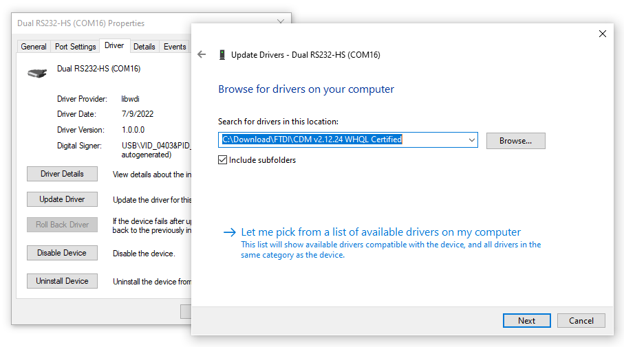
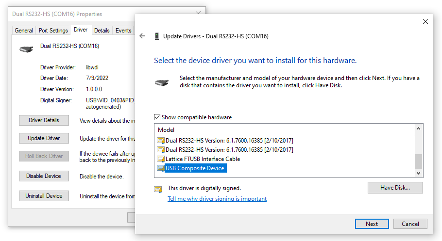
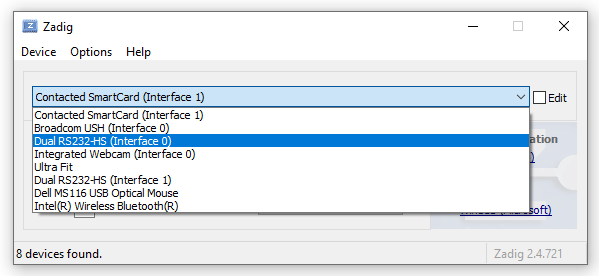
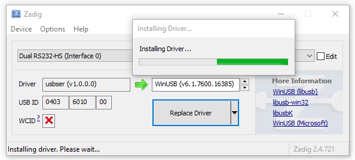
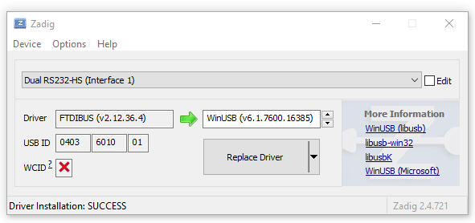
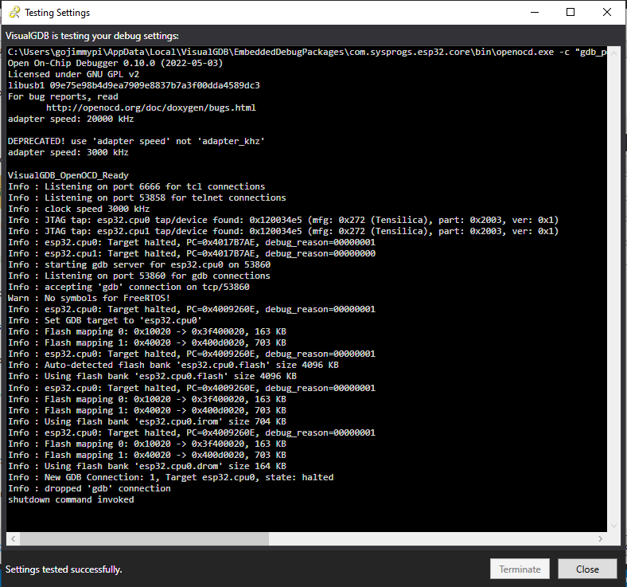

Fixing FTDI2232HL Dual Interface that appears as only one device.

The FTDI 2232, such as the one found on the [Espressif ESP32-Ethernet-Kit V1.2](https://docs.espressif.com/projects/esp-idf/en/latest/esp32/hw-reference/esp32/get-started-ethernet-kit.html#) 
is _normally_ a 2-interface device. But sometimes Microsoft Windows... well, you know.

If for some reason Windows just insists that there's only one device, there's hope! As reported in Zadig:

Although the board will technically work with only once device, a decision will need to be made as to whether
that the respective interface is used for JTAG _or_ Serial. During development _and_ an interface for COM-port 
serial output.

To resolve this situation, first ensure the board is plugged in and manually install the "Compoosite Device" driver. 

[ft2232hl](https://ftdichip.com/products/ft2232hl/)