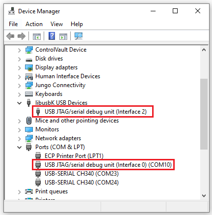

Setting up the ICE-V Wireless ESP32-C3 RISC-V + iCE40 FPGA 
development board with the Award Winning SERV RISC-V Core.


What's a SERV Core? It's an Award Winning tiny RISC-V soft CPU on an FPGA that was designed by Olaf Kindgren.
See [github.com/olofk/serv](https://github.com/olofk/serv) for more info.

See also my [micro-blog thread](https://twitter.com/gojimmypi/status/1544479903843696640?s=20&t=hZ9f8mrLQiTFg3PKvoIp2w) 
on Twitter related to the ICE-V board. Hopefully I'll capture all of the key details here as well.

Disclaimer: I received a free ICE-V Wireless board as described in my [prior blog](./2022-07-10-ICE-V-Wireless-FPGA-ESP32-C3.md).
I have not been compensated in any other way. Opinions expressed are my own. That said, it is a pretty cool board.
It is available on a [GroupGets campaign](https://groupgets.com/campaigns/1036-ice-v-wireless) that ends Tue, 16 Aug 2022 16:42:49 PDT.

### Requirements

[Espressif ESP-IDF](https://docs.espressif.com/projects/esp-idf/en/latest/esp32/get-started/index.html) 
and/or [VisualGDB](https://docs.espressif.com/projects/esp-idf/en/latest/esp32/get-started/index.html) is used to build 
and flash the ESP32 software.

SERV Core [github.com/olofk/serv](https://github.com/olofk/serv)  (see below regarding pending PR for ICE-V board)

FuseSoC Cores [github.com/fusesoc/fusesoc-cores/](https://github.com/fusesoc/fusesoc-cores/) (see below regarding PR for ICE-V board)

Write to FPGA with [send_c3sock.py](https://github.com/ICE-V-Wireless/ICE-V-Wireless/blob/main/python/send_c3sock.py). 
See [SENDBIT](https://github.com/ICE-V-Wireless/ICE-V-Wireless/blob/39f334b97ca3921e535368eb6db6014119025b38/Gateware/icestorm/Makefile#L34)
setting in the [icestorm Makefile](https://github.com/ICE-V-Wireless/ICE-V-Wireless/blob/main/Gateware/icestorm/Makefile).

ICE-V Wireless FPGA [pcf file](https://github.com/ICE-V-Wireless/ICE-V-Wireless/blob/main/Gateware/src/bitstream.pcf).

### USB Configuration

A USB Driver Utility such as [Zadig](https://zadig.akeo.ie/) or the [Sysprogs USB Driver Tool](https://visualgdb.com/UsbDriverTool/)
is essential for Windows users. After all these years, Microsoft still hasn't figured out the whole USB thing. Even after
getting a device working, a reboot later (typically after a Windows update) and Zadig will likely be needed again to assign
the proper drivers.

See my prior blogs such as [iCE40 FPGA Programming with WSL](./2020-12-20-ice40-fpga-programming-with-wsl-and.html)
and [Programming FPGA Devices from WSL](./2020-06-06-programming-fpga-devices-from-wsl.html). 

In the case of the ICE-V Wireless, here's what my driver list looks like:


Yes, there's `Interface 0` and `Interface 2` but NO `Interface 1`:


The devices looks like this in Windows Device Manager:



### Install

Reminder that unlike the Radiona [ULX3S](https://radiona.org/ulx3s/) 
that has an FPGA that sits IN FRONT of the ESP32 
(requiring a special [FPGA passthru](https://github.com/gojimmypi/ulx3s-examples/tree/master/passthru) 
to program the ESP32) - in contrast, the ICE-V Wireless has the FPGA sitting
BEHIND the ESP32-C3, requiring a [special app on the ESP32](https://github.com/ICE-V-Wireless/ICE-V-Wireless/tree/main/Firmware) to program the FPGA:

```
# enable the EDS-IDF environment
. $HOME/esp/esp-idf/export.sh

cd /mnt/c/workspace/
git clone https://github.com/ICE-V-Wireless/ICE-V-Wireless.git

cd ICE-V-Wireless/Firmware
idf.py build
```

I have an interim [VisualGDB project for the ESP32-C3 Firmware app](https://github.com/gojimmypi/ICE-V-Wireless/tree/my_last_working_branch/VisualGDB)
with working code to receive the FPGA binary and write to the local iCE40.
Note this is currently based on an older branch, as I had encountered some problems with both my local ESP-IDF 4.4.1 as well 
as my ESP-IDF 5.0 that are as of yet, unresolved.

There's a stable release of [ESP-IDF v4.4.2](https://docs.espressif.com/projects/esp-idf/en/v4.4.2/esp32/) available
on [GitHub](https://github.com/espressif/esp-idf/releases/tag/v4.4.2).

The [ICE-V-Wireless](https://github.com/ICE-V-Wireless/ICE-V-Wireless) is currently my `upstream`. 
Fetching my ICE-V-Wireless fork.

As a Windows/WSL user, I'm venturing into somewhat new territory for SERV & FuseSoC.
Fortunately Olaf, Michael, Eric, and others are patient and kind in helping newbies like me. Thank you.


### Potential Challenges

Out of that gate, I encountered a variety of challenges, presented here so that others may avoid:

One may be somewhat specific to me, but heads up the [detection of Python 2.7 vs 3.x](https://github.com/olofk/serv/issues/86) 
is not as robust as it could be.  TL;DR: be sure to use Python 3.x and make sure that `python --version` returns a
modern version and not the 2.7 one for best results.

The next problem is regarding [fusesoc duplicates](https://github.com/olofk/serv/issues/85). Perhaps also petty,
but this could be important, particularly during versioning conflicts. The `fusesoc library list` command
will readily identify duplicate libraries.

Similarly related to Python 2.x vs 3.x challenge is the `pip` vs `pip3` option. In my case it was best to explicitly 
state `pip3` despite the instructions indicating jsut `pip`. See [SERV Issue #83](https://github.com/olofk/serv/issues/83)
for more detail if you encounter `pip` install problems.

Despite all the challenges related to my environment, I'd like to again extend thanks to Olaf for being so kind 
in reaching out to help & offer suggestions.

At the moment, my PR's are still fresh off the press and not yet merged. Thus to follow along with the ICE-V Wireless,
my forks will be needed.

Stay tuned for [SERV PR #88](https://github.com/olofk/serv/pull/88) 
and [FuseSoC Cores PR #15](https://github.com/fusesoc/fusesoc-cores/pull/15) merge that each that adds ICE-V Support.
Additionally there's a [FuseSoc Blinky PR #89](https://github.com/fusesoc/blinky/pull/89) which also
adds ICE-V Support. Most recently emeb submitted [PR #90](https://github.com/olofk/serv/pull/90)
as [discussed on Discord channel](https://discord.com/channels/728101453071384647/977434078221598811/1006243287381844018)
regarding the POR (Power On Reset) timing.

Note that I manually added the POR `initial` condition locally; 
it is not in my fork nor PR.

### Key Technical Details

Here are some key documents for reference:

- ICE-V Wireless [Schematic](https://github.com/ICE-V-Wireless/ICE-V-Wireless/blob/main/docs/esp32c3_fpga_schematic.pdf)
- ICE-V Wireless [bitstream.pcf](https://github.com/ICE-V-Wireless/ICE-V-Wireless/blob/main/Gateware/src/bitstream.pcf)
- ICE-V Wireless [default bitstream source](https://github.com/ICE-V-Wireless/ICE-V-Wireless/blob/main/Gateware/src/bitstream.v)
- Espressif [ESP32-C3 Technical Reference](https://www.espressif.com/sites/default/files/documentation/esp32-c3_technical_reference_manual_en.pdf)
- Lattice [iCE40 Ultra Family Data Sheet DS1048](https://eu.mouser.com/datasheet/2/225/lattice_ice40ultra-1174814.pdf) (copy [here](../docs/lattice_ice40ultra-1174814.pdf))
- Lattice [Pin Out For iCE40 Ultra (iCE5LP4k)](https://www.latticesemi.com/view_document?document_id=50697), See SG48 column; those are pcf numbers. (copy [here](../docs/FPGA-SC-02027-4-0-iCE5LP-4K-Pinout.ods))

##### Technical Notes

Here are some gems gleaned during the [Discord](https://discord.com/channels/728101453071384647/977434078221598811) chat:

>_The PicoRV32 core that's used in this design doesn't have JTAG debugging capabilities. 
There may be others out there that do, but this one is very bare-bones to keep the resource use down._

>_Upside is that the firmware is stored in EBR that's loaded with the bitstream and the ice40 
tools allow changing the RAM contents w/o fully rebuilding, so the firmware development cycle
is pretty fast. Look in the Makefile - there's a target called recode that will recompile 
firmware, update the bitstream and reload it to hardware in a blink.
There's also a 115200kbps UART in there that you can printf() to._

>_Currently there's 64kB of RAM and 8kB of ROM in the soft MCU system  on the FPGA. That can be expanded somewhat if needed._

>_The PSRAM is not mapped into the addressable space in this system, but there are examples of how to do that out there._

>_The LY68L6400 is 64Mb - equal to 8MB._

>_The FPGA image and all the ESP32C3 code is stored in a 4MB flash that's integrated into the Mini module. That's entirely separate from what happens w/ the FPGA._

>_The UP5k can load itself at reset from an external SPI flash chip, but on the ICE-V-Wireless we don't let it do that - the bitstreams come exclusively from the C3 over it's SPI port.
The PSRAM is not at all involved in this._

> _when you're sending a bitstream to the board with the send_c3sock.py script there are two different options:
> * if you don't specify -f then the bitstream is immediately loaded into the FPGA
> * if you do specify -f then the bitstream is saved in SPIFFS and loaded upon reboot. 
So if you're using the -f option you're not immediately seeing the latest bitstream you sent._

>_ATM the only non-WiFi way to put bitstreams on is by building them into the SPIFFS filesystem at compile / flash time._

  -- emeb from discord

### Fusesoc Blinky

I've added ICE-V Wireless support in my [gojimmypi/fusesoc-blinky](https://github.com/gojimmypi/fusesoc-blinky)
in my [fusesoc/blinky](https://github.com/fusesoc/blinky).

*NOTE*: 

- FuseSoC FPGA core does not currently start when first loaded.

- Core only starts after reset.

- Unless `--flash` is used, prior FPGA binary image load is lost at reset.

This means that FuseSoC blinky *requires* the `--flash` parameter, and
the board must be reset or power cycled to actually start the blinky.

See the [Discord chat for a discussion on Power-On-Reset (POR) timing](https://discord.com/channels/728101453071384647/977434078221598811/1006190449746260060).

To use the FuseSoc Blinky: In a new, empty fusesoc project directory:


```
cd /mnt/c/workspace

#fetch ICE-V Wireless, if not already there:
git clone https://github.com/gojimmypi/ICE-V-Wireless.git

mkdir myfusesocblinky
cd myfusesocblinky

fusesoc library add fusesoc_cores https://github.com/gojimmypi/fusesoc-cores
fusesoc library add serv https://github.com/gojimmypi/serv
fusesoc library add blinky https://github.com/gojimmypi/fusesoc-blinky

# similation
fusesoc run --target=sim fusesoc:utils:blinky

# build for ICE-V Wireless
fusesoc run --target=icev_wireless fusesoc:utils:blinky

python3 ../ICE-V-Wireless/python/send_c3sock.py -a 192.168.1.28 --flash ./build/fusesoc_utils_blinky_1.1.1/icev_wireless-icestorm/fusesoc_utils_blinky_1.1.1.bin
```

### Usage


```bash
# These steps were performed in WSL on Windows:

cd /mnt/c/workspace
git clone https://github.com/gojimmypi/ICE-V-Wireless.git
cd ICE-V-Wireless
git remote add upstream https://github.com/ICE-V-Wireless/ICE-V-Wireless
git fetch upstream
git pull upstream main
git push


pip3 install fusesoc

mkdir /mnt/c/workspace/mynewfusesoc
cd /mnt/c/workspace/mynewfusesoc


# this will:
# git clone fusesoc_libraries into current directory
# git clone serv fusesoc_libraries into current directory
# create a default fusesoc.conf
#
# note these are from the gojimmypi fork, pending merge of the respective PRs:
fusesoc library add fusesoc_cores https://github.com/gojimmypi/fusesoc-cores
fusesoc library add serv https://github.com/gojimmypi/serv

fusesoc run --target=icev_wireless servant

# see the files in C:\workspace\mynewfusesoc\build\servant_1.1.0\icev_wireless-icestorm

../ICE-V-Wireless/python/send_c3sock.py --flash ./build/servant_1.1.0/icev_wireless-icestorm/servant_1.1.0.bin
```

SERVANT Hello (not currently fully operational; Seems to be POR timing issue)

```

# with no --memfil parameter,  zephyr_hello.hex is used. 
# From log: Preloading $paramod...\servant_ram from zephyr_hello.hex
fusesoc run --target=icev_wireless servant --memfile=./zephyr_hello.hex
cp ./build/servant_1.1.0/icev_wireless-icestorm/servant_1.1.0.bin ./servant_hello.bin
python3 ../ICE-V-Wireless/python/send_c3sock.py -a 192.168.1.28 ./servant_hello.bin
```

Of interest is the [pin definition file used by fusesoc](https://github.com/gojimmypi/serv/blob/main/data/icev_wireless.pcf). 
In my case, once installed, is found here:

```
C:\workspace\mynewfusesoc\fusesoc_libraries\servant\data\icev_wireless.pcf
```

With just a couple of lines of FPGA pin definitions:

```
# 12 MHz clock
set_io i_clk        35

# RS232
set_io q 9

# use q 39 for red, q 40 for green, q 41 for blue LED
```

### FuseSoC Zephyr

There's some discussion on the Discord channel [regarding the blinky hex](https://discord.com/channels/728101453071384647/977434078221598811/1006323363637121194), 
but the `zephyr_hello.hex` is confirmed to work with the ICE-V Wireless:

```bash
# from your fusesoc project directory:
fusesoc run --target=icev_wireless servant --memfile=fusesoc_libraries/serv/sw/zephyr_hello.hex
python3 ../ICE-V-Wireless/python/send_c3sock.py -a 192.168.1.28 --flash ./build/servant_1.1.0/icev_wireless-icestorm/servant_1.1.0.bin
```

### GitHub maintenance

A reminder for 


```bash
cd /mnt/c/workspace/fusesoc-cores

# one-time:
git remote add upstream https://github.com/fusesoc/fusesoc-cores

git fetch upstream
git pull upstream master
git push

cd /mnt/c/workspace/serv

# one-time:
git remote add upstream https://github.com/olofk/serv
git fetch upstream
git pull upstream main
git push
```

### Oddities

Although the board is indeed called a _Wireless_ FPGA, I found it a bit awkward to not
have an optional _wired_ FPGA bitstream upload capability. This also means during any 
ESP32 development effort, any FPGA updates will require the ESP32 chip to be running 
the bitstream loader. It could of course be running in an RTOS thread.

The RGB LEDs connected to the FPGA are connected _directly_ to the FPGA. Modern LEDs
can be rather bright. Keep this in mind to avoid any eye injuries. 
(kidding, it is not that bright, but still brighter than you might expect, with no 
current-limiting resistors)

### Troubleshooting

Keep in mind that the board version used was _prior_ to completion of the GroupGets campaign.
Software and hardware may well be revised to address issues. Some problem were clearly related
to my system config. ymmv.

##### IndexError: index out of range

The `IndexError: index out of range` error seemed to typically occur if there's a weak 
WiFi signal and the connection is lost during transfer. The current code version does not seem to
recover well and needed a restart to successfully upload.

```
$ python3 ./send_c3sock.py -a 192.168.1.28 -f servant.bin
Size of servant.bin is 104090 bytes
Traceback (most recent call last):
  File "./send_c3sock.py", line 197, in <module>
    send_file(args[0], cmmd, addr, port)
  File "./send_c3sock.py", line 34, in send_file
    if reply[0] :
IndexError: index out of range
```

### Other stuff


```
fusesoc library add servant https://github.com/gojimmypi/serv
fusesoc library add fusesoc-cores https://github.com/gojimmypi/fusesoc-cores
fusesoc run --target=icev_wireless servant


fusesoc core list | grep blink
```

There were some other issues that are here for reference only. More investigation is
needed to determine if the

```
fusesoc:utils:blinky:0                 : empty
fusesoc:utils:blinky:1.0               : empty
fusesoc:utils:blinky:1.1               : empty
```


blinky not found:
```
gojimmypi:/mnt/c/workspace/mywslfusesoc
$ fusesoc core list | grep blink
fusesoc:utils:blinky:0                 : empty
fusesoc:utils:blinky:1.0               : empty
fusesoc:utils:blinky:1.1               : empty
gojimmypi:/mnt/c/workspace/mywslfusesoc
$ fusesoc run --target=icev_wireless fusesoc:util:blinky
ERROR: 'fusesoc:util:blinky' or any of its dependencies requires 'blinky', but this core was not found
```


blinky still not found after manual load:

```
gojimmypi:/mnt/c/workspace/mywslfusesoc
$ fusesoc library add blinky https://github.com/fusesoc/blinky
INFO: Cloning library into fusesoc_libraries/blinky
Cloning into 'fusesoc_libraries/blinky'...
remote: Enumerating objects: 605, done.
remote: Counting objects: 100% (252/252), done.
remote: Compressing objects: 100% (65/65), done.
remote: Total 605 (delta 195), reused 200 (delta 182), pack-reused 353
Receiving objects: 100% (605/605), 115.45 KiB | 42.00 KiB/s, done.
Resolving deltas: 100% (314/314), done.
gojimmypi:/mnt/c/workspace/mywslfusesoc
$ fusesoc run --target=sim fusesoc:util:blinky
ERROR: 'fusesoc:util:blinky' or any of its dependencies requires 'blinky', but this core was not found
gojimmypi:/mnt/c/workspace/mywslfusesoc
$ fusesoc run --target=icev_wireless fusesoc:util:blinky
ERROR: 'fusesoc:util:blinky' or any of its dependencies requires 'blinky', but this core was not found
gojimmypi:/mnt/c/workspace/mywslfusesoc
```


tool=modelsim fails:
```
gojimmypi:/mnt/c/workspace/mywslfusesoc
$ fusesoc run --target=icebreaker tool=modelsim fusesoc:util:blinky
Traceback (most recent call last):
  File "/home/gojimmypi/.local/bin/fusesoc", line 11, in <module>
    sys.exit(main())
  File "/home/gojimmypi/.local/lib/python3.6/site-packages/fusesoc/main.py", line 776, in main    args.func(cm, args)
  File "/home/gojimmypi/.local/lib/python3.6/site-packages/fusesoc/main.py", line 374, in run
    args.build_root,
  File "/home/gojimmypi/.local/lib/python3.6/site-packages/fusesoc/main.py", line 393, in run_backend
    core = _get_core(cm, system)
  File "/home/gojimmypi/.local/lib/python3.6/site-packages/fusesoc/main.py", line 45, in _get_core
    core = cm.get_core(Vlnv(name))
  File "/home/gojimmypi/.local/lib/python3.6/site-packages/fusesoc/coremanager.py", line 267, in get_core
    c = self.db.find(name)
  File "/home/gojimmypi/.local/lib/python3.6/site-packages/fusesoc/coremanager.py", line 73, in find
    found = self._solve(vlnv, only_matching_vlnv=True)[-1]
  File "/home/gojimmypi/.local/lib/python3.6/site-packages/fusesoc/coremanager.py", line 154, in _solve
    request.install(Requirement._from_string(_top_dep))
  File "/home/gojimmypi/.local/lib/python3.6/site-packages/simplesat/constraints/requirement.py", line 149, in _from_string
    named_constraints = parser.parse(string, version_factory)
  File "/home/gojimmypi/.local/lib/python3.6/site-packages/simplesat/constraints/parser.py", line 224, in parse
    tokens_blocks = _tokenize(self._scanner, requirement_string)
  File "/home/gojimmypi/.local/lib/python3.6/site-packages/simplesat/constraints/parser.py", line 154, in _tokenize
    raise InvalidConstraint(msg.format(requirement_string))
simplesat.errors.InvalidConstraint: 'tool=modelsim >= 0-0'(distribution name: 'tool')(unparsed '=modelsim >= 0-0')
gojimmypi:/mnt/c/workspace/mywslfusesoc
```


<br />

See also:

- [ICE-V Wireless Discord Channel](https://discord.com/channels/728101453071384647/977434078221598811)
- [gitter librecores/fusesoc Channel](https://gitter.im/librecores/fusesoc?utm_source=notification&utm_medium=email&utm_campaign=unread-notifications)
- [Zephyr RTOS Support for ICE-V Wireless](https://github.com/zephyrproject-rtos/zephyr/tree/main/boards/riscv/icev_wireless)
- hackster.io [QWERTY's ICE-V Wireless Packs RISC-V, FPGA, Bluetooth, and Wi-Fi Into a Single Handy Board](https://www.hackster.io/news/qwerty-s-ice-v-wireless-packs-risc-v-fpga-bluetooth-and-wi-fi-into-a-single-handy-board-8938f830a0ce)
- linuxgizmos [RISC-V based ICE-V Wireless board includes a Lattice ICE40 UltraPlus FPGA](https://linuxgizmos.com/risc-v-based-ice-v-wireless-board-includes-a-lattice-ice40-ultraplus-fpga/)
- electronics-lab [QWERTY Embedded Design Crowdfunding ICE-V Wireless FPGA Development Board at $75.00](https://www.electronics-lab.com/qwerty-embedded-design-crowdfunding-ice-v-wireless-fpga-development-board-at-75-00/)
- cnx-software [ICE-V Wireless FPGA board combines Lattice Semi iCE40 UltraPlus with WiFi & BLE module](https://www.cnx-software.com/2022/06/27/ice-v-wireless-fpga-board-lattice-semi-ice40-fpga-wifi-ble-module/)
- mwelling [ICE-V-Wireless fork](https://github.com/mwelling/ICE-V-Wireless)
- emeb [ESP32C3_FPGA](https://github.com/emeb/ESP32C3_FPGA)
- 