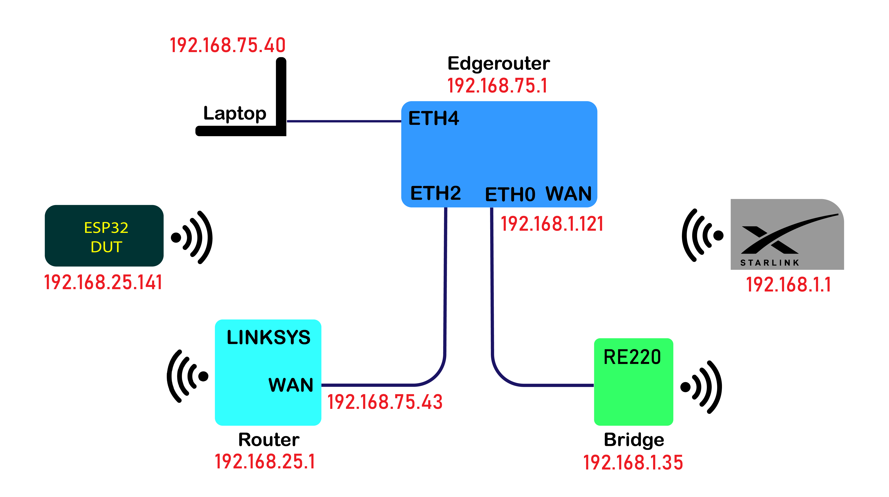
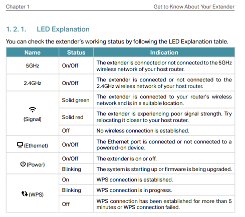

Sniffing WiFi packets on an ESP32 during development.



This blog documents the network configuration used in an ESP32 test environment with some challenges:

- The ESP32 DUT cannot practically be configured to have a wired Ethernet interface.
- A wired Ethernet interface is needed to insert a port-sniffing router.
- No wired Ethernet ports are available in practical proximity to development computer.

For a simpler version of port sniffing the ESP32 with a wired connection, see the prior blog
[EdgeRouter-X Port Mirroring: Inspect ESP32 Network Packets](https://gojimmypi.github.io/Edgerouter-Port-Monitor/).

Reminder for EsdgeRouter-X settings, lost at reboot time:

```bash
# we'll monitor from eth4. (ports start at 0, left-most when facing)
sudo /sbin/switch mirror monitor 4

# start mirroring packets from eth2 onto eth4; a value of 3 means all packets
sudo /sbin/switch mirror target 2 3
```

Other helpful tidbits found at [community.ui: "Stale DNS issue"](https://community.ui.com/questions/Stale-DNS-issue-with-several-USG-/805ebe02-e976-420a-801c-138d03a93d23):

```bash
# To see current DNS stats:
show dns forwarding statistics

# To clean DNS cache:
clear dns forwarding cache

# Show dns nameservers
show dns forwarding nameservers

# To show the leases on a given network:
show dhcp leases pool net_LAN_192.168.1.0-24

# To clear the stale record for ip 192.168.1.44:
clear dhcp lease ip 192.168.1.44
```

To add wired Ethernet to an ESP32, see prior blog: [ENC28J60 ESP32](https://gojimmypi.github.io/ENC28J60-ESP32/)

## Equipment Used

- [ESP32-WROOM32](https://www.amazon.com/gp/product/B01N0SB08Q/), the Device Under Test (DUT)
- [Starlink Dishy](https://www.starlink.com/) (any ISP should work)
- [TP-Link AC750 WiFi Extender (RE220)](https://www.amazon.com/gp/product/B07N1WW638/)  (not required)
- [Ubiquity EdgeRouter-X](https://smile.amazon.com/Ubiquiti-Networks-ER-X-Router/dp/B0144R449W/) (used for port mirroring)

## Overview

We'll connect the ESP32 Device Under Test (`DUT`) to the Internet:

```
  DUT <<--WiFi-->> Router <<--EtherNet-to-ISP-->> Internet
```

Although the test topology may sound complicated at first, it is actually fairly simple as shown:


## Topology

The main production network is on a completely separate LAN and ISP. That netwok uses [PiHole](https://pi-hole.net/) 
as described in a [previous blog](https://gojimmypi.github.io/raspberry-pi-pi-hole-setup-notes/).

The good thing about the Pi-Hole is all the DNS lookups for undesired sites are blocked. 
The bad thing is that during testing, a test destination address may be blocked.

The test network here will use [StarLink](https://www.starlink.com/) ISP. There's no Pi-Hole and there's also no wired Ethernet interface. 
(There's an optional [Ethernet Adapter sold separately](https://shop.starlink.com/products/us-consumer-ethernet-adapter-gen2))

```
DUT Test Router <<-- Wired Ethernet to ISP -->> Internet
```

The `DUT` Router Setup:


The `DUT` Router LAN:


The `DUT` Router WAN:


The `DUT` Router Wireless:


As all on-site networking equipment acts as a switch and not a hub, some sort of port spanning or mirroring will be needed to sniff packets.
See prior [blog on Port Mirroring](https://gojimmypi.github.io/Edgerouter-Port-Monitor/).

```
 Test Router <<--Wired-->> Port-Sniffer <<--Ethernet-to-ISP-->> Internet
```

The EdgeRouter-X will be used to help sniff WiFi packets. It will sit between the wired connection of the ISP (in this case, a bridge) 
and the WiFi Test Router (`RT1`) for the `DUT`. The EdgeRouter-X does not have WiFi capability, but it does have a port mirroring feature.

```
 DUT <<--WiFi-->> Test Router <<--Wired-->> EdgeRouter-X <<--Ethernet-to-ISP-->> Internet
```

EdgeRouter Dashboard:


EdgeRouter Routes:


EdgeRouter `ETH0`:


EdgeRouter `ETH2`:


EdgeRouter `ETH4`:


EdgeRouter Configure Port Mirror:


In order to get wired Ethernet of the EdgeRouter-X to connect to the StarLink WiFi, the AC750/RE220 is configured in bridge (extender) mode. 
Basically the RE220 creates a single wired-Ethernet port that is on the same subnet as the StarLink WiFi. Other network 
topologies may not need this.

```
 DUT <<-- WiFi -->> Test Router <<-- Wired -->> EdgeRouter-X <<-- Wired -->> RE220 Bridge <<-- WiFi -->> StarLink ISP -->> Internet
```

The RE220 home screen has this, but in reverse order (right to left):


Here are the basic RE220 settings:


There are LED indicators on the TP-Link AC750 (aka RE220) from page 4 of the [manual](../docs/AC750-RE220.pdf):




The ESP32 Device Under Test (DUT) connects to a Linksys Test Router (RT1) over WiFi. SSID = `dut-test`.

Note that in order to connect and see the test router configuration, 
the network cable will need to be moved from the EdgeRouter (192.168.75.x)
to the Test Router (192.168.25.x) as the WiFi WAN port of a router typically does not allow inbound security config.

All clients, including WAN ports are configured in the default mode using DHCP. Actual IP addresses may vary:

The DUT Test Router Network is `192.168.25.x`.

```
ESP32 DUT               <<  WiFi >>  Linksys Router RT1
  DHCP IP = 192.168.25.141              IP = 192.168.25.1
  Gateway = 192.168.25.1                RT = 192.168.75.1
```

The Linksys Router's WAN port is connected to a Ubiquity EdgeRouter-X on `ETH2`. The sniffing network is `192.168.75.x`.

```
Linksys Router RT1      << Wired >>  EdgeRouter-X RTX
  LAN     = 192.168.25.1               LAN     = 192.168.75.x
  WAN IP  = 192.168.75.43              WAN IP  = 192.168.1.121 (DHCP)
  Gateway = 192.168.75.1               Gateway = 192.168.1.1
```

The EdgeRouter-X's WAN (`ETH0`) port is connected to the bridge:

```
EdgeRouter-X RTX        << Wired >>  RE220 Bridge B1
  LAN     = 192.168.75.x               LAN     = 192.168.x
  WAN IP  = 192.168.1.121              WAN IP  = (n/a in bridge mode)
  Gateway = 192.168.1.1
```

The RE220 Bridge is connected to StarLink over WiFi

```
RE220 Bridge B1         << WiFi >>   Starlink
  IP      = 192.168.1.35               IP = 192.168.1.1
  Gateway = 192.168.1.1                RT = 192.168.1.1
```

The development desktop computer is on the StarLink subnet at `192.168.1.243`.

## Admin Interfaces:

Some "special" IP addresses and names:


StarLink http://192.168.100.1/  == http://dishy.starlink.com/

RE220 http://192.168.1.35/webpages/login.html == http://tplinkrepeater.net/

Components are added by [parsing each of the directories in the components directory](https://github.com/espressif/esp-idf/blob/5c1044d84d625219eafa18c24758d9f0e4006b2c/tools/cmake/build.cmake#L198)


<br />

See also:

- [JTAG Single Step Debugging ESP32 with Tigard](https://gojimmypi.github.io/Tigard-JTAG-SingleStep-Debugging-ESP32/)
- [SSH to ULX3S Espressif ESP32 with wolfSSH](https://gojimmypi.github.io/SSH-to-ULX3S-ESP32/)
- [SSH to ESP8266](https://gojimmypi.github.io/SSH-to-ESP8266/)
- [REST API SOAP Payload Sniffing](https://gojimmypi.github.io/rest-api-soap-payload-sniffing/)
- [EdgeRouter-X Port Mirroring: Inspect ESP32 Network Packets](https://gojimmypi.github.io/Edgerouter-Port-Monitor/)
- [Dual WAN OpenVPN with EdgeRouter X or RT-AX86U](https://gojimmypi.github.io/dual-wan-openvpn-with-edgerouter-x-or/) 