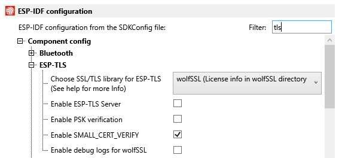
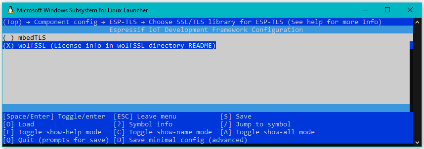
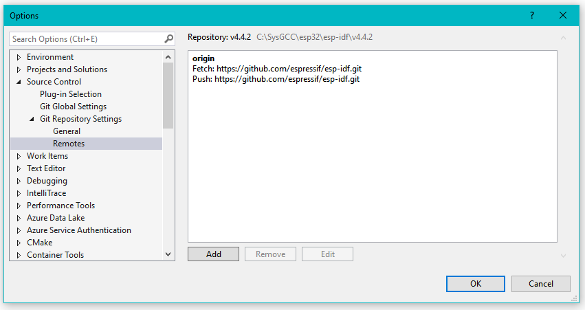

Here are some notes on removing the mbedTLS and using the commercial-grade wolfSSL encryption libraries with the Espressif ESP32.

This blog is still a work-in progress.

## Initial Review

Note that the [wolfSSL libraries](https://github.com/wolfssl/) are all open source GPLv2 and free for makers! 
Contact [wolfSSL for commercial license info](https://www.wolfssl.com/license/).

The 4.x versions of the [Espressif ESP-IDF toolchain](https://github.com/espressif/esp-idf) allow configuration of application-level TLS
provider selection between either mbedTLS or [wolfSSL](https://www.wolfssl.com/documentation/manuals/wolfssl/index.html). 
More specifically: a selection between mbedTLS and the [Espressif esp-wolfssl](https://github.com/espressif/esp-wolfssl)
component.

In order to use [esp-wolfssl](https://github.com/espressif/esp-wolfssl), it should be installed in the local project "components" directory.
Be sure to add it to the project-level `set(COMPONENTS` list in the CMakeFiles.txt file.

Note the [esp-wolfssl](https://github.com/espressif/esp-wolfssl) uses a fixed point-in-time submodule of [wolfssl](https://github.com/wolfSSL/wolfssl)
and is not recommended for production environments. As of the date of this blog, that [esp-wolfssl submodule](https://github.com/wolfSSL/wolfssl/tree/57aac1c50b45275c7a99eca32ad985998b292dc8)
is 2 months old. See the [wolfSSL Releases](https://github.com/wolfSSL/wolfssl/releases) for the latest wolfSSL release.

#### Select TLS Provider

Selection between the TLS providers is a simple matter of right-clicking on a VisualGDB project and typing "TLS" in the filter box 
and choosing "wolfSSL":



Selection can also be made at the command prompt using `idf.py menuconfig`. Select "Component Config", then "ESP-TLS", then "Choose SSL/TLS Library":



#### Warning about mbedTLS Revert

NOTE: The [esp-wolfssl](https://github.com/espressif/esp-wolfssl) must be properly installed int the local project `components` 
directory and exactly, perfectly configured. If any problems are encountered the `idf.py build` process will quietly revert back to mbedTLS.

It is not immediately obvious just what mechanism is used to revert to mbedTLS when the `esp-wolfssl` is not properly configured. The key statement is 
the [kconfig.cmake execute_process()](https://github.com/espressif/esp-idf/blob/138bbec8ab4deb533d06ee8365f549e838b3fffa/tools/cmake/kconfig.cmake#L206)
which calls [confgen.py](https://github.com/espressif/esp-idf/blob/release/v4.2/tools/kconfig_new/confgen.py). Debugging that script is beyond the scope of this blog.

The key point is that a `Kconfig` file *must* be present in the root of the respective component directory in order to not have the ESP-IDF revert to mbedTLS 
when the CMake files are reloaded.

The important file for wolfSSL is the `user_settings.h`, which for the `esp-wolfssl` would be found in the project directory: `components/esp-wolfssl/include`. 
For more information on user settings, see [Chapter 2 of the wolfSSL Documentation](https://www.wolfssl.com/documentation/manuals/wolfssl/chapter02.html).

Although it would be nice if the Espressif ESP-IDF included wolfSSL source code, or even just a directory for the component 
to be [easily installed](https://github.com/gojimmypi/esp-idf/blob/PR_wolfssl_component/components/wolfssl/wolfssl_setup.cmd),
per [#9288, it is unlikely that will ever happen](https://github.com/espressif/esp-idf/pull/9288).

For now, the wolfSSL component will need to be installed in the local project component directory.

Moving beyond the stale `esp-wolfssl` component should be one of the first orders of business. 
Note that the [mbedTLS component](https://github.com/espressif/esp-idf/tree/release/v4.2/components/mbedtls) includes
an even older version of the [Espressif fork of mbedTLS](https://github.com/espressif/mbedtls) from [Mbed-TLS/mbedtls](https://github.com/Mbed-TLS/mbedtls). 
As of the date of this blog, that Espressif [submodule](https://github.com/espressif/mbedtls/tree/dc406b82b20481bde74a60fa8a776285d3fb9cf3) is 9 months old. 


## Migration Steps

There's a [Sample WiFi STA Example](https://github.com/gojimmypi/wolfssl-examples/tree/f40a11c1689f061ebcdb411e73cf575b18e65f5c) which is the
out-of-the-box experience when first creating an [Example App with VisualGDB](https://visualgdb.com/tutorials/esp32/esp-idf/).

#### Private Config

Rather than hard-code values such as [SSID and password](https://github.com/gojimmypi/wolfssl-examples/blob/148faf37f2cbfef386f3e17e42eab743ffb7ebcc/ESP32/mbedTLS-to-wolfSSL-Migration/main/station_example_main.c#L27)) 
in the main app and/or [SDK config](https://github.com/gojimmypi/wolfssl-examples/blob/148faf37f2cbfef386f3e17e42eab743ffb7ebcc/ESP32/mbedTLS-to-wolfSSL-Migration/sdkconfig#L138), 
it is probably best to keep all those values someplace else to ensure they don't get accidentally pushed to GitHub.

Some developers choose to include the `sdkconfig` file in the `.gitignore` list. That may not always be the wisest choice, as other valuable settings in that file would then also be excluded from GitHub.

A better way is to reference a file completely outside the scope of GitHub. For instance, if all projects are located in a clone from a `workspace` directory, that could be
a good location to store a `my_private_config.h` file. Then from the root of any project, the secret file would be in the '../' parent directory.
One possible way to use such a file is by including a [main/my_config.h](https://github.com/wolfSSL/wolfssh-examples/blob/main/Espressif/ESP32/ESP32-SSH-Server/main/my_config.h)
file in the project, such as the [one for the SSH to UART server](https://github.com/wolfSSL/wolfssh-examples/blob/4b2aaa451db96e6c4bf57317fd1bf73bdd86c37a/Espressif/ESP32/ESP32-SSH-Server/main/my_config.h#L1).

That `my_config.h` file also includes some comments for robustly including the  `my_private_config.h` regardless of environment path syntax (e.g. Windows, WSL, Linux, etc.) - note these
changes are applied to the [example project CMakeFile.txt](https://github.com/gojimmypi/wolfssl-examples/blob/a78e89dc70baf2fce9569871876480fd6b19be65/ESP32/mbedTLS-to-wolfSSL-Migration/CMakeLists.txt#L41):

```
if(EXISTS "/c/workspace/my_private_config.h")
   message(STATUS "found SYSPROGS_MY_PRIVATE_CONFIG")
   add_definitions( -DSYSPROGS_MY_PRIVATE_CONFIG="/c/workspace/my_private_config.h" )
endif()

if(EXISTS "/workspace/my_private_config.h")
   message(STATUS "found WINDOWS_MY_PRIVATE_CONFIG")
   add_definitions( -DWINDOWS_MY_PRIVATE_CONFIG="/workspace/my_private_config.h" )
endif()

if(EXISTS "/mnt/c/workspace/my_private_config.h")
   message(STATUS "found WSL_MY_PRIVATE_CONFIG")
   add_definitions( -DWSL_MY_PRIVATE_CONFIG="/mnt/c/workspace/my_private_config.h" )
endif()

if(EXISTS "(~/my_private_config.h")
   message(STATUS "found LINUX_MY_PRIVATE_CONFIG")
   add_definitions( -DWSL_MY_PRIVATE_CONFIG="~/my_private_config.h" )
endif()
```
 

 ## ESF-IDF Revisions for wolfSSL

There are some minor changes needed to the ESP-IDF to properly support wolfSSL as a local component.

The ESP-IDF repo is massive, so be patient when cloning. To clone the ESP-IDF locally, don't forget the submodules:

 ```bash
 git clone https://github.com/gojimmypi/esp-idf.git
 git submodule update --init --recursive
 ```

But in all likelihood, the ESP-IDF is probably already installed. If not, check out the [installation instructions](https://docs.espressif.com/projects/esp-idf/en/latest/esp32/get-started/).

In the case of VisualGDB, the ESP-IDF toolchain was installed in `C:\SysGCC\esp32\esp-idf\v4.4.2` in a "detached head" mode.

It would probably be best to create a branch of the ESP-IDF in case things go sideways. In VisualGDB, this is quite easy with the
"Git - Managed Remotes..." selection from the toolbar:



Note that sometimes Visual Studio may not immediately "see" git changes made via command-line. Exit and restart.

As noted in a [prior blog](https://gojimmypi.github.io/git-tangle-replace-branch/), it can be helpful to add an "upstream" remote. 
(See also [Managing remote repositories](https://docs.github.com/en/get-started/getting-started-with-git/managing-remote-repositories))

Here are some git commands:

```
# change to the directory where your ESP-IDF toolchain was installed.
cd . 

# View current remotes:
git remote -v

# View the current commit hash (helpful to return when in detached head mode)
git rev-parse HEAD

# change the remote to your fork of esp-idf
git remote set-url origin https://github.com/gojimmypi/esp-idf.git

# add an upstream remote
git remote add upstream https://github.com/espressif/esp-idf.git

# update any submodules needed
git submodule update --init --recursive

# keep the master branch in sync with upstream
git fetch upstream
git pull upstream master


# got back to the detached head branch from the git rev-parse HEAD command (see above)
# in this case: 1b16ef6cfc2479a08136782f9dc57effefa86f66
git branch 1b16ef6cfc2

```

## Intializat the ESP-IDF environment

```
# change to the directory that contains your project:
#
cd /mnt/c/workspace/wolfssl-examples/ESP32/mbedTLS-to-wolfSSL-Migration

# if the above was installed via VisualGDB, this may need to be run from a command prompt
# to use the same idf.py toolchain from outside of VisualGDB:
#
# /mnt/c/SysGCC/esp32/esp-idf/v4.4.2/install.sh
#
# The export command below will prompt if the install is needed.

# this is the typical setup of a fresh command prompt to run the idf.py
# be sure to run export.sh from the desired version directory:
#
. /mnt/c/SysGCC/esp32/esp-idf/v4.4.2/export.sh
```

## Install the wolfSSL component

Create a project `./components/wolfssl` directory and run either the [wolfSSL setup.sh](https://github.com/wolfSSL/wolfssl/blob/master/IDE/Espressif/ESP-IDF/setup.sh)
or [setup_win.bat](https://github.com/wolfSSL/wolfssl/blob/master/IDE/Espressif/ESP-IDF/setup_win.bat).

Alternatively, there's a new experimental [git sparse install]()


## Memory


The mbedTLS has some settings in [esp-idf/components/mbedtls/port/esp_mem.c](https://github.com/espressif/esp-idf/blob/release/v4.2/components/mbedtls/port/esp_mem.c) 
that chose where and how to allocate memory on the ESP32 (assumed to be Xtensa architecture only: TODO review for RISC-V)


`hostapd/wpa_supplicant` is hosted at [w1.fi/cgit/hostap/](https://w1.fi/cgit/hostap/),
The version 2.10 is available in a [zip download](https://w1.fi/cgit/hostap/snapshot/hostap_2_10.zip)

The Espressif hostap/supplicant didn't always have all code open source. [ESP-IDF #3003](https://github.com/espressif/esp-idf/issues/3003)
resolved that.

```
git clone https://w1.fi/cgit/hostap
```

## wpa_supplicant

Take a few wolfSSL files from [w1.fi/cgit/hostap/tree/src/crypto](https://w1.fi/cgit/hostap/tree/src/crypto) and put them
into `esp-idf\[version]\components\wpa_supplicant\src\crypto`. ([here](https://github.com/espressif/esp-idf/tree/master/components/wpa_supplicant/src/crypto)),
Specifically:

- [tls.h](https://w1.fi/cgit/hostap/tree/src/crypto/tls.h)
- [crypto_wolfssl.c](https://w1.fi/cgit/hostap/plain/src/crypto/crypto_wolfssl.c)
- [fips_prf_wolfssl.c](https://w1.fi/cgit/hostap/plain/src/crypto/fips_prf_wolfssl.c)
- [tls_wolfssl.c](https://w1.fi/cgit/hostap/plain/src/crypto/tls_wolfssl.c), [dgarske / hostap](https://github.com/dgarske/hostap/blob/wolfssl/src/crypto/tls_wolfssl.c)


https://w1.fi/cgit/hostap/tree/src/crypto/tls_wolfssl.c

https://w1.fi/cgit/hostap/tree/src/crypto/crypto_wolfssl.c

Put them into: https://github.com/espressif/esp-idf/tree/master/components/wpa_supplicant/src/crypto

## Additional Resources

- Espressif [Heap Memory Allocation](https://docs.espressif.com/projects/esp-idf/en/latest/esp32/api-reference/system/mem_alloc.html
- Espressif [ESP32 Memory Analysis - Case Study](https://blog.espressif.com/esp32-memory-analysis-case-study-eacc75fe5431)
- esp32.com [Where's the rest of the internal memory?](https://esp32.com/viewtopic.php?t=3802)
- visualgdb [toolchain documentation](https://visualgdb.com/documentation/toolchains/)
- w1.fi [hostapd/wpa_supplicant](https://w1.fi/cgit/hostap/)
- w1.fi [wpa_supplicant / hostapd: Porting to different target boards and operating systems](https://w1.fi/wpa_supplicant/devel/porting.html)
- Espressif [esp-wolfssl component](https://github.com/espressif/esp-wolfssl)
- Espressif [Heap Debug](https://docs.espressif.com/projects/esp-idf/en/latest/esp32/api-reference/system/heap_debug.html)
- Espressif [Minimizing RAM Usage](https://docs.espressif.com/projects/esp-idf/en/latest/esp32/api-guides/performance/ram-usage.html#optimize-iram-usage)
- Espressif [Minimizing Binary Size](https://docs.espressif.com/projects/esp-idf/en/latest/esp32/api-guides/performance/size.html#idf-py-size)
- Espressif [esp-idf wpa_supplicant CMakeLists.txt](https://github.com/espressif/esp-idf/blob/master/components/wpa_supplicant/CMakeLists.txt)
- Espressif [esp-idf wpa_supplicant crypto.h](https://github.com/espressif/esp-idf/blob/master/components/wpa_supplicant/src/crypto/crypto.h)
- Espressif [esp-idf components/esp-tls/esp_tls.c](https://github.com/espressif/esp-idf/blob/master/components/esp-tls/esp_tls.c)
- Espressif [Request to provide source code of EspressIf's hostap fork (IDFGH-592) #3003](https://github.com/espressif/esp-idf/issues/3003)
- Espressif [ESP32 Memory Analysis - Case Study](https://blog.espressif.com/esp32-memory-analysis-case-study-eacc75fe5431)
- GitHub [dgarske/hostap](https://github.com/dgarske/hostap/blob/wolfssl/src/crypto/tls_wolfssl.c) 
- stackoverflow [CMake: Print out all accessible variables in a script](https://stackoverflow.com/questions/9298278/cmake-print-out-all-accessible-variables-in-a-script)  
- wolfSSL [hostap/wpa_supplicant](https://github.com/wolfSSL/hostap/tree/master/wpa_supplicant)
- wolfSSL [SSL/TLS Tutorial](https://www.wolfssl.com/documentation/manuals/wolfssl/chapter11.html)
- wolfSSL [wolfSSL_CTX_UseSNI #1900 ](https://github.com/wolfSSL/wolfssl/issues/1900) Server Name Indicator (SNI)
- wolfSSL [Azure Sphere - WolfSSL API](https://docs.microsoft.com/en-us/samples/azure/azure-sphere-samples/wolfssl/)
- wolfSSL [Building wolfSSL](https://www.wolfssl.com/documentation/manuals/wolfssl/chapter02.html)
- wolfSSL [wolfMQTT/examples/aws/awsiot.c](https://github.com/wolfSSL/wolfMQTT/blob/master/examples/aws/awsiot.c)
- gojimmypi [ESP32 RISC-V wolfSSL Benchmark](https://github.com/gojimmypi/wolfssl-examples/blob/ESP32_RISCV/ESP32/benchmark/main/main.c)
- Kaleb's [wolfSoFT - wolf Suite of Frameworks and Tools](https://github.com/kaleb-himes/wolfSoFT)

[wolfSSL - How to find and load the right root CA](https://www.youtube.com/watch?v=47rgCUrSgpc)
[Post Quantum Crypto in wolfSSL](https://www.youtube.com/watch?v=0gveI0_9HYo)