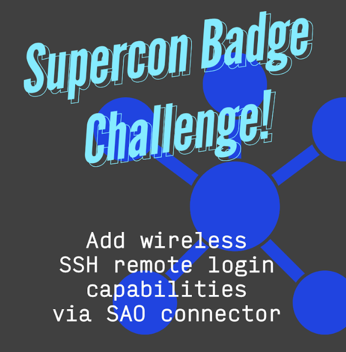
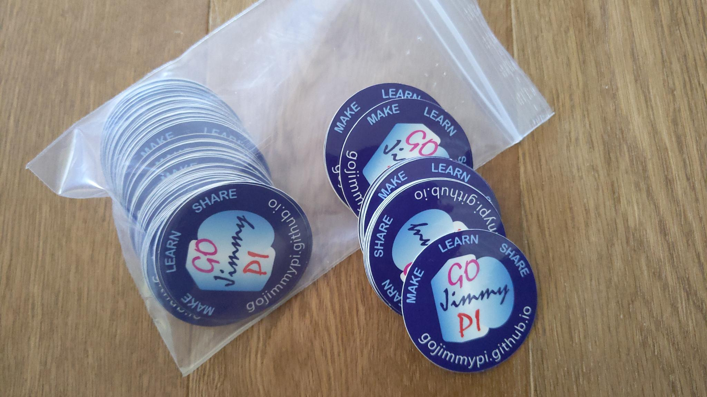
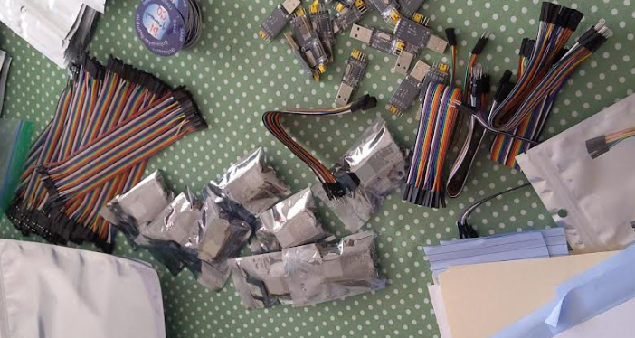
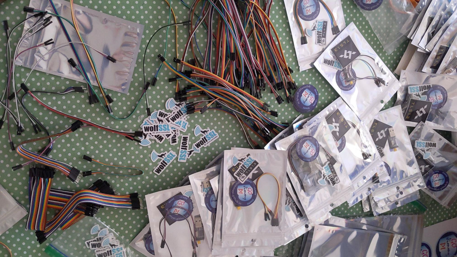
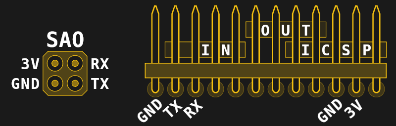
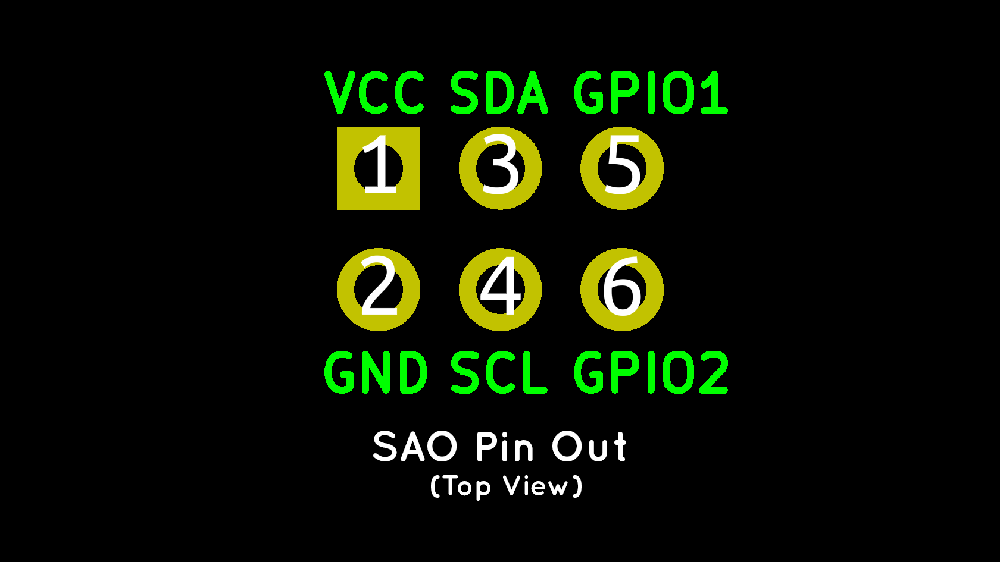

Hackaday Supercon is back!! Here's a little Badge SAO idea: Wireless SSH Access!



I'll have a little giveaway this time! I had no idea what to expect at my first Hackaday in 2019.
I hadn't been to any sort of conference in years, and what Supercon is... well, it is not like any conference
I had ever attended. 

What was really great was the kindness and generosity of all those folks there. One of the first people
I met was [@mithro](https://twitter.com/gojimmypi/status/1196172438934941697?s=20&t=6Q3FA9_6EQsM7wUW1sJ_kQ) who 
gave my a pair of [fomu](https://tomu.im/fomu.html). There was also [@ZxSpectROM](https://twitter.com/gojimmypi/status/1195480147362631680?s=20&t=6Q3FA9_6EQsM7wUW1sJ_kQ)
that ensured I had a RC2014 board. But me, I just showed up with a ticket in hand. There were many others.

So this year, I've remedied that! First, I've made my [first ever stickers](https://twitter.com/gojimmypi/status/1586452536722001921?s=20&t=6Q3FA9_6EQsM7wUW1sJ_kQ):



Next, I thought it would be good to have some badge accessories. So I bought some USB-TTY adapters and even some
ESP32-WROOM-32 dev boards to give away.



As much as I would have liked, I didn't have a personal budget for _everyone_ at Supercon... but for the people I meet, 
and for some people that have been inspirational and helpful on twitter, I have some giveaways, too.



I thought some things that would be a good companion to this year's badge would be some ESP32 dev boards to go along with
my challenge! So in some of the envelops there will be an ESP32-WROOM32 dev board, that should work perfectly
with my SSH to UART software. 

Although I have the SSH to UART project working, getting something implemented on the 4-bit Badge Processor... well,
that's the challenge!.

In other envelopes, there will be a USB-TTY Serial adapter. Given the primitive nature of the badge, it may be quite interesting
enough just to get the UART talking, let alone connecting the SSH server.

I'll also have some wolfSSL swag to give away. I have a part time gig with them; of course my SSH to UART server is of course
based on their [wolfSSH](https://github.com/wolfssl/wolfssh) library.


Pre-show, there's seemed to be a bit of discrepancy between the 4-pin SAO connector shown on the
[Badge Announcement Page](https://hackaday.com/2022/10/12/the-2022-supercon-badge-is-a-handheld-trip-through-computing-history/)
and the link to the [6-pin Version](https://hackaday.io/project/175182-simple-add-ons-sao) mentioned there.

Here's the 4-pin SAO pinout that I believe will be on the badge:



Here's the 6-pin SAO pinout that's referenced: 



Whichever connector is used, we simply need either the `Tx` and `Rx` on the 4-pin or the `GPIO1` and GPIO2` on the 6-pin connector.
Don't forget to connect the ground pin! 

Of course, if you want the ultimate ESP8266 Badge SAO, check out the 
[custom board by nschurando](https://discord.com/channels/879434765390975007/1001636192149835867/1033508153008070696).
Here's a link to the [schematic](http://sitronlabs.com/slbl00001.pdf).

> [Watch out though](https://discord.com/channels/879434765390975007/1001636192149835867/1035529853543387247) 
> _as the pins RX and TX on the 4-pin SOA connector of this year's badge are mapped to non 5V-tolerant GPIOs of the PIC. 
So they'll effectively be limited to VDD+0.3V. And with the 2x1.5V alkaline batteries ever so slightly discharged you're already at risk of damaging the badge when interfacing it with 3.3V logic._

See the [PIC24FJ256GA704-I/PT](https://www.microchip.com/en-us/product/PIC24FJ256GA704)

To get started - if you want to go the lazy route, you could go with my [original development](https://github.com/gojimmypi/wolfssh/tree/ESP32_Development/examples/ESP32-SSH-Server)
that has a (stale) copy of the [wolfSSL](https://github.com/wolfSSL/wolfssl/tree/master/IDE/Espressif/ESP-IDF) 
and [wolfSSH](https://github.com/wolfSSL/wolfssh/tree/master/ide/Espressif) 
libraries already installed as 
[local project components](https://github.com/gojimmypi/wolfssh/tree/ESP32_Development/examples/ESP32-SSH-Server/components).

That's of course not the best route, as there have been several releases in the many months since my repo was last updated. 
See the [setup for wolfSSL](https://github.com/wolfSSL/wolfssl/tree/master/IDE/Espressif/ESP-IDF)
and [wolfSSH](https://github.com/wolfSSL/wolfssh/tree/master/ide/Espressif/ESP-IDF) to properly install the latest versions.

Note that my SSH-to-UART project does _not_ use the Espressif [esp-tls](https://github.com/espressif/esp-idf/tree/master/components/esp-tls) 
layer SSH.


Thanks [@LinuxJedi](https://twitter.com/gojimmypi/status/1522390635948351488?s=20&t=6Q3FA9_6EQsM7wUW1sJ_kQ) 
that pointed out only RSA is implemented at this time. So if you have your SSH shell locked down, you may need to do:

```
-o"PubkeyAcceptedAlgorithms +ssh-rsa" 
-o"HostkeyAlgorithms +ssh-rsa"
```

(this blog page is still a work in progress)

See prior blogs:

- Twitter [SSH to UART Microblog](https://www.google.com/search?q=ssh+uart+%40gojimmypi+site%3Atwitter.com)
- [Espressif ESP32 WiFi Port Sniffing](https://gojimmypi.github.io/Espressif-ESP32-WiFi-Port-Sniffing-DUT/)
- [SSH to ESP8266](https://gojimmypi.github.io/SSH-to-ESP8266/)
- [SSH to ULX3S ESP32](https://gojimmypi.github.io/SSH-to-ULX3S-ESP32/)

