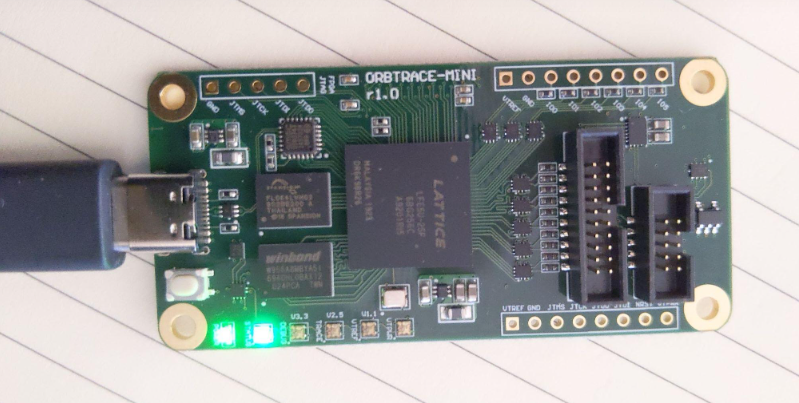
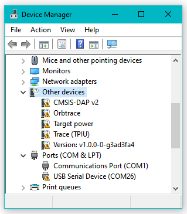
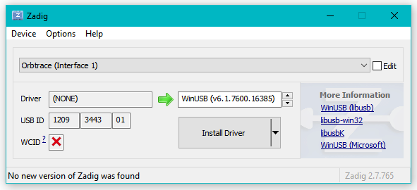
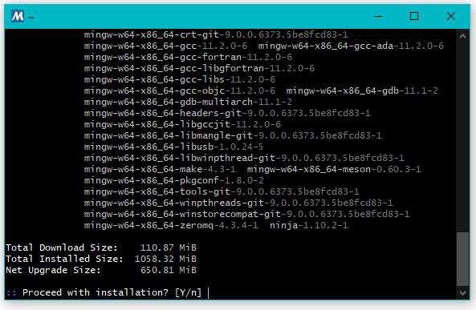
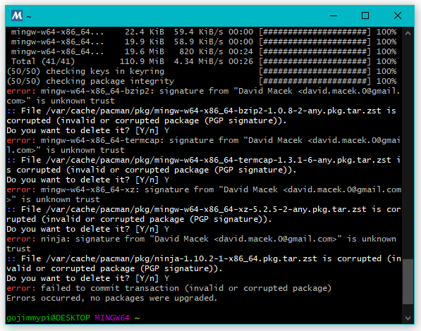
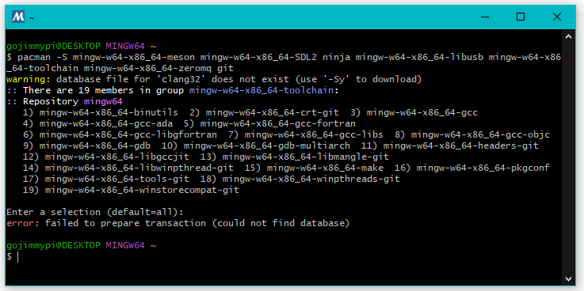
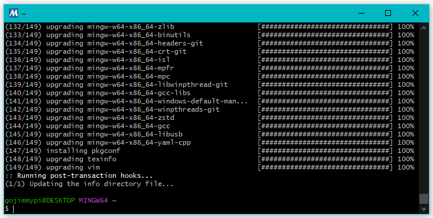
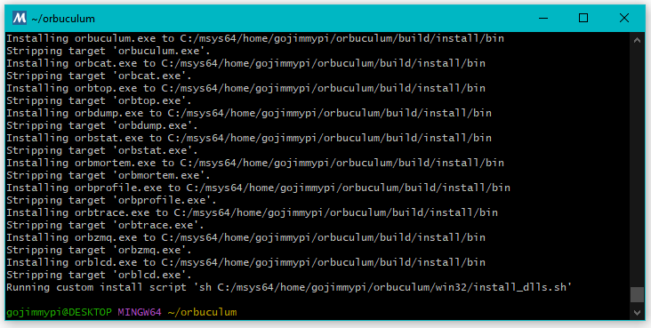
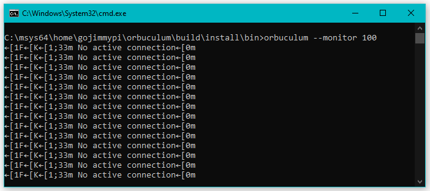
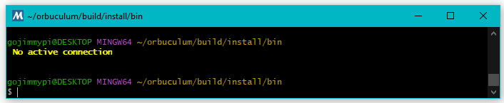

I first learned about the [orbtrace-mini](https://orbcode.org/orbtrace-mini/) 
on [Hackaday](https://hackaday.com/2022/07/26/orbtrace-effort-open-tool-for-professional-debugging/). 
Upon reading that article, I immediately sent [zyp] an email expressing my interest. I received a 
prompt reply and was instructed to add myself to the [waiting list](https://github.com/orbcode/orbtrace/issues/11).
It recently arrived!



When I first plugged my new [orbtrace-mini](https://orbcode.org/orbtrace-mini/) into Windows 10, 
I saw the usual song-and-dance about installing a new device.
There was a small delay and then a message that "Your device is setup and ready". 

I Check Device Manager, just to be sure. I saw all these warnings:



Indeed Zadig indicated that the device is likely less than ready:




So I instead connected the device to my Ubuntu VM, But I saw this error:


So I went back to Windows. The instructions say to use mysys32 / ming32 and ran the command:

```
pacman -S mingw-w64-x86_64-meson mingw-w64-x86_64-SDL2 ninja mingw-w64-x86_64-libusb mingw-w64-x86_64-toolchain mingw-w64-x86_64-zeromq git
```



But saw this error:



I don't use mingw very often, particularly now that WSL is so cool. I needed to google _how_ to update, as 'aptget -update' of course doesn't work here. 
I tried to [update](https://www.msys2.org/docs/updating/):

```
pacman -Suy
```

ming64 claimed it needed to exit, so I allowed it... gave it some time, and tried again. New error:



I ran `pacman -Suy` a second time. This next time took much longer to complete:




Now for the [build](https://github.com/orbcode/orbuculum#build):

```bash
git clone https://github.com/orbcode/orbuculum.git
meson setup build
ninja -C build
meson configure build --prefix A:/
meson install -C ./build --destdir ./install --strip
```

All my Windows executables ended up in `C:/msys64/home/gojimmypi/orbuculum/build/install/`



The file path can be pasted into Windows File Explorer, even with forward slashes.



I see a similar response in ming64:



This is almost certainly an issue easily resolved with Zadig, but I've been unable to find anyone else that encountered this
problem and I don't know which drives to use for all the different devices. I've reached out on [Discord](https://discord.gg/P7FYThy) 
and will update here soon.

I had a reply from [zyp] almost immediately:

> you might want to start by loading a newer gateware on it, WCID descriptors were added in v1.1 and should make the windows experience more pleasant

I'll do that, and update here upon completion.

I know, I know: why do I still use Windows? I ask myself that on a regular basis. ;)
