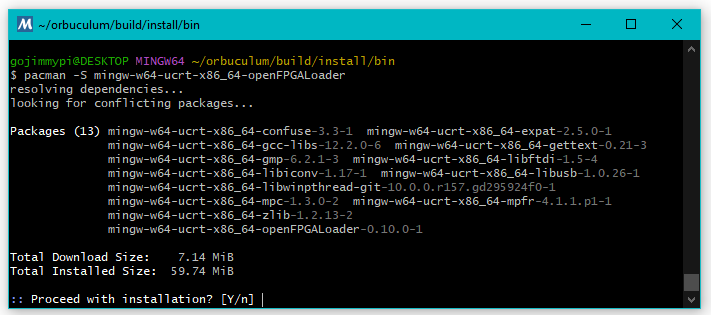
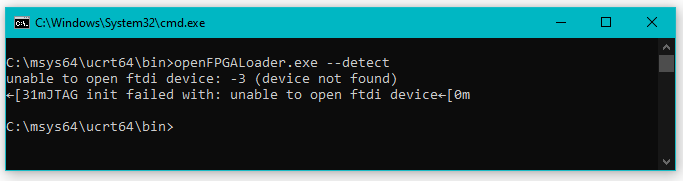

I first learned about the [orbtrace-mini](https://orbcode.org/orbtrace-mini/) 
on [Hackaday](https://hackaday.com/2022/07/26/orbtrace-effort-open-tool-for-professional-debugging/). 
Upon reading that article, I immediately sent [zyp] an email expressing my interest. I received a 
prompt reply and was instructed to add myself to the [waiting list](https://github.com/orbcode/orbtrace/issues/11).
My board recently arrived!


When I first plugged my new [orbtrace-mini](https://orbcode.org/orbtrace-mini/) into Windows 10, 
I saw the usual song-and-dance about installing a new device.
There was a small delay and then a message that "Your device is setup and ready". 

I Check Device Manager, just to be sure. I saw all these warnings:


Indeed Zadig indicated that the device is likely less than ready:


So I instead connected the device to my Ubuntu VM, But I saw this error:


So I went back to Windows. The instructions say to use mysys32 / ming32 and ran the command:

```
pacman -S mingw-w64-x86_64-meson mingw-w64-x86_64-SDL2 ninja mingw-w64-x86_64-libusb mingw-w64-x86_64-toolchain mingw-w64-x86_64-zeromq git
```


But saw this error:


I don't use mingw very often, particularly now that WSL is so cool. I needed to google _how_ to update, as 'aptget -update' of course doesn't work here. 
I tried to [update](https://www.msys2.org/docs/updating/):

```
pacman -Suy
```

ming64 claimed it needed to exit, so I allowed it... gave it some time, and tried again. New error:


I ran `pacman -Suy` a second time. This next time took much longer to complete:


Now for the [build](https://github.com/orbcode/orbuculum#build):

```bash
git clone https://github.com/orbcode/orbuculum.git
meson setup build
ninja -C build
meson configure build --prefix A:/
meson install -C ./build --destdir ./install --strip
```

All my Windows executables ended up in `C:/msys64/home/gojimmypi/orbuculum/build/install/`


The file path can be pasted into Windows File Explorer, even with forward slashes.


I see a similar response in ming64:


This is almost certainly an issue easily resolved with Zadig, but I've been unable to find anyone else that encountered this
problem and I don't know which drives to use for all the different devices. I've reached out on [Discord](https://discord.gg/P7FYThy) 
and will update here soon.

I had a reply from [zyp] almost immediately:

> you might want to start by loading a newer gateware on it, WCID descriptors were added in v1.1 and should make the windows experience more pleasant

The [instructions for installing openFPGALoader](https://trabucayre.github.io/openFPGALoader/guide/first-steps.html) are refreshingly easy! No fuss
with clone, toolchain, build, etc. I was able to install on Windows using MSYS2/MingW:

```
pacman -S mingw-w64-ucrt-x86_64-openFPGALoader
```


 
The executable gets installed to `C:\msys64\ucrt64\bin`.

Running from a DOS prompt and the device is not found. Tried unplugging and re-plugging. Same result:



Tried running the command from the MingW prompt:


This is not really a surprise, as Windows still lists "none" for most of the drivers:

Interface 0:


Interface 1:


Interface 2:


Interface 3:


Interface 4:


Interface 5:


Interface 6:


I also tried using the [dfu_util](https://github.com/ulx3s/dfu-util/tree/master/bin-win64) 
that's worked for my ULX3S, but saw the same results:


I noticed there's a discrepancy on USB Device ID between the Build Instructions and my board.
So I opened [orbtrace #12](https://github.com/orbcode/orbtrace/issues/12).

I tried to use Zadig to set a variety of drivers on `Interface 0` without success.

Having no luck on Windows, I tried `dfu-util` on my Ubuntu VM. 
I already had 0.9 installed, but it could not see any devices.
Next I tried the latest version from as described on [dfu-util.sourceforge.net](https://dfu-util.sourceforge.net/build.html).
Still no joy.

```
sudo apt-get install libusb-1.0-0-dev autoconf

git clone git://git.code.sf.net/p/dfu-util/dfu-util
cd dfu-util


./autogen.sh
./configure  # on most systems
make
```


## Milestone

After all of the above, I realized I was confusing the bootloader (aka gateware) with the application, and
the. I ended up completing my upgrade steps in an Ubuntu VM, not Windows.

`Bootloader mode` is when the purple light is on. Key here: HOLD DOWN the button while powering the device up UNTIL the light turns purple.

When in bootloader mode, the USB Device ID is `1209:3442`. That last digit is a TWO!

When NOT in bootloader mode, he USB Device ID is `1209:3443`. That last digit is a THREE!

Be sure to specify a slot for `dfu-util` (the `-a` parameter); Slot 0 is not used.

The application gets loaded into SLOT 1 with the `dfu-util` parameter `-a 1`.

The bootloader gets loaded into SLOT 2 with the `dfu-util` parameter `-a 2`.

BE SURE to not mix up the slot numbers with application vs bootloader. If you do, well, don't power cycle until you load the correct one in the proper slot.

When in bootloader mode, power cycle to return to operational mode. The device ID will change from `1209:3442` to `1209:3443`.

Note there are [build instructions](https://github.com/orbcode/orbtrace#building) and slightly different instructions
on the [release page](https://github.com/orbcode/orbtrace/releases). The release instructions are a bit more clear at the time of this blog.

BOTH the application AND bootloader need to have the purple light on to load.

```
# application in slot 1
dfu-util -d 1209:3442 -a 1 -D orbtrace_mini_application_1.2.0.bit

# bootloader (aka gateware) in slot 2
dfu-util -d 1209:3442 -a 2 -D orbtrace_mini_bootloader_1.2.0.bit
```

A successful orbtrace application update looks like this:


A successful orbtrace bootloader update looks like this:


A successful bootloader update looks like this:

Huge thanks to [mubes] and [zyp] on the [1bitsquared orbuculum discord channel](https://discord.com/channels/613131135903596547/614885210395508738/1057034002487320717)
for helping me get my board upgraded and working.


