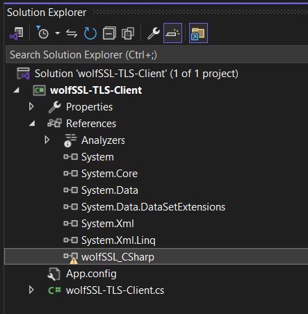
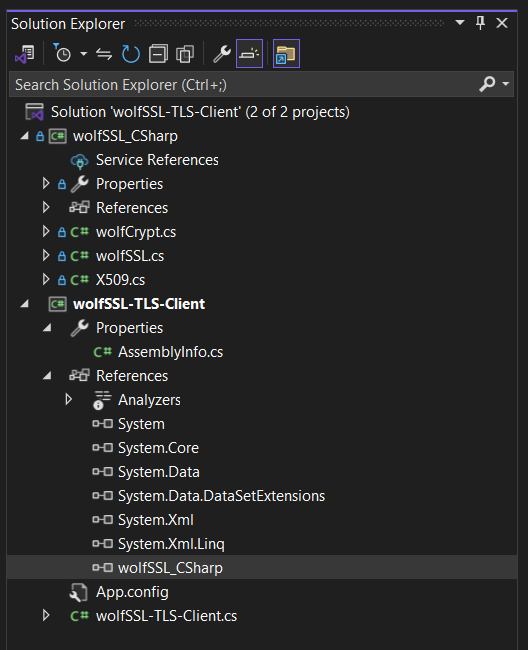
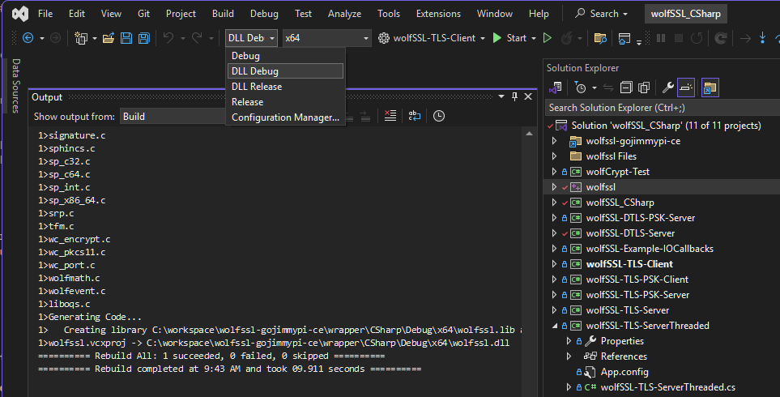
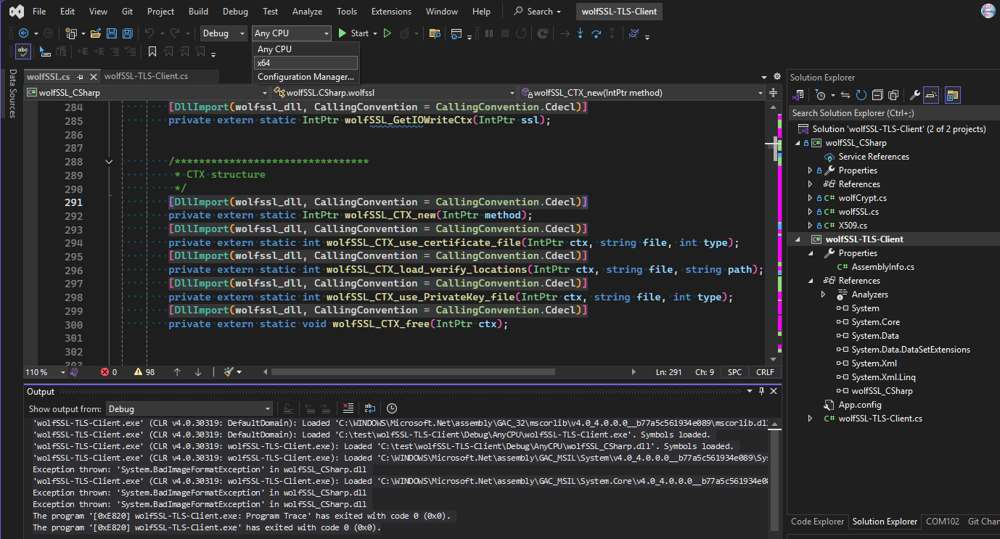

Some notes on using wolfSSL in Visual Studio.

See my blog [Getting Started with wolfSSL using Visual Studio 2022](https://www.wolfssl.com/getting-started-with-wolfssl-using-visual-studio-2022/).

The [wolfSSL source code](https://github.com/wolfSSL/wolfssl) is written in C and is completely self-contained, requiring no external dependencies.
Some features will utilize the operating system as appropriate, such as networking.

The Visual Studio `wolfssl.vcxproj` for the [C# Examples](https://github.com/wolfSSL/wolfssl/tree/master/wrapper/CSharp) is a Visual C project file.
To use wolfSSL for a typical Windows application, the DLL will need to be compiled with the `WOLFSSL_DLL` preprocessor macro. See new details in [my dev branch](https://github.com/gojimmypi/wolfssl/blob/dev-35/wrapper/CSharp/README.md)
coming soon to the upstream repository in [wolfssl PR #8562](https://github.com/wolfSSL/wolfssl/pull/8562).

The `wolfSSL_CSharp.csproj` [C# Wrapper for wolfssl](https://github.com/wolfSSL/wolfssl/tree/master/wrapper/CSharp/wolfSSL_CSharp) is  optional for C# developers.
It creates a convenient `wolfSSL.CSharp` namespace to use the native C wolfssl library in C# like this:

```
        Console.WriteLine("Calling ctx Init from wolfSSL");
        ctx = wolfssl.CTX_new(wolfssl.usev23_client());
        if (ctx == IntPtr.Zero)
        {
            Console.WriteLine("Error in creating ctx structure");
            return;
        }
```

But what if an application is not in the wolfssl directory structure? For example, let's take the [wolfSSL-TLS-Client](https://github.com/wolfSSL/wolfssl/tree/master/wrapper/CSharp/wolfSSL-TLS-Client)
example and put it in `c:\test\wolfSSL-TLS-Client`.

If you try to compile it, this error will likely be encountered:

```
The type or namespace name 'wolfSSL' could not be found (are you missing a using directive or an assembly reference?)
```

Expand the `references` and there will likely be a warning symbol over the `wolfssl_CSharp` item.



There are two ways to resolve this: The easiest is to browse to the wolfSSL repository and add the `wolfSSL_CSharp` project. This is typically located in:

```
C:\workspace\wolfssl-%USERNAME%\wrapper\CSharp\wolfSSL_CSharp\wolfSSL_CSharp.csproj
```

The other option is to also copy the `wolfssl_CSharp` [project directory](https://github.com/wolfSSL/wolfssl/tree/master/wrapper/CSharp/wolfSSL_CSharp) to the same directory, in this case `C:\test`

For a fresh compile, it likely still won't work. This error will probably be see:

```
The name 'wolfssl' does not exist in the current context
The type or namespace name 'wolfSSL' could not be found (are you missing a using directive or an assembly reference?)
Metadata file 'C:\test\wolfSSL-TLS-Client\Debug\AnyCPU\wolfSSL_CSharp.dll' could not be found
```

To resolve this, _this_ project needs to be added to the wolfSSL-TLS-Client solution. Right-click on the solution, click `Add`, select the local ``wolfSSL_CSharp`.

In either case, the new sample solution should look like this:



The solution should now at least compile (but it is not yet operable). Outpout should look something like this::

```
Rebuild started at 9:31 AM...
1>------ Rebuild All started: Project: wolfSSL_CSharp, Configuration: Debug Any CPU ------
1>  C:\workspace\wolfssl-gojimmypi\wrapper\CSharp\wolfSSL_CSharp\..\..\..\certs\server-key.pem
1>  1 File(s) copied
1>  C:\workspace\wolfssl-gojimmypi\wrapper\CSharp\wolfSSL_CSharp\..\..\..\certs\server-cert.pem
1>  1 File(s) copied
1>  C:\workspace\wolfssl-gojimmypi\wrapper\CSharp\wolfSSL_CSharp\..\..\..\certs\dh2048.pem
1>  1 File(s) copied
1>  C:\workspace\wolfssl-gojimmypi\wrapper\CSharp\wolfSSL_CSharp\..\..\..\certs\ca-cert.pem
1>  1 File(s) copied
1>  wolfSSL_CSharp -> C:\test\wolfSSL-TLS-Client\Debug\AnyCPU\wolfSSL_CSharp.dll
2>------ Rebuild All started: Project: wolfSSL-TLS-Client, Configuration: Debug Any CPU ------
2>  wolfSSL-TLS-Client -> C:\test\wolfSSL-TLS-Client\Debug\AnyCPU\wolfSSL-TLS-Client.exe
========== Rebuild All: 2 succeeded, 0 failed, 0 skipped ==========
========== Rebuild completed at 9:31 AM and took 00.941 seconds ==========
```

If the application runs now, an error like this is expected:

```
Windows - ca-cert.pem
Windows - dh2048.pem
wolfssl init error System.DllNotFoundException: Unable to load DLL 'wolfssl.dll': The specified module could not be found. (Exception from HRESULT: 0x8007007E)
   at wolfSSL.CSharp.wolfssl.wolfSSL_Init()
   at wolfSSL.CSharp.wolfssl.Init() in C:\workspace\wolfssl-gojimmypi\wrapper\CSharp\wolfSSL_CSharp\wolfSSL.cs:line 1512
Calling ctx Init from wolfSSL
wolfssl error System.DllNotFoundException: Unable to load DLL 'wolfssl.dll': The specified module could not be found. (Exception from HRESULT: 0x8007007E)
   at wolfSSL.CSharp.wolfssl.wolfSSLv23_client_method()
   at wolfSSL.CSharp.wolfssl.usev23_client() in C:\workspace\wolfssl-gojimmypi\wrapper\CSharp\wolfSSL_CSharp\wolfSSL.cs:line 1635
ctx_new error System.DllNotFoundException: Unable to load DLL 'wolfssl.dll': The specified module could not be found. (Exception from HRESULT: 0x8007007E)
   at wolfSSL.CSharp.wolfssl.wolfSSL_CTX_new(IntPtr method)
   at wolfSSL.CSharp.wolfssl.CTX_new(IntPtr method) in C:\workspace\wolfssl-gojimmypi\wrapper\CSharp\wolfSSL_CSharp\wolfSSL.cs:line 1071
Error in creating ctx structure

C:\test\wolfSSL-TLS-Client\Debug\AnyCPU\wolfSSL-TLS-Client.exe (process 51676) exited with code 0 (0x0).
To automatically close the console when debugging stops, enable Tools->Options->Debugging->Automatically close the console when debugging stops.
Press any key to close this window . . .
```

Why? The `wolfSSL_CSharp` wrapper only knows _about_ the DLL, not _where_ to find it (recall the `[DllImport(wolfssl_dll, CallingConvention = CallingConvention.Cdecl)]` decorators.)

This same error would occur of course if not using the wrapper class library, and instead use wolfssl directly, with your own decorators in the declarations.

The new code in [PR #8562](https://github.com/wolfSSL/wolfssl/pull/8562) more robustly finds the DLL, including a new `App.config` specification with `WOLFSSL_DLL_PATH`:

```xml
<?xml version="1.0" encoding="utf-8"?>
<configuration>
    <startup>
        <supportedRuntime version="v2.0.50727"/>
    </startup>
    <appSettings>
        <add key="WOLFSSL_DLL_PATH" value="C:/Windows/System32"/>
        <add key="WOLFSSL_CERTS_PATH" value="C:/workspace/wolfssl/certs"/>
    </appSettings>
</configuration>
```

If not developing for wolfssl, the easiest way to resolve this is to simply ensure the `wolfssl.dll` can be found.
This is in all the [usual places for Windows to find a DLL](https://learn.microsoft.com/en-us/windows/win32/dlls/dynamic-link-library-search-order).

The search order may not be intuitive, copied here for reference:

1. DLL redirection.
2. API sets.
3. Desktop apps only (not UWP apps). SxS manifest redirection.
4. Loaded-module list.
5. Known DLLs.
6. The package dependency graph of the process. This is the application's package plus any dependencies specified as <PackageDependency> in the <Dependencies> section of the application's package manifest. Dependencies are searched in the order they appear in the manifest.
7. The folder the calling process was loaded from (the executable's folder).
8. The system folder (%SystemRoot%\system32).

The fact that an error was encountered, rules out in particular items #1 to #6. For this exercise, the compiled DLL can be place in the local project build directory,
in this case:

```text
C:\test\wolfSSL-TLS-Client\Debug\AnyCPU\
```

Where to find the wolfssl.ddl? That's built with the `wolfssl.vcxproj` in the [wrapper/CSharp](https://github.com/gojimmypi/wolfssl/tree/dev-35/wrapper/CSharp) directory.

When selecting `DLL Debug` or `DLL Release` the proper functions are exposed in the DLL. Building the `wolfssl` project should result in an output that looks like this:

```text
Rebuild started at 9:43 AM...
1>------ Rebuild All started: Project: wolfssl, Configuration: DLL Debug x64 ------
1>Performing Custom Build Tools
1>Microsoft (R) Macro Assembler (x64) Version 14.42.34438.0
1>Copyright (C) Microsoft Corporation.  All rights reserved.
1>
1> Assembling: ..\..\wolfcrypt\src\aes_asm.asm
1>Performing Custom Build Tools
1>Microsoft (R) Macro Assembler (x64) Version 14.42.34438.0
1>Copyright (C) Microsoft Corporation.  All rights reserved.
1>

[ ... more assembling messages ... ]

1>crl.c
1>dtls13.c
1>dtls.c
1>internal.c

[ ... more source files ... ]

1>Generating Code...
1>   Creating library C:\workspace\wolfssl-gojimmypi\wrapper\CSharp\Debug\x64\wolfssl.lib and object C:\workspace\wolfssl-gojimmypi\wrapper\CSharp\Debug\x64\wolfssl.exp
1>wolfssl.vcxproj -> C:\workspace\wolfssl-gojimmypi\wrapper\CSharp\Debug\x64\wolfssl.dll
========== Rebuild All: 1 succeeded, 0 failed, 0 skipped ==========
========== Rebuild completed at 9:43 AM and took 09.911 seconds ==========

```

The project should look something like this:




In particular, from the wolfSSL output, note this line:

```text
1>wolfssl.vcxproj -> C:\workspace\wolfssl-gojimmypi\wrapper\CSharp\Debug\x64\wolfssl.dll
```

Copy the `wolfssl.*` files to the `C:\test\wolfSSL-TLS-Client\Debug\AnyCPU` directory (see above when compiling `wolfSSL-TLS-Client`).

For example these files:

```text
wolfssl.dll
wolfssl.exp
wolfssl.ilk
wolfssl.lib
wolfssl.pdb
```

REMINDER: When cleaning or rebuilding (instead of just using "build" for project), files manually copied may need to be recopied.

Note again the `wolfSSL-TLS-Client` example will _run_ but likely fails with a new error:

```text
Windows - ca-cert.pem
Windows - dh2048.pem
wolfssl init error System.BadImageFormatException: An attempt was made to load a program with an incorrect format. (Exception from HRESULT: 0x8007000B)
   at wolfSSL.CSharp.wolfssl.wolfSSL_Init()
   at wolfSSL.CSharp.wolfssl.Init() in C:\workspace\wolfssl-gojimmypi-pr\wrapper\CSharp\wolfSSL_CSharp\wolfSSL.cs:line 1512
Calling ctx Init from wolfSSL
wolfssl error System.BadImageFormatException: An attempt was made to load a program with an incorrect format. (Exception from HRESULT: 0x8007000B)
   at wolfSSL.CSharp.wolfssl.wolfSSLv23_client_method()
   at wolfSSL.CSharp.wolfssl.usev23_client() in C:\workspace\wolfssl-gojimmypi-pr\wrapper\CSharp\wolfSSL_CSharp\wolfSSL.cs:line 1635
ctx_new error System.BadImageFormatException: An attempt was made to load a program with an incorrect format. (Exception from HRESULT: 0x8007000B)
   at wolfSSL.CSharp.wolfssl.wolfSSL_CTX_new(IntPtr method)
   at wolfSSL.CSharp.wolfssl.CTX_new(IntPtr method) in C:\workspace\wolfssl-gojimmypi-pr\wrapper\CSharp\wolfSSL_CSharp\wolfSSL.cs:line 1071
Error in creating ctx structure

C:\test\wolfSSL-TLS-Client\Debug\AnyCPU\wolfSSL-TLS-Client.exe (process 59424) exited with code 0 (0x0).
To automatically close the console when debugging stops, enable Tools->Options->Debugging->Automatically close the console when debugging stops.
Press any key to close this window . . .
```


Visual Studio will have a message like this:

```
'wolfSSL-TLS-Client.exe' (CLR v4.0.30319: DefaultDomain): Loaded 'C:\WINDOWS\Microsoft.Net\assembly\GAC_32\mscorlib\v4.0_4.0.0.0__b77a5c561934e089\mscorlib.dll'. Skipped loading symbols. Module is optimized and the debugger option 'Just My Code' is enabled.
'wolfSSL-TLS-Client.exe' (CLR v4.0.30319: DefaultDomain): Loaded 'C:\test\wolfSSL-TLS-Client\Debug\AnyCPU\wolfSSL-TLS-Client.exe'. Symbols loaded.
'wolfSSL-TLS-Client.exe' (CLR v4.0.30319: wolfSSL-TLS-Client.exe): Loaded 'C:\test\wolfSSL-TLS-Client\Debug\AnyCPU\wolfSSL_CSharp.dll'. Symbols loaded.
'wolfSSL-TLS-Client.exe' (CLR v4.0.30319: wolfSSL-TLS-Client.exe): Loaded 'C:\WINDOWS\Microsoft.Net\assembly\GAC_MSIL\System\v4.0_4.0.0.0__b77a5c561934e089\System.dll'. Skipped loading symbols. Module is optimized and the debugger option 'Just My Code' is enabled.
Exception thrown: 'System.BadImageFormatException' in wolfSSL_CSharp.dll
'wolfSSL-TLS-Client.exe' (CLR v4.0.30319: wolfSSL-TLS-Client.exe): Loaded 'C:\WINDOWS\Microsoft.Net\assembly\GAC_MSIL\System.Core\v4.0_4.0.0.0__b77a5c561934e089\System.Core.dll'. Skipped loading symbols. Module is optimized and the debugger option 'Just My Code' is enabled.
Exception thrown: 'System.BadImageFormatException' in wolfSSL_CSharp.dll
Exception thrown: 'System.BadImageFormatException' in wolfSSL_CSharp.dll
The program '[0xE820] wolfSSL-TLS-Client.exe: Program Trace' has exited with code 0 (0x0).
The program '[0xE820] wolfSSL-TLS-Client.exe' has exited with code 0 (0x0).
```

This is because the `wolfSSL-TLS-Client` was built with the `AnyCPU` configuration and the `wolfssl.dll` was build with `x64`.

The configurations MUST MATCH.

Go back to the `wolfSSL-TLS-Client` project configuration and select `x64` to match the DLL:



The project will _still_ fail to run. Recall the `wolfssl.*` files were copied to the `C:\test\wolfSSL-TLS-Client\Debug\AnyCPU` directory.
They need to be instead copied to the x64 directory (or wherever the `wolfSSL-TLS-Client.exe` is created when building):

```
C:\test\wolfSSL-TLS-Client\Debug\x64
```

Run the application again. This time `wolfssl.dll` should have been properly found and loaded.

The example is very close at this point, with the only issue being finding the sample certificates. When running the `wolfSSL-TLS-Client`
from the examples in the wolfssl repository tree, the certs are found a few directories up in the [certs](https://github.com/wolfSSL/wolfssl/tree/master/certs)
directory. That's not the case for our new test location, so instead we see a new error:

```
Windows - ca-cert.pem
Windows - dh2048.pem
Calling ctx Init from wolfSSL
Finished init of ctx .... now load in CA
Could not find CA cert file
freeing ctx handle

C:\test\wolfSSL-TLS-Client\Debug\x64\wolfSSL-TLS-Client.exe (process 76864) exited with code 0 (0x0).
```

The wolfssl example are only a reference. Actual use-case certificates are expected to be used in a real-world situation. See the line:

[wolfssl.CTX_load_verify_locations(ctx, caCert, null)](https://github.com/wolfSSL/wolfssl/blob/bc7fbee5393b63e80a2c79d369551162abd45780/wrapper/CSharp/wolfSSL-TLS-Client/wolfSSL-TLS-Client.cs#L127)

If we still want to use the samples here, they need to be copied to the same location as our local project `wolfssl.dll`. In this case here:


```
C:\test\wolfSSL-TLS-Client\Debug\x64
```

When building the `CSharp`, the files of interest are located in the same build directory:

```
C:\workspace\wolfssl-gojimmypi\wrapper\CSharp\Debug\x64
```

The current upstream wolfssl will _not_ find the certificate files. There's a new feature also in [PR #8562](https://github.com/wolfSSL/wolfssl/pull/8562)
that will facilitate finding the certs from other project directories.

For now, either modify the source code to use your own certificates, or use the DLL and certificate files from the [pr-vs-dotnet35](https://github.com/gojimmypi/wolfssl/tree/pr-vs-dotnet35) branch,
in this case compiled to:

```
C:\workspace\wolfssl-gojimmypiwrapper\CSharp\Debug\x64
```

Ensure the `CSharp` example being compiled is the one from the [pr-vs-dotnet35](https://github.com/gojimmypi/wolfssl/tree/pr-vs-dotnet35). See the
updated [setPath()](https://github.com/gojimmypi/wolfssl/blob/cb69f56683890639320a555654dd04188a524650/wrapper/CSharp/wolfSSL_CSharp/wolfSSL.cs#L753) function.

If this error is encountered:

```
No App.config setting found for WOLFSSL_CERTS_PATH
Windows cert path: Path not found: ../../../../../certs/
```

Then the `wolfSSL-TLS-Client` example was not copied from the `pr-vs-dotnet35` branch and/or the PR has not yet been merged upstream.

Edit the `App.config` as appropriate:

```
<?xml version="1.0" encoding="utf-8"?>
<configuration>
    <startup>
        <supportedRuntime version="v2.0.50727"/>
    </startup>
    <appSettings>
        <add key="WOLFSSL_DLL_PATH" value="C:/Windows/System32"/>
        <add key="WOLFSSL_CERTS_PATH" value="C:/workspace/wolfssl/certs"/>
    </appSettings>
</configuration>
```