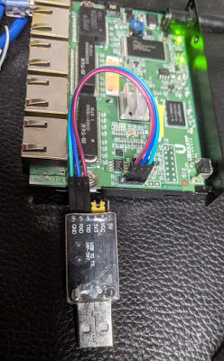
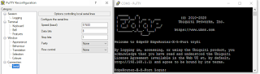

This blog details the steps needed to reflash an EdgeRouterX and upgrade [firmware](https://www.ui.com/download/software/er-x).

The `scp` copy method was needed after the existing firmware was found to be corrupted and did not accept web upload nor [TFTP](https://pjo2.github.io/tftpd64/).

There are two different EdgeRouter-X device models, nearly identical ER-X and the ERX-SFP. The SFP has a fiber port.



```bash
cat /tmp/device_model
```

Remove all ethernet cables from the EdgeRouter-X, otherwise some config commands may fail.

<div style="margin-bottom:1em">
    Thanks to&nbsp;<a href="https://youtu.be/t3ZEFBHx-ZI">Willie Howe's Ubiquiti EdgeRouter X Hidden Console Port</a>&nbsp;video, I was able to easily find and connect a serial port to the internal UART connector of the EdgeRouter-X:
</div>


<div class="separator" style="clear: both; text-align: left;">
    <a href="../images/s1199/EdgeRouter_UART.jpg" style="margin-left: 1em; margin-right: 1em;">
        
    </a>
</div>
<p></p>

<p>
    Connect via putty to the serial port. 57600, 8N1:
</p>

<div class="separator" style="clear: both; text-align: left;">
    <a href="../images/s1039/EdgeOS_Putty.png" style="margin-left: 1em; margin-right: 1em;">
        
    </a>
</div>
<br />


Factory reset via [convoluted hardware method](https://help.uisp.com/hc/en-us/articles/22591216117015-EdgeRouter-Reset-to-Factory-Defaults)
holding down the reset button for 10 seconds after port LEDs start lighting up in sequence and until the LED on port 1 lights up again...
or:


```bash
sudo cp /opt/vyatta/etc/config.boot.default /config/config.boot
reboot
```

Optionally re-flash using `scp` to copy and image to the device:

From another computer with _wired Ethernet_, make note of current config. Manually set the local IP address to `192.168.1.2`. Turn off WiFi if needed.

On Windows, this is in Control Panel: Network and Internet - Network Connections, right-click, properties, "Internet Protocol Version 5 (TCP/IPv4) Properties".

The default gateway is `192.168.1.1` (The EdgeRouter-X), subnet mask `255.255.255.0`. No DNS needed during setup.

Plug the Ethernet from other computer into `eth0`. Yes, it *MUST* be `eth0` if factory reset.

The default IP address of the router after factor reset is `192.168.1.1` and should be accessed from `eth0`.

Use `scp` to copy the latest firmware to the EdgeRouter-X:


```bash
scp ER-e50.v2.0.9-hotfix.7.5622731.tar  ubnt@192.168.1.1:/tmp/
```

The output should look something like this:


```text
gojimmypi:~
$ cd /mnt/c/download/edgerouter

gojimmypi:/mnt/c/download/edgerouter
$ ls
ER-e50.v2.0.9-hotfix.7.5622731.tar

gojimmypi:/mnt/c/download/edgerouter
$ scp ER-e50.v2.0.9-hotfix.7.5622731.tar ubnt@192.168.1.1:/tmp/
The authenticity of host '192.168.1.1 (192.168.1.1)' can't be established.
ED25519 key fingerprint is SHA256:qJzhYqR0EkaLAeIBSJGkuAV81MzHS5BiRnYEjOKrZsY.
This key is not known by any other names
Are you sure you want to continue connecting (yes/no/[fingerprint])? y
Please type 'yes', 'no' or the fingerprint: yes
Warning: Permanently added '192.168.1.1' (ED25519) to the list of known hosts.
Welcome to EdgeOS

By logging in, accessing, or using the Ubiquiti product, you
acknowledge that you have read and understood the Ubiquiti
License Agreement (available in the Web UI at, by default,
http://192.168.1.1) and agree to be bound by its terms.

ubnt@192.168.1.1's password:
ER-e50.v2.0.9-hotfix.7.5622731.tar                                                    100%   70MB  10.4MB/s   00:06

gojimmypi:/mnt/c/download/edgerouter
```

From there, either `ssh ubnt@192.168.1.1` from the other computer, or connect via serial port.

It's best to connect via serial port as some commands may fail when reconfiguring a live system.

If using serial port, now is a good time to restore network IP configuration on computer that was used to copy the firmware image.

Do not plug any Ethernet cables into the EdgeRouter during configuration.

The default username and password after factor reset is `ubnt`, `ubnt`.


Config the file is in `/tmp`:


```
ubnt@EdgeRouter-X-5-Port:~$ ls /tmp
ER-e50.v2.0.9-hotfix.7.5622731.tar
device_model
ubnt.socket.cfgd
ubnt.socket.cli
ubnt.socket.ecstatsd
ubnt.socket.platd
ubnt.socket.statsd
ubnt.socket.sysd
ubnt@EdgeRouter-X-5-Port:~$
```

Add the new system image:


```
add system image /tmp/ER-e50.v2.0.9-hotfix.7.5622731.tar
```

Output should look like this:


```
ubnt@EdgeRouter-X-5-Port:~$ add system image ER-e50.v2.0.9-hotfix.7.5622731.tar
Version [v2.0.8-hotfix.1.5278088.200305.1641] is about to be replaced
Are you sure you want to replace old version? (Yes/No) [Yes]: Yes
Cannot find upgrade image. Upgrade failed.
.tar@EdgeRouter-X-5-Port:~$ add system image /tmp/ER-e50.v2.0.9-hotfix.7.5622731
Version [v2.0.8-hotfix.1.5278088.200305.1641] is about to be replaced
Are you sure you want to replace old version? (Yes/No) [Yes]: Yes
Checking upgrade image...Done
Preparing to upgrade...Done
Clearing directory /var/cache/apt (1.1M)...Done
Copying upgrade image...Not enough disk space for root file system
Do you want to delete old version first? (Yes/No) [Yes]:
Removing old image...Done
Warning duplicate image name, changing to [v2.0.9-hotfix.7.5622731.230615.0857-1]
Done
Checking upgrade image...Done
Copying config data...Done
Finishing upgrade...Done
Upgrade completed
```

For completeness, reboot and set to factory defaults a second time:


```
reboot
```

Factory reset:


```bash
sudo cp /opt/vyatta/etc/config.boot.default /config/config.boot
reboot
```


Enter configuration mode:


```bash
configure
```

Ensure all ethernet cables are removed from the EdgeRouter-X!

Enter new configuration, first delete `eth0` and `eth1` that are part of factor reset.


```
delete interfaces ethernet eth0 address
commit

delete interfaces ethernet eth1 address
commit

set interfaces bridge br0 address 192.168.142.203/24

set interfaces ethernet eth0 bridge-group bridge br0
set interfaces ethernet eth1 bridge-group bridge br0
set interfaces ethernet eth2 bridge-group bridge br0

set service gui listen-address 192.168.142.203

commit
save
exit
```

Reboot from bash prompt.


```bash
reboot
```

The final Vyatta-format `boot.config` file looks like this with the `show configuration` command:


```bash
interfaces {
    bridge br0 {
        address 192.168.142.203/24
    }
    ethernet eth0 {
        bridge-group {
            bridge br0
        }
        duplex auto
        speed auto
    }
    ethernet eth1 {
        bridge-group {
            bridge br0
        }
        duplex auto
        speed auto
    }
    ethernet eth2 {
        duplex auto
        speed auto
    }
    ethernet eth3 {
        duplex auto
        speed auto
    }
    ethernet eth4 {
        duplex auto
        poe {
            output off
        }
        speed auto
    }
    loopback lo {
    }
    switch switch0 {
        mtu 1500
    }
}
service {
    gui {
        http-port 80
        https-port 443
        listen-address 192.168.142.203
        older-ciphers enable
    }
    ssh {
        port 22
        protocol-version v2
    }
    unms {
    }
}
system {
    analytics-handler {
        send-analytics-report false
    }
    crash-handler {
        send-crash-report false
    }
    host-name EdgeRouter-X-5-Port
    login {
        user YOURLOGIN {
            authentication {
                encrypted-password ****************
                plaintext-password ****************
            }
            level admin
        }
    }
    ntp {
        server 0.ubnt.pool.ntp.org {
        }
        server 1.ubnt.pool.ntp.org {
        }
        server 2.ubnt.pool.ntp.org {
        }
        server 3.ubnt.pool.ntp.org {
        }
    }
    syslog {
        global {
            facility all {
                level notice
            }
            facility protocols {
                level debug
            }
        }
    }
    time-zone UTC
}
```


The bad blocks should be reported during boot, but not during Linux initialization:


```
[NAND]select ecc bit:4, sparesize :64 spare_per_sector=16
nand: device found, Manufacturer ID: 0xc2, Chip ID: 0xda
nand: Macronix NAND 256MiB 3,3V 8-bit
nand: 256 MiB, SLC, erase size: 128 KiB, page size: 2048, OOB size: 64
Scanning device for bad blocks
Bad eraseblock 97 at 0x000000c20000
Bad eraseblock 1479 at 0x00000b8e0000
Bad eraseblock 1966 at 0x00000f5c0000
Bad eraseblock 2001 at 0x00000fa20000
8 fixed-partitions partitions found on MTD device MT7621-NAND
Creating 8 MTD partitions on "MT7621-NAND":
0x000000000000-0x000010000000 : "ALL"
0x000000000000-0x000010000000 : "ALL"
0x000000000000-0x000000080000 : "Bootloader"
0x000000080000-0x0000000e0000 : "Config"
0x0000000e0000-0x000000140000 : "eeprom"
0x000000140000-0x000000440000 : "Kernel1"
0x000000440000-0x000000740000 : "Kernel2"
0x000000740000-0x00000ff00000 : "RootFS"
```


See prior related blogs:

- [Espressif ESP32 WiFi Port Sniffing](../Espressif-ESP32-WiFi-Port-Sniffing-DUT/)
- [EdgeRouter-X Port Mirroring: Inspect ESP32 Network Packets](../Edgerouter-Port-Monitor/)
- [Dual WAN OpenVPN with EdgeRouter X or RT-AX86U](../dual-wan-openvpn-with-edgerouter-x-or/)

Other links of interest:

- [Tftpd64](https://pjo2.github.io/tftpd64/)
- [EdgeRouter X, ER-X Firmware](https://www.ui.com/download/software/er-x)
- [EdgeRouter X Getting Started](https://dl.ubnt.com/guides/edgemax/EdgeRouter_ER-X_QSG.pdf)
- [EdgeRouter X User Guide](https://dl.ubnt.com/guides/edgemax/EdgeOS_UG.pdf)
- [EdgeRouter X Data Sheet](https://dl.ubnt.com/datasheets/edgemax/EdgeRouter_X_DS.pdf)

Certificate-related links

- [GlobalSign Root Certificates](https://support.globalsign.com/ca-certificates/root-certificates/globalsign-root-certificates)
- [LetsEncrypt isrgrootx1 PEM](https://letsencrypt.org/certs/isrgrootx1.pem.txt)

Special links:

- [ExpressVpnRouter](https://expressvpnrouter.com/ui/dashboard) (must have local ExpressVPN router)

