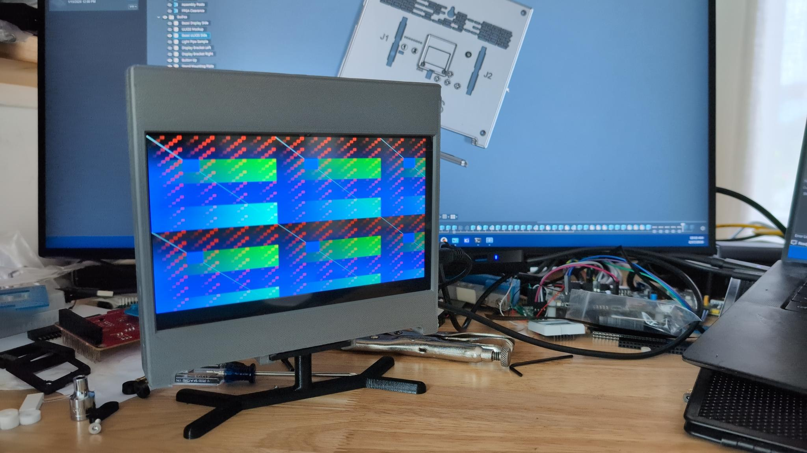
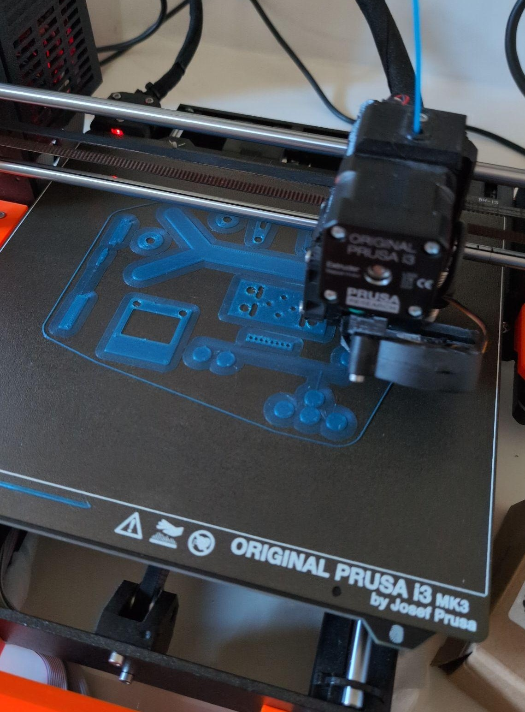
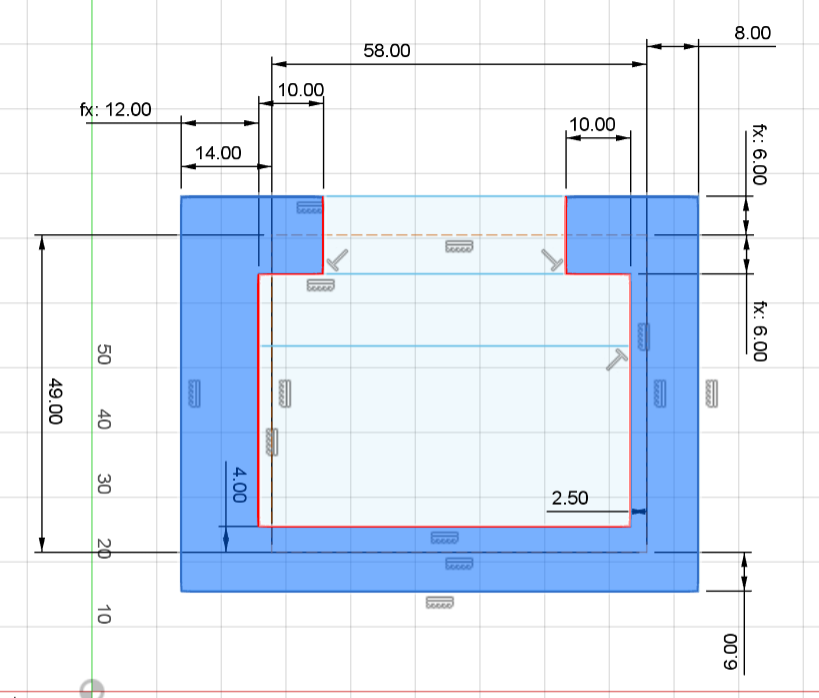
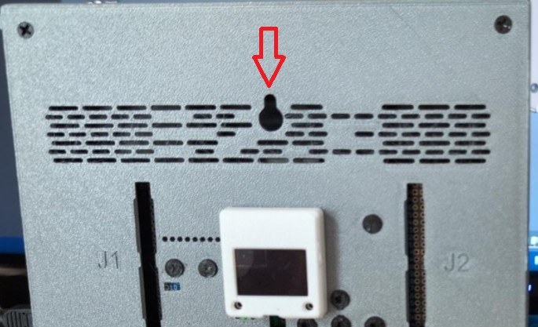
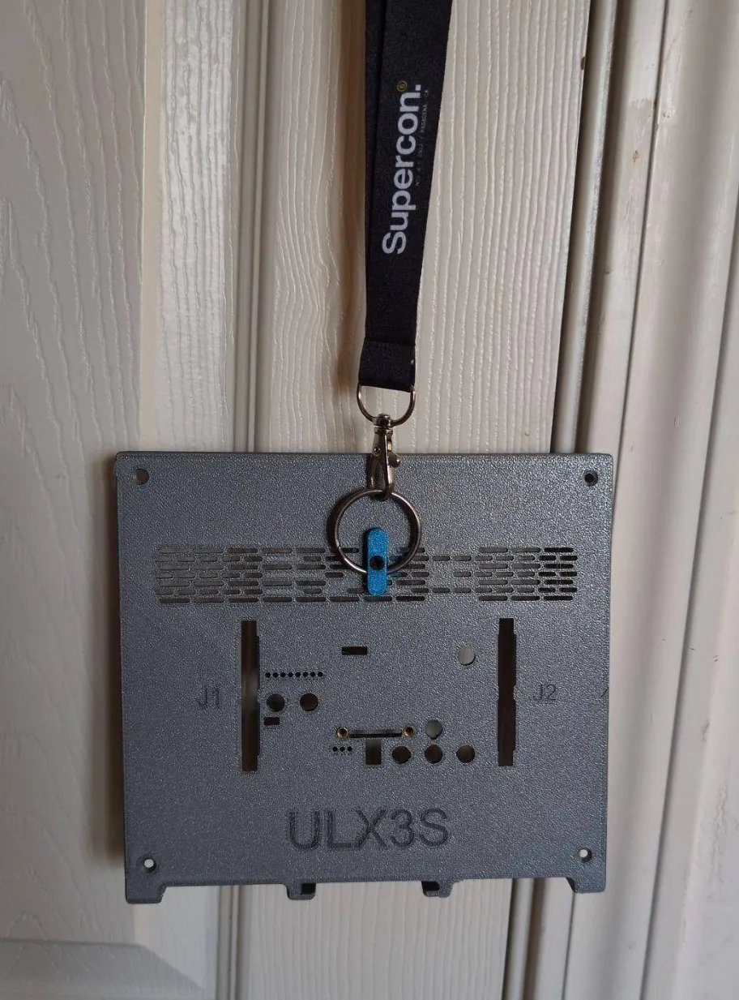

It's [here](https://github.com/gojimmypi/ulx3s-elecrow-7inch-hdmi-enclosure)! The ULX3S Enclosure for the Elecrow 7inch HDMI Display is now available!

There should be an update at [Crowd Supply for the ULX3S](https://www.crowdsupply.com/radiona/ulx3s/updates) in the near future. Preview the [announcement](https://github.com/gojimmypi/ulx3s-elecrow-7inch-hdmi-enclosure/blob/main/ANNOUNCEMENT.md).

The enclosure and all of the related parts are available as open source 3D printable.

The full [assembly instructions](https://github.com/gojimmypi/ulx3s-elecrow-7inch-hdmi-enclosure/ASSEMBLY.md) are available.

If you want an enclosure but don't have access to a 3D Printer, I may be able to help. Send me a message (at gmail) or [Etsy](https://www.etsy.com/people/gojimmypi).

The "enclosure" started out with humble beginnings in [January of 2026](https://x.com/gojimmypi/status/2011592018355798474?s=20) as a simple adapter
board. (The Elecrow display was designed for the Raspberry Pi, with different mounting post positions)

One thing led to another, and well... now there's an entire enclosure with many different features and capabilities.

Use the removable stand and enjoy your ULX3S on a desk as shown above.

Hang your ULX3S-controlled HDMI display on the wall with a keyhole:

Wear your ULX3S as a badge! There's an optional keyhole adapter to secure a keyring for a lanyard:

Install any or all of the covers on enclosure holes that are not used.

Connect an external HDMI source to the display. Warning: do not drive display with external source or attempt to use HDMI concurrently with ULX3S connected.

Enjoy sound projects with the internal speakers included with the Elecrow display.

The display and ULX3S board run fairly cool, but there's a place to install an optional internal fan.

There's an external audio port from the display as well as a volume control.

The files are all on GitHub:

https://github.com/gojimmypi/ulx3s-elecrow-7inch-hdmi-enclosure

