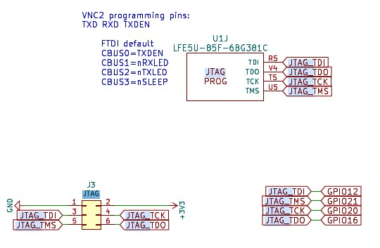


<!-- begin /ulx4m/index.html -->


# gojimmypi's ULX4M Home Page

My personal notes for the [Intergalaktik ULX4M]()

There are two flavors of the board with [Lattice ECP5](https://www.latticesemi.com/en/Products/FPGAandCPLD/ECP5). 
The [documentation](https://github.com/intergalaktik/ulx4m-documentation) has details:

- [ULX4M-LS (Lattice + SDRAM)](https://github.com/intergalaktik/ulx4m-documentation/tree/main/ulx4m-ls) with ``; [](https://github.com/intergalaktik/ulx4m/blob/ulx4m-ls/doc/schematics.pdf)
- [ULX4M-LD (Lattice + DDR3)](https://github.com/intergalaktik/ulx4m-documentation/tree/main/ulx4m-ld) with `LFE5UM-85F-8BG381C`; [schematics](https://github.com/intergalaktik/ulx4m/blob/ulx4m-ld/doc/ULX4M-LD-v003.pdf)


## Programming

All examples start from the workspace directory. In this example, the [Hazard3](https://github.com/gojimmypi/Hazard3/tree/ulx3s-dev) repo.

```bash
WORKSPACE=/mnt/c/workspace/
PROJECT_WORKSPACE="$WORKSPACE/Hazard3"
```

With power disconnected, move either ULX4M `SW1` slider to its `ON`
position, then connect USB power. LED0-LED2 should remain on and Windows should
enumerate the DFU device.

Assuming the bitstream is `fpga_ulx4m_ld_um85.bit` program with [openFPGALoader](https://trabucayre.github.io/openFPGALoader/guide/install.html):

```bash
./openFPGALoader.exe --dfu --vid 0x1d50 --pid 0x614b --altsetting 0 \
    fpga_ulx4m_ld_um85.bit
```

## JTAG

Lattice [FPGA-TN-02050 Programming External SPI Flash through JTAG for ECP5/ECP5-5G](https://www.latticesemi.com/view_document?document_id=52228) (also [here](../docs/FPGA-TN-02050-1-0-Programming-Ext-SPI-Flash-JTAG-ECP5-5G.pdf))



| JTAG signal | FPGA pin - LFE5U-85F-6BG381C | J3 connector pin | GPIO connection |
| ----------- | :--------------------------: | :--------------: | :-------------: |
| `JTAG_TDI`  |                         `R5` |              `3` |        `GPIO12` |
| `JTAG_TDO`  |                         `V4` |              `6` |        `GPIO16` |
| `JTAG_TCK`  |                         `T5` |              `4` |        `GPIO20` |
| `JTAG_TMS`  |                         `U5` |              `5` |        `GPIO21` |
| `GND`       |                         - -  |              `1` |             - - |
| `+3V3`      |                         - -  |              `2` |             - - |

| FTDI pin | Default function |
| -------- | ---------------- |
| `CBUS0`  | `TXDEN`          |
| `CBUS1`  | `nRXLED`         |
| `CBUS2`  | `nTXLED`         |
| `CBUS3`  | `nSLEEP`         |

## UART

| USB-to-UART adapter | Waveshare header            | ULX4M signal                |
| ------------------- | --------------------------- | --------------------------- |
| **GND**             | Physical **pin 14**         | GND                         |
| **TXD**             | Physical **pin 16**, GPIO23 | FPGA `uart_rx`, ECP5 pin N4 |
| **RXD**             | Physical **pin 18**, GPIO24 | FPGA `uart_tx`, ECP5 pin N3 |
| VCC/5V/3V3          | **Do not connect**          | - -                         |
